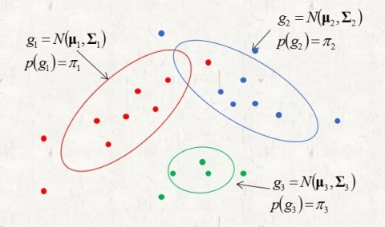
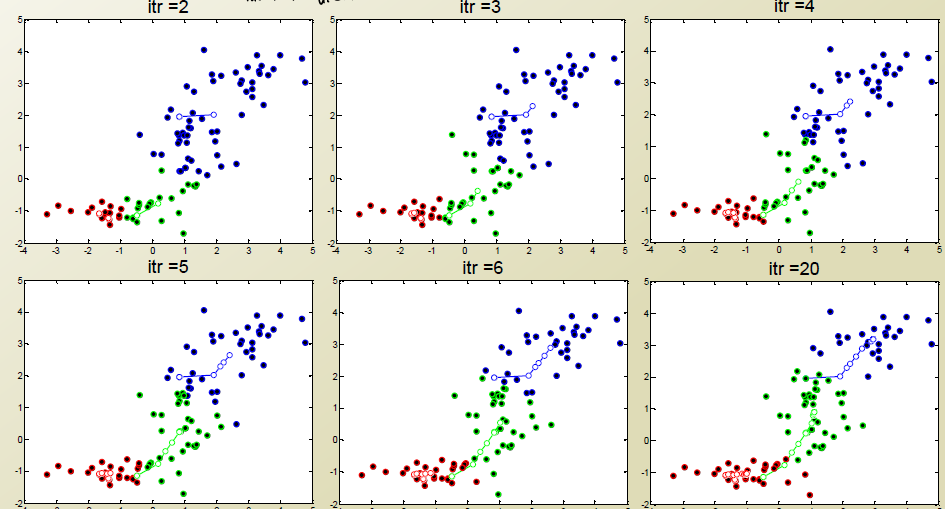

```{r setup, include=FALSE}
knitr::opts_chunk$set(echo = TRUE)
```

## 3. EM 알고리즘의 적용

EM 알고리즘이 가장 많이 쓰이는 예시들을 두 가지 정도 소개하고자 한다. 먼저 클러스터링에서 K-Means 알고리즘이다.

### 3.1 K-means 알고리즘

#### 3.1.1 K-means vs GMM

먼저 명확히 해야할 것은 K-means 알고리즘은 가우시안 혼합모형(Gaussian Mixture Model, GMM)의 특이 케이스로 이해될 수 있다는 점이다.

```{r, echo = FALSE, fig.cap = 'GMM Clustering', fig.align='center', out.width='80%'}

```

GMM은 저렇게 타원형의 군집을 찾아낸다. 타원형의 군집이 구성되는 이유는 각각의 군집별로 공분산 구조를 다르게 생각하기 때문이다. 만약 여기서 우리가 공분산 구조가 $\Sigma_k =  \epsilon \mathbf{I}$로 다 동일하다고 생각하면, 구(sphere)형의 구조를 찾아내기에 적합한 모델이 될 것이다. 결국 K-means는 GMM에서 공분산 구조가 단위행렬 $\mathbf{I}$가 되는 경우라고 생각해도 된다.

또한 자세히 설명하기에는 시작이 부족하지만, GMM은 베이지안의 관점에서 문제를 바라보기 때문에, 경계값을 명확하게 어떤 군집으로 배정하는 것이 아니라 확률을 부여할 수 있게 된다. 따라서 GMM은 특정 클러스터로 배정하기 어려운 관측값에 확률을 부여함으로써 Soft Assignment를 가능하게 한다. 하지만 K-means는 soft assignment를 고려하지 않고, hard assignment만 고려하게 된다는 차이가 존재한다.

그렇다면 우리는 EM을 적용할 때, 가우시안 혼합분포에서 시작해서 문제를 간단하게 변형시켜 K-menas를 풀어내려 한다.

#### 3.1.2 K-means by EM

Log-Likelihood for entire data

$$
lnP(X|\pi,\mu,\Sigma)=\sum_{j=1}^K ln\{\sum_{k=1}^K \pi_k N(x|\mu_k,\Sigma_k)\}
$$

EM Algorithm for GMM

$$
\begin{aligned}
\text{Expectation} \quad : \quad &\gamma(z_{nk})=\frac{P(z_k=1)P(x|z_k=1)}{\sum_{i=1}^K P(z_i=1)P(x|z_i=1)} = 
\frac{\pi_kN(x|\mu_k,\Sigma_k)}{\sum_{i=1}^K \pi_i N(x|\mu_i,\Sigma_i)} \\
\text{Maximization} \quad : \quad &\hat{\mu_k} = \frac{\sum_{n=1}^N \gamma(z_{nk})x_n}{\sum_{n=1}^N\gamma(z_{nk})}, \quad\quad 
\hat{\Sigma_k} = \frac{\sum_{n=1}^N\gamma(z_{nk}) (x_n-\hat{\mu_k)}(x_n-\hat{\mu_k})^T}{\sum_{n=1}^N\gamma(z_{nk})}, \quad\quad
\hat{\pi}_k= \frac{\sum_{n=1}^N\gamma(z_{nk})}{N}
\end{aligned}
$$

이전에 정의한 다변량정규분포의 MLE와 다항분포의 MLE를 계산하는 방법을 적용하면 다음과 같이 각각의 step을 요약할 수 있다. 하지만 여기서 GMM을 K-means 문제로 단순화하게 되면, maximization step에서 공분산 $\Sigma_k$와 각각의 $\pi_k$를 정의하는데에 필요한 계산을 생략할 수 있고, 더불어서 expectation step에서 각 점이 클러스터에 속하는 확률값을 계산할 필요없이, 가장 가까운 중심의 클러스터에 hard assign되면 된다. 이를 수식으로 나타내자.

Loss function of K-means

$$
J = \sum_{n=1}^N \sum_{k=1}^K r_{nk} ||x_n-\mu_k||^2
$$

다음과 같이 매우 간단하게 변할 수 있다. 여기서 $r_{nk}$값은 0또는 1의 값만 가지고, 이는 hard assign됨을 의미한다. Expectation step에서는 각각의 $r_{nk}$를 해당 데이터포인트에 가장 가까운 중심을 갖는 군집으로 할당하고, Maximization step에서는 새로 군집이 할당된 데이터포인트 사이에서 중심 $\mu_k$를 업데이트한다.

$$
\begin{aligned}
\text{Expectation} \quad &: \quad \text{Assign the data points to the nearest centroid} \\
\text{Maximization} \quad &: \quad \mu_k = \frac{\sum_{n=1}^N r_{nk}x_n}{\sum_{n=1}^N r_{nk}}
\end{aligned}
$$

Maximization step에서 새로운 $\mu_k$는 $\frac{\text{assign된 데이터의 위치}}{assign 개수}$가 되어서, 새롭게 assign된 데이터의 평균으로 $\mu_k$가 이동함을 알 수 있다.

```{r, echo = FALSE, fig.cap = 'K-menas Clustering', fig.align='center', out.width='80%'}

```

이렇듯 우리가 흔히 사용하던 k-means 또한 EM으로 설명될 수 있음을 확인했다.

### 3.2 Latent Variable Modeling

우리가 익숙한 클러스터링에 대한 EM 예제를 살펴보았다. 하지만 이런 EM은 클러스터링 이외에도 잠재변수가 존재하는 경우 매우 유용하게 사용될 수 있다고 한다. 이를 위해서 다른 예시를 하나 더 가져왔다. 논문에 있는 예시는 ML추정으로 풀 수 있는 예시이기 때문에, 더 복잡한 예시를 가져와서 tex 치느라 힘들어 줄을뻔했다.

#### 3.2.1 example - incomplete

남택이가 운영하는 베스킨라빈스는 민트초코, 딸기, 바닐라, 체리만 판다고 하자...즉 우리가 관측할 수 있는 변수 $y$는 다음과 같이 {민트초코, 딸기, 바닐라, 체리}로 이루어진다. 각각을 선택할 확률을 $(\frac{1}{2}+\frac{p}{4}, \frac{1}{4}(1-p), \frac{1}{4}(1-p),\frac{p}{4})$이라 하자. 그렇다면 하루동안의 매출을 이용해서 $p$값을 추정하고자 한다. 만약 하루동안 $n$명의 사람이 베라에 왔다면, 각 종류별로 팔린 아이스크림의 개수인 확률변수 $Y$는 다음과 같은 이항분포를 따른다.

$$
\begin{aligned}
Y \sim& multi(n, \mathbf{p}) \\
\mathbf{p}=(\frac{1}{2}+\frac{p}{4}, \frac{1}{4}&(1-p), \frac{1}{4}(1-p),\frac{p}{4})
\end{aligned}
$$

결국 확률변수 $Y$에 대한 모수로 $\theta$는 최대가능도 추정을 통해 추정하는 것이 가능하다.

$$
\begin{aligned}
l(p) &= log \binom{n}{y_1 \:y_2\: y_3\: y_4}(\frac{1}{2} + \frac{p}{4})^{y_1} (\frac{1-p}{4})^{y_2} (\frac{1-p}{4})^{y_3} (\frac{p}{4})^{y_4} \\
 &= log \binom{n}{y_1\:y_2\:y_3\:y_4}+ y_1 log(\frac{1}{2} + \frac{p}{4}) + y_2 log(\frac{1-p}{4}) + y_3 log(\frac{1-p}{4}) + y_4 log(\frac{p}{4})
\end{aligned}
$$

이 경우는 상대적으로 미분값=0을 하면 간단하게 정리되지 않는다. $p$에 대한 이차식이 나오는데, 뭐 구하려면 근의공식 써서 analytical form을 찾을 수 있지만, 간단하지 않다. 따라서 우리는 EM으로 이 문제를 접근하고자 한다.

#### 3.2.2 example - complete

우리는 이런 잠재변수까지 고려했을때 complete하다고 한다. 확률변수 $X = (X_1,X_2,X_3, X_4, X_5)$가 다섯가지 카테고리를 갖는 다항분포를 따른다고 하자.

$$
\begin{aligned}
X &\sim multi(n, \mathbf{p}) \\
\mathbf{p}=(\frac{1}{2}, \:\frac{p}{4},\: \frac{1}{4}&(1-p),\: \frac{1}{4}(1-p),\: \frac{p}{4})
\end{aligned}
$$

그러면 확률변수 $X$와 $Y$는 다음과 같이 매핑될 수 있다.

$$
Y = (Y_1, Y_2,Y_3, Y_4)=T(X) = (X_1+X_2, \:X_3, \:X_4, \:X_5)
$$

이를 일상의 언어로 표현하면, {민트초코, 딸기, 바닐라, 체리}중에서 민트초코를 선택하는 잠재적인 요인에는 {민초단, 초코단} $\rightarrow$ {민트초코}라는 경로가 존재하는 것이다. 즉, 민트초코를 구매하는 고객중에, 이들이 민초에 대한 수요인지, 초코에 대한 수요인지까지 모델링하기 때문에 잠재변수까지 complete하게 표현하는 형태이다.

이 $X$에 대한 가능도함수는 다음과 같이 정의될 수 있다.

$$
L(\theta)= \Pi_{i=1}^n  \binom{n}{x_1\: x_2\: x_3\: x_4\: x_5} (\frac{1}{2})^{x_1} \:(\frac{1}{4}p)^{x_2}\: (\frac{1-p}{4})^{x_3}\: (\frac{1-p}{4})^{x_4} \: (\frac{1}{4}p)^{x_5}
$$

로그가능도는 다음과 같다.

$$
l(p) = h(x,n) + (x_2+x_5)log(\frac{1}{4}p) + (x_3+x_4)log(\frac{1-p}{4})
$$

이를 p에 대해 미분해서 최대 가능도 추정량을 구하면 다음과 같다.

$$
\hat{p} = \frac{x_2+x_5}{x_2+x_3+x_4+x_5}
$$

#### 3.2.3 Expectation step

이제 em 알고리즘을 위해 다음을 거치자.

$$
Q(p, p^{(k)})= E[X\:|\:Y=y,p^{(k)}]
$$

이때 $X_3, X_4, X_5$는 $Y_2, Y_3, Y_4$과 같다. 그래서 다음이 성립한다.

$$
E[X_i \:|\:Y=y, p^{(k)}]=y_{i-1}, \quad where \:\: i=3,4,5
$$

반면에 $Y_1$은 관측할 수 있지만, $Y_1$을 안다고 해서 $X_1, X_2$를 알 수는 없다. 하지만 $Y_1$를 알고 있다면, 최소한 $X_1, X_2$가 이항분포를 따르게 된다. 데이터 $\mathbf{y}$와 $p^{(k)}$가 주어졌을 때, $X_1$에 대한 조건부 pdf는 다음과 같다.

$$
\begin{aligned}
p\left(x_{1}|\underline{y},p^{\left(k\right)}\right) & =  \frac{p\left(x_{1},y|p^{\left(k\right)}\right)}{p\left(y|p^{\left(k\right)}\right)}\\
 & =  \frac{\frac{n!}{x_{1}!\left(y_{1}-x_{1}\right)!y_{2}!y_{3}!y_{4}!}\left(\frac{1}{2}\right)^{x_{1}}\left(\frac{1}{4}p^{\left(k\right)}\right)^{y_{1}-x_{1}}}{\frac{n!}{y_{1}!y_{2}!y_{3}!y_{4}!}\left(\frac{1}{2}+\frac{1}{4}p^{\left(k\right)}\right)^{y_{1}}}\\
 & =  \frac{y_{1}!}{x_{1}!\left(y_{1}-x_{1}\right)!}\left(\frac{\frac{1}{2}}{\frac{1}{2}+\frac{1}{4}p^{\left(k\right)}}\right)^{x_{1}}\left(\frac{\frac{1}{4}p^{\left(k\right)}}{\frac{1}{2}+\frac{1}{4}p^{\left(k\right)}}\right)^{y_{1}-x_{1}}.
\end{aligned}
$$

$X_2=y_1-X_1$이기 때문에, 다음과 같이 이항분포를 만들 수 있다.

$$
\begin{aligned}
X_{1}|\underline{Y} & =\underline{y},p^{\left(k\right)}\sim B\left(y_{1},\frac{\frac{1}{2}}{\frac{1}{2}+\frac{1}{4}p^{\left(k\right)}}\right)\\
X_{2}|\underline{Y} & =\underline{y},p^{\left(k\right)}\sim B\left(y_{1},\frac{\frac{1}{4}p^{\left(k\right)}}{\frac{1}{2}+\frac{1}{4}p^{\left(k\right)}}\right)
\end{aligned}
$$

그래서 각각의 기대값을 구하게 되면, 다음과 같다.

$$
\begin{aligned}
\mathbb{E}\left[X_{1}\vert\underline{Y}=\underline{y},p^{\left(k\right)}\right] & =  y_{1}\frac{\frac{1}{2}}{\frac{1}{2}+\frac{1}{4}p^{\left(k\right)}},\\
\mathbb{E}\left[X_{2}\vert\underline{Y}=\underline{y},p^{\left(k\right)}\right] & =  y_{1}\frac{\frac{1}{4}p^{\left(k\right)}}{\frac{1}{2}+\frac{1}{4}p^{\left(k\right)}}
\end{aligned}
$$

이 값을 다시 대입하면,

$$
\begin{aligned}
Q\left(p,p^{\left(k\right)}\right) & =  \mathbb{E}\left[l\left(\theta;\underline{X}\right)\vert\underline{Y}=\underline{y},p^{\left(k\right)}\right]\\
 & =  \left(y_{1}\frac{\frac{1}{4}p^{\left(k\right)}}{\frac{1}{2}+\frac{1}{4}p^{\left(k\right)}}+y_{4}\right)log\left(\frac{1}{4}p\right)+ \left(y_{2}+y_{3}\right)log\left(\frac{1-p}{4}\right)+h\left(\underline{y},p^{\left(k\right)}\right)
\end{aligned}
$$

결국에 아까 X의 로그 가능도 함수에서, x들의 자리가 y로 대체된 것을 확인할 수 있다.

#### 3.2.4 Maximization step

이에 대한 최대가능도 추정은 아까 식에 대입만 하면 된다.

$$
p^{\left(k+1\right)}=\frac{\left(y_{1}\frac{\frac{1}{4}p^{\left(k\right)}}{\frac{1}{2}+\frac{1}{4}p^{\left(k\right)}}+y_{4}\right)}{y_{1}\frac{\frac{1}{4}p^{\left(k\right)}}{\frac{1}{2}+\frac{1}{4}p^{\left(k\right)}}+y_{2}+y_{3}+y_{4}}
$$


