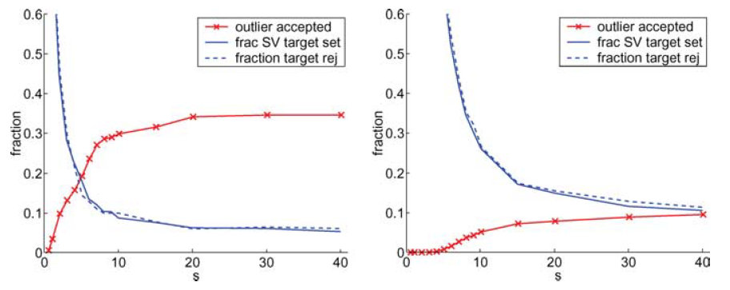
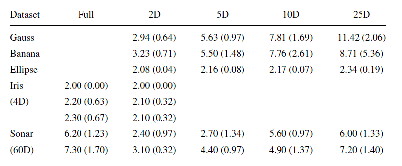
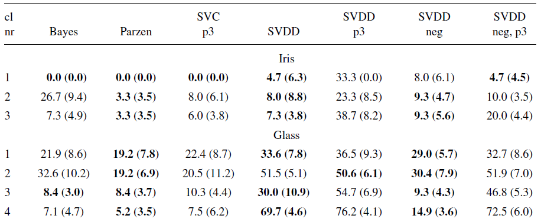
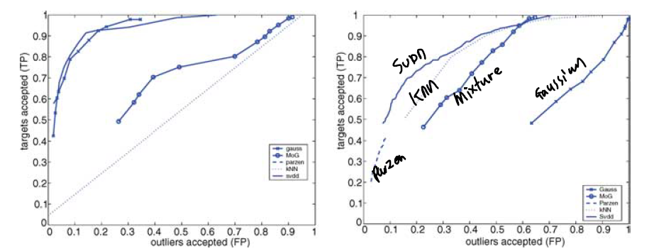
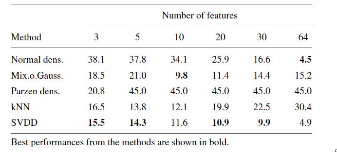

```{r setup, include=FALSE}
knitr::opts_chunk$set(echo = TRUE)
```

## 3. Experiment

SVDD의 특징들을 실험을 통해 보여주는 부분이다. 논문에서는 3. SVDD Characteristics & 4. Experiment인데, 그냥 실험부분으로 묶었다.

### 3.1 Numbers of Support vectors

충분히 적절한 데이터 구조에 대한 묘사(Sufficiently Accurate description)을 위해서는 얼마 만큼의 데이터가 필요할까? 이는 우리의 데이터의 형태나 아웃라이어의 underlying distribution에 의존할 수 밖에 없어서 명확하게 말하기는 어렵지만, 구형의 데이터를 가정할 경우 하한은 정의될 수 있다. 이전에 SVM을 다룰 때, $d$ dimension에서는 $d+1$ 개의 데이터를 shatter할 수 있다고 했다. 이것과 아마 관계되는 것 같은데, 결국 $d$ 차원에서는 $d+1$ 개의 support vector가 최소의 개수로 만들어질 수 있다. 근데 이것은 2차원 상에서는 맞는데, 고차원에서는 $d+1$보다 작은 개수를 가지는 것으로 보인다. 논문에 관련된 정확한 내용이 없기 때문에 , 중요한 것은 support vector 개수의 하한을 정의할 수 있다는 것!

```{r, echo = FALSE, fig.cap = 'Numbers of Support Vector', fig.align='center', out.width='70%'}

```

s를 키우면 가우시안 커널의 분산이 커지면서 거의 원형에 가까운 형태가 나타나게 된다. 그래프를 보게 되면, s가 커짐에 따라 파란선과 빨간선 모두 수렴하는 형태를 지니는 것을 확인할 수 있다. s가 증가함에 따라 target(normal)에서는 support vector의 개수가 줄어들게 되고, outlier들은 normal의 범주 안으로 들어오게 된다. 결국에 서포트 벡터의 개수가 줄어들어서 최소 개수의 서포트벡터로 수렴하는 것이다.

다음의 표는 시뮬레이션에 대한 표이다. 데이터를 가우스, 바나나, 타원 형태로 생성을 한다. 변수개수가 늘어났을 때, 필요한 서포트 벡터 개수의 하한을 표현한 표이다. 차원을 늘리면 늘릴수록 필요한 서포트 벡터가 늘어나기 때문에 결국에 더 많은 데이터가 필요함을 보여준다고 이해할 수 있다.

```{r, echo = FALSE, fig.cap = 'Numbers of Support Vector2', fig.align='center', out.width='70%'}

```

### 3.2 Training with outliers

이런 one-class learning을 만약에 classification 문제로 바라보면 어떻게 될까? 결국에 성능 문제에 있어서 분류문제와 이상치 탐지 문제를 비교하는 파트를 담고 있다. 아래 표는 분류 알고리즘으로는 나이브베이즈, parzen classifier, SVC with 3-polynomial을 사용했고, 이상치 탐지로는 SVDD, SVDD with 3-polynomial를 사용했다. 그래서 그 결과를 보면 다음과 같다.

```{r, echo = FALSE, fig.cap = 'Classification and anomaly detection', fig.align='center', out.width='70%'}

```

3번째를 기준으로 이제 알고리즘의 특성이 나누어지는데, 성능 차이가 현격한 것은 확인할 수 있다. 결국 우리 문제를 classification으로 바라볼 수 있다면, 분류문제로 푸는게 성능 측면에서 더 좋다고 이해할 수 있다. 실제로 극심한 class imbalance의 경우에도, 100000:1000과 같이 적은 범주의 데이터가 sampling이라던지 다른 방법으로 충분히 데이터의 구조를 파악하고 해결해줄 수 있다면 이는 분류문제로 다루는 것이 좋다. 같은 비율 1000:10의 경우에는 이제 적은 범주의 데이터가 10개 밖에 안되므로 이런 경우에는 outlier의 underlying distribution을 파악하는 것이 어렵기 때문에 이상치 탐지로 해결하는 것이 적절하다. 그리고 저 예시에서는 SVDD(Gaussian Kernel)을 사용하는 것이 일반적으로 좋다는 것을 확인할 수 있다.

### 3.3 Comparison with Other Methods

다른 이상치 탐지 알고리즘에 대해 SVDD 성능의 우수성을 보여주는 부분이다. 시계열 특성을 지니는 spectrum 데이터에 대한 이상치 탐지를 여러 데이터셋에 대해 시행했다. 알고리즘은 Gaussian, Mixture Gaussian, Parzen density, KNN, SVDD를 사용했다. 결과에 대한 시각화를 보면 다음과 같다.

```{r, echo = FALSE, fig.cap = 'Comparison 1', fig.align='center', out.width='70%'}

```

ROC curve를 보게 되면 SVDD가 다른 모델보다 성능이 좋은 것을 확인할 수 있다.

```{r, echo = FALSE, fig.cap = 'Comparison 2', fig.align='center', out.width='70%'}

```

표를 통해 보아도 비슷한 결과를 확인할 수 있다. 변수 개수가 많던지 적던지 좋은 성능을 보여주고 있다.

```{r, echo = FALSE, fig.cap = 'Comparison 3', fig.align='center', out.width='70%'}
knitr::include_graphics('pic/comparison3.png')
```

이 경우에는 SVDD의 성능이 KNN보다 좋지 않은 것을 확인할 수 있다. 물론 2등은 하고 있다. 이 데이터는 데이터들이 다른 데이터들에 비해 밀집도가 높은 데이터였다고 한다. 그 결과 SVDD는 sparse하고, complex(like banana)한 데이터에 더 좋은 성능을 보여준다고 논문은 말하고 있다.

## 4. Conclusion

- SVDD는 확률적으로 구분하거나, 밀도를 이용하는 것이 아니라 경계를 구분하는 알고리즘이다.
- Kernel을 통해 flexible boundary를 만들 수 있다.
- polynomial kernel보다는 gaussian kernel이 일반적으로 더 좋다.
- 또한 error나 numbers of supprot vector에 대한 이론적인 정의를 할 수 있으므로, 대충 튜닝 때려박는 것보다 이해하고 튜닝하는 것이 가능하다.
- sparse & complex한 구조의 데이터에 더 좋은 성능을 발휘한다.


