```{r setup, include=FALSE}
knitr::opts_chunk$set(echo = TRUE)

```

# Introduction

SVDD에 대해 설명하기에 앞서 outlier detection에 대해 간단히 알아보자. outlier detection = novelty detection = anomaly detection 모두 어감상의 차이는 있지만 같은 개념이라고 생각하면 된다. outlier detection은 데이터들을 특정 기준으로 나눈다는 점에서 classification과 비슷하지만 조금 다르다. 

```{r figure1, echo=FALSE, fig.align='center', out.width = '50%'}
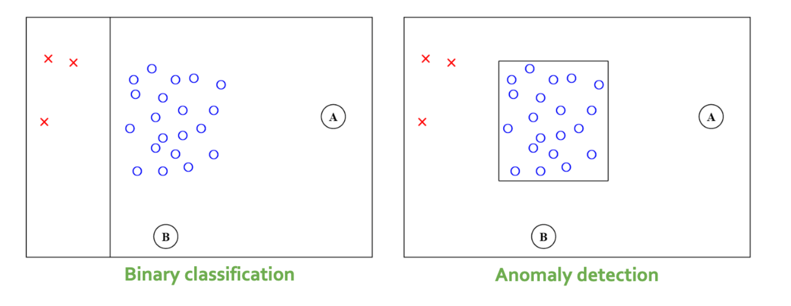
```

왼쪽의 그림은 binary classification을 표현한 것으로,빨간 x와 파란 동그라미를 잘 구분하는 분류 경계면을 찾는 것이 목적이다. 오른쪽의 그림은 outlier detection을 표현한 그림으로 빨간 x의 수가 파란 동그라미에 비해 많이 적다는 것을 알 수 있고, 따라서 해당하는 범주(outlier)에 대한 대표성이 부족하다고 해서 정상 데이터만을 이용하여 어디까지가 정상(normal)영역인지를 추정하는 것이 목적이다. 이렇게 정상범주에 대해 비정상 범주의 데이터 수가 확실하게 작을 때 outlier detection을 사용한다. 예를 들자면 공장에서 생산한 물건의 품질을 양품과 불량인 것으로 나누는 상황을 생각해 볼 수 있다. 양품의 수에 비해 불량의 수는 매우 작을 것이다. 

이제 본격적으로 SVDD에 대해 알아보자.

```{r figure2, echo=FALSE, fig.align='center', out.width = '50%'}
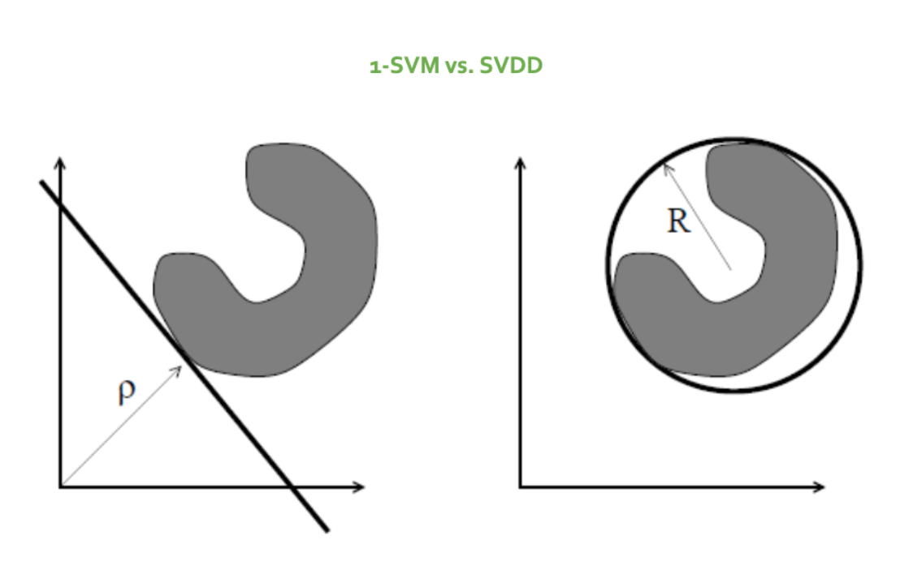
```

1-SVM과 SVDD는 모두 정상과 정상이 아닌 데이터를 구분하는 함수를 찾는 방식이지만 그림에서 보는 것처럼 1-SVM이 원점에서 가장 멀리 떨어진 정상 데이터들의 경계면을 찾는 것에 목적을 두었다면 SVDD는 정상 데이터를 감싸안는 최소 최적의 구를 찾는 목적함수로 이상치 탐지를 위한 경계면을 제공한다. 데이터가 초구 안에 들어온다면 정상이고 초구의 밖에 있다면 비정상 데이터이므로 직관적인 이해는 SVDD가 더 쉽다. 

# Theory

## Normal data description

```{r figure3, echo=FALSE, fig.align='center', out.width = '50%'}
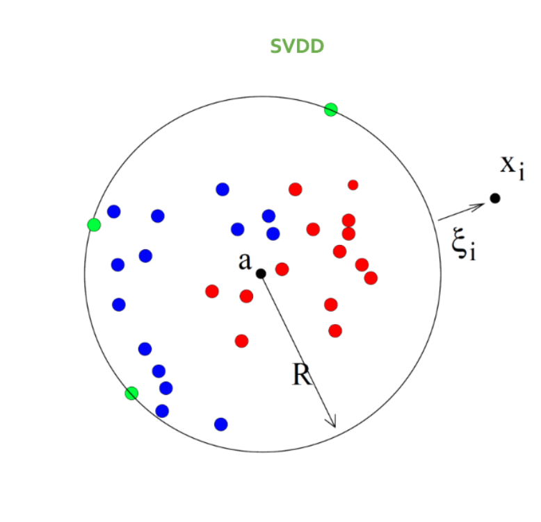
```

앞서 설명했듯이, SVDD는 정상 데이터를 감싸안는 최적의 초구(hypersphere)를 찾는 방식이다. 여기서 a는 초구의 중심이고, R은 반지름으로, 이 범위 안에 데이터를 다 몰아 넣는 것이 목적인데 그럼에도 불구하고 너무 동떨어진 데이터가 있다면 패널티($\xi_i$)를 부여하는 것이 목적이다. 

가장 compact한 초구를 찾는 것이 목적이므로 우리는 다음과 같이 정의되는 $$F(R,a)=R^2$$의 최소값을 찾아야 한다. 따라서 $${\|x_i-a\|}^2 \leq R^2$$와 같은 constraints가 필요하다. 여기서 constraints(regulation)을 취해주는 이유는 어떤 문제를 해결하는 분류기를 찾고 싶을 때, 해당 분류기가 들어있는 통이 너무 커서 적절한 해답을 찾기 힘든 경우, 분류기들을 일단 채에 한 번 거른 후에 걸러진 것들 중에 답을 찾는 것과 같이 생각하면 된다. 

앞서 언급한 것처럼 초구가 감싸안지 못하는 부분에 대해서는 패널티($\xi_i$)가 필요하다. 따라서 $$F(R,a)=R^2+C\sum_i\xi_i$$ 와 같이 $\xi_i>0$인 부가변수를 이용하여 패널티를 준다. 따라서 $${\|x_i-a\|}^2 \leq R^2+\xi_i$$와 같은 constraints를 통해 초구가 감싸안지 못하는 부분에 대해 패널티를 적용한다. constraints를 라그랑주 승수법을 이용해 표현하면 다음과 같다.

$$
L(R,a,\alpha_i,\gamma_i)=R^2+C\sum_i\xi_i-\sum_i\alpha_i\{{R^2+\xi_i-({\|x_i\|}^2-2a\cdotp x_i+{\|a\|}^2)}\}-\sum_i\gamma_i\xi_i
$$ 
라그랑주 승수법이란 제약이 있는 최적화 문제를 푸는 방법으로, 최적화 하려는 값에 형식적인 라그랑주 승수항을 더하여 제약된 문제를 제약이 없는 문제로 바꾸어 준다. 위의 식에서 $R^2+C\sum_i\xi_i$는 원래의 목적함수 부분이고, $\sum_i\alpha_i\{{R^2+\xi_i-({\|x_i\|}^2-2a\cdotp x_i+{\|a\|}^2)}\}$은 첫 번째 제약식 ${\|x_i-a\|}^2 \leq R^2$에 대한 penalty이며, $\sum_i\gamma_i\xi_i$는 두 번째 제약식 $\xi_i>0$에 대한 penalty이다. 여기서 $\alpha_i>0$이고 $\gamma_i>0$이다. 

최적화를 위해 위의 식을 각각 $R,\alpha_i,\xi_i$에 대해서 편미분 하면 다음과 같다. 

$$
\frac{\partial L}{\partial R} = 0:\quad\sum_i\alpha_i = 1
$$

$$
\frac{\partial L}{\partial a} = 0:\quad a=\frac{\sum_i\alpha_ix_i}{\sum_i\alpha_i}=\sum_i\alpha_ix_i
$$

$$
\frac{\partial L}{\partial \xi_i} = 0:\quad C-\alpha_i-\gamma_i=0
$$

$C-\alpha_i-\gamma_i=0$에서 $\alpha_i=C-\gamma_i$이고,$\alpha_i\geq 0$이고$\gamma_i\geq 0$이기 때문에 다음과 같이 쓸 수 있다. 

$$
0 \leq \alpha_i \leq C
$$

앞에서 미분한 결과들을 앞에서 라그랑주 승수법으로 표현한 
$$
L(R,a,\alpha_i,\gamma_i)=R^2+C\sum_i\xi_i-\sum_i\alpha_i\{{R^2+\xi_i-({\|x_i\|}^2-2a\cdotp x_i+{\|a\|}^2)}\}-\sum_i\gamma_i\xi_i
$$ 
이 식에 대입하여 다음과 같이 표현할 수 있다. 

$$
L=\sum_i\alpha_i(x_i\cdotp x_i)-\sum_{i,j}\alpha_i\alpha_j(x_i\cdotp x_j)
$$

object $x_i$의 위치는 다음과 같이 조건에 따라 달라진다. 

```{r figure4, echo=FALSE, fig.align='center', out.width = '60%'}
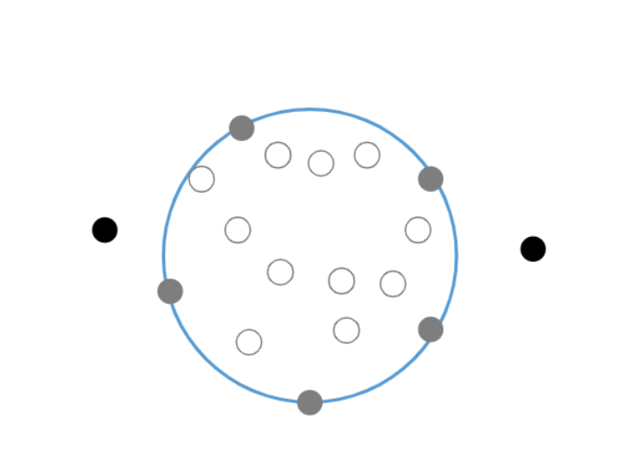
```

$$
{\|x_i-a\|}^2 < R^2\rightarrow\alpha_i=0,\gamma_i=0
$$

$$
{\|x_i-a\|}^2 = R^2\rightarrow0<\alpha_i<C,\gamma_i=0
$$

$$
{\|x_i-a\|}^2 > R^2\rightarrow\alpha_i=C,\gamma_i>0
$$

- 첫 번째 case는 그림에서 하얀 동그라미이다. object와 중심 a와의 거리가 반지름 R보다 작기 때문에 모두 hypersphere안에 들어가게 되고, 따라서 constraints에 대한 penalty도 모두 0이다. 
- 두 번째 case는 그림에서 회색 동그라미이다. object와 중심 a와의 거리가 반지름 R과 같기 때문에 object가 hypersphere 위에 있는 경우이다. 
- 세 번째 case는 그림에서 검은색 동그라미인데 중심 a와 object의 거리가 R보다 크기 때문에 object가 hypersphere 바깥에 있는 경우이다. 

이 세 가지 case 중 $\alpha_i>0$를 만족하는 두 번째, 세 번째 case가 support vector라고 불리는 것들이다.  

object z를 test하기 위해서 이 z와 구의 중심 간의 거리를 계산하는 것이 필요하다. 이 z는 그 거리가 반지름보다 작거나 같을 때 정상범주로 받아들여진다. 따라서 식으로 표현하면 다음과 같다. 

$$
{\|z-a\|}^2=(z\cdotp z)-s\sum_i\alpha_i(z\cdotp x_i)+\sum_{i,j}\alpha_i\alpha_j(x_i\cdotp x_j)\leq R^2
$$

$R^2$는 구의 중심과 boundary사이의 거리이고, support vector 중에 description 밖으로 동떨어진 것들은 제외된다. 따라서 다음 식과 같이 표현할 수 있다.

$$
R^2=(x_i\cdotp x_k)-2\sum_i\alpha_i(x_i\cdotp x_k)+\sum_{i,j}(x_i\cdotp x_j)
$$

위 식들을 보면 $x_i$가 $(x_i\cdotp x_j)$와 같이 다른 object와 내적의 형태로 나타나는 것을 볼 수 있는데 이 내적을 커널함수로 대체하면 더 유연한 방식을 얻을 수 있다. 

## SVDD with negative examples

target(normal)이 sphere 내부에 있는 example이라면 반대로 negative example은 sphere의 외부에 있는 exmaple을 가리킨다. negative example이 사용가능하다면 description 향상을 위해 학습에 포함될 수 있다. 앞서 잠시 설명했던 것처럼 단순히 class들 사이의 구분을 하는 Support Vector Classifier와는 다르게 SVDD는 target범주에 대해 boundary를 얻는다. 따라서 Support Vector Classifier는 어떤 class에도 속하지 않는 outlier를 찾아내지 못한다. 

식을 통해 negative example을 이용한 SVDD를 설명해 보자. target(normal) object의 지수는  $i,j$, negative example의 지수 $l,m$, 그리고 target object의 라벨은 $y_i=1$, outlier object의 라벨은 $y_l=-1$이라고 하자. 마찬가지로 target과 outlier에 대한 error를 각각 $\xi_i$, $\xi_l$이라고 한다. 그러면 목적함수는 다음과 같다. 조금 더 아웃라이어의 분포 형태를 고려한 튜닝을 추가하게 된다.

$$
F(R,a,\xi_i,\xi_l)=R^2+C_1\sum_i\xi_i+C_2\sum_l\xi_l
$$

그리고 constraints은 다음과 같다.

$$
{\|x_i-a\|}^2\leq R^2+\xi_i,\quad {\|x_l-a\|}^2\leq R^2+\xi_l,\quad \xi_i\geq 0,\xi_l\geq 0
$$

마찬가지로 앞에 보았던 것처럼 이러한 constraints를 라그랑주 승수법을 통해 표현하면 다음과 같다. 

$$
\begin{aligned}
L(R,a,\xi_i,\xi_l,\alpha_i,\alpha_l,\gamma_i,\gamma_l)&=R^2+C
_1\sum_i\xi_i+C_2\sum_i\xi_l-\sum_i\gamma_i\xi_i-\sum_i\xi_l\gamma_l \\
&\quad-\sum_i\alpha_i[R^2_xi_i-{(x_i-1)}^2]-\sum_l\alpha_l[{(x_l-a)}^2-R^2+xi_l]
\end{aligned}
$$
여기서 $\alpha_i\geq 0,\alpha_l\geq 0, \gamma_i \geq 0, \gamma_l \geq 0$ 이다. 

미분을 하면 다음과 같은 결과를 얻는다. 

$$
\sum_i\alpha_i-\sum_l\alpha_l=1
$$

$$
a=\sum_i\alpha_ix_i-\sum_l\alpha_lx_l
$$

$$
0\leq \alpha_i \leq C_1,0\leq \alpha_l \leq C_2
$$

이 결과들을 라그랑주 승수법으로 표현한 식에 대입하면 다음과 같다. 

$$
L=\sum\alpha_i(x_i\cdotp x_i)-\sum\alpha_l(x_l\cdotp x_l)-\sum_{i,j}\alpha_i\alpha_j(x_i\cdotp x_j)+2\sum_{l,j}\alpha_l\alpha_j(x_l\cdotp x_j)-\sum_{l,m}\alpha_l\alpha_m(x_l\cdotp x_m)
$$

$\acute{\alpha_i}=y_i\alpha_i$라는 새로운 변수를 정의할 때,(여기서 i는 이제 target과 outlier모두에 해당하는 지수) negative example을 이용한 SVDD는 앞에서 구한 일반적인 SVDD와 같아진다는 것을 알 수 있다. $\acute{\alpha_i}=y_i\alpha_i$라고 하면 $\sum_i\alpha_i-\sum_l\alpha_l=1$은 $\sum_i\acute{\alpha_i}=1$이 되고, $a=\sum_i\alpha_ix_i-\sum_l\alpha_lx_l$은 $a=\sum_i\acute{\alpha_i}x_i$가 되기 때문이다.

```{r figure5, echo=FALSE, fig.align='center', out.width = '50%'}
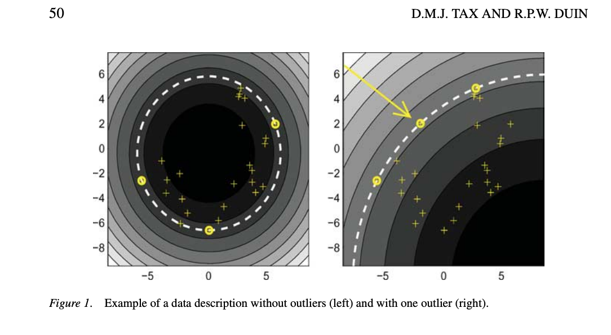
```

이 그림에서 흰색 점선은 boundary를 나타내고, 노란색 동그라미는 boundary위에 있는 support vector이다. 회색이 진해질 수록 원점에서 가깝다. 오른쪽과 왼쪽의 그림은 모두 같은 데이터셋을 표현한 것인데 오른쪽의 그림에서는 하나의 outlier object(화살표가 가리키고 있는 부분)로 확장한 그림이다. 이 outlier는 왼쪽 그림에서는 안쪽에 위치하고 있다. 오른쪽 그림에서 이 outlier는 reject되도록 계산되어야 하고, 왼쪽 그림의 description에서 살짝 조정을 했더니 이 outlier가 boundary 위에 위치하게 되었다. 이것은 outlier class인 support vector인데 target class인 support vector와 구분되지 않는다. 앞에서 어떤 z라는 object를 test할 때의 식을 생각해 보면  ${\|z-a\|}^2=(z\cdotp z)-s\sum_i\alpha_i(z\cdotp x_i)+\sum_{i,j}\alpha_i\alpha_j(x_i\cdotp x_j)\leq R^2$ 이  식에서 object가 boundary 위에 있을 때도 정상범주라고 받아들여지기 때문이다. 이 description이 화살표가 가리키는 이 outlier를 reject하도록 조정되더라도 다른 target set을 핏하게 감싸지는 못한다. 이 데이터셋이 바나나 모양으로 생성이 되었는데도 boundary는 원형으로 감싸고 있기 때문이다. 따라서 더 유연한 description이 필요하다. 

## Kernel funciton

더 유연한 data description이 요구될때, $\mathbf{x}$를 고차원의 입력공간 $\Phi(\mathbf{x})$으로 매핑해 사용할 수 있다. 이 경우,  벡터간의 내적 $(\mathbf{x_i} \cdot \mathbf{x_j})$은 새로운 내적  $\Phi(\mathbf{x_i})\Phi(\mathbf{x_j})$으로 바뀐다. SVM과 마찬가지로 $\Phi(\mathbf{x_i})\Phi(\mathbf{x_j})$는 Kernel trick을 통해 내적공간의 함수 $K(\mathbf{x_i},\mathbf{x_j})$로 간단하게 표현될 수 있다. 

좋은 커널 함수는 target data를 구형으로 생긴 영역 안으로, outlier object를 영역 밖으로 표현하는 함수인데, 모든 함수가 다 잘 작동하지는 않는다. 두가지 커널 함수 Polynomial과 Gaussian에 대해 살펴보며 알아보자. 

### Polynomial

d차원의 Polynomial kernel은 다음과 같다. 

$$
\begin{aligned} 
K(\mathbf{x_i},\mathbf{x_j})=(\mathbf{x_i} \cdot \mathbf{x_j})^d
\end{aligned}
$$

$\mathbf{x_i} \cdot \mathbf{x_j} = cos(\theta_{ij})||\mathbf{x_i}||\cdot||x_j||$이기 때문에 polynomial kernel은 $(\mathbf{x_i} \cdot \mathbf{x_j})^d = cos^d(\theta_{ij})||\mathbf{x_i}||^d\cdot||x_j||^d$로 적을 수 있다. 그런데 만약 $\theta_{ij}$가 아주 작은 값을 가져 $cos(\theta_{ij})$가 거의 1이라면, $cos^d(\theta_{ij})||\mathbf{x_i}||^d\cdot||x_j||^d\simeq||\mathbf{x_i}||^d\cdot||x_j||$이다. 그런데 만약 데이터가 원점에서 아주 멀어 매우 큰 norm값을 갖게 되면 이 데이터가 다른 데이터의 영향력을 압도하며 큰 영향력을 미치게 된다. 이 문제는 데이터의 평균을 0, 분산을 1로 만들어 완화시킬 수 있는데, 이렇게 단위 분산으로 만들어줄 경우 오히려 noise를 확대시키고 norm의 영향을 상쇄하지 못해 의미가 없다. centering만 하는 것 역시 norm의 영향을 해결하지 못한다.  

```{r, echo = FALSE, fig.cap = 'Example of Polynomial Kernel', fig.align='center', out.width='80%'}
knitr::include_graphics('polynomial.jpg')
# Polynomial Kernel
```

위와 같은이유로 polynomial kernel에서 원점과 가장 멀리 떨어진 데이터가 항상 support vector가 되고, target object가 없는 영역이 커진다. 

### Gaussian

$$
\begin{aligned} 
K(\mathbf{x_i},\mathbf{x_j})=\exp(-\frac{||\mathbf{x_i}-\mathbf{x_j}||^2}{s^2})
\end{aligned} 
$$

Gaussian kernel은 데이터 사이의 거리만을 이용하기에 위치와 독립적이다. 또, Gaussian kernel에서 각 데이터들은 unit norm vector로 mapping되기에 ($\Phi(\mathbf{x_i})\Phi(\mathbf{x_j})=1$) norm의 영향은 받지 않고, 벡터 사이의 각도만이 영향을 주게 된다. 

```{r, echo = FALSE, fig.cap = 'Example of Gaussian Kernel ', fig.align='center', out.width='70%'}
knitr::include_graphics('gaussian.jpg')
# Gaussian Kernel
```

Gaussian kernel에서 s의 값이 작으면 support vector의 개수가 늘어나며 wiggly한 형태를 갖지만, s가 커질수록 support vector의 개수는 늘어난다. 또, C가 커질수록 $\xi_i$에 가해지는 penalty가 크기에 구의 반경이 커지고, support vector의 개수는 줄어든다. 

## Target error estimate

target분포로 부터 나온 데이터가 description의 경계 밖에 있는 경우, 이를 error라고 한다. 우리는 Leave One Out estimation을 이용해 support vector의 개수가 error의 지표가 됨을 보일 수 있다. 


 - 만약 경계 안쪽의 데이터 ($\alpha_i=0$)를 제외하여 description을 다시 계산할 경우, 데이터를 제거하기전과 동일한 description이 만들어 지면서 제외된 데이터는 description의 경계 내에 속하게 된다.

 - description의 경계를 만드는데 꼭 필요한 support vector를 essential support vector라고 하는데, 만약 essential support vector가 아닌 support vector($\alpha_i<C$)를 제거하여 경계를 계산하면 제거하기 전과  동일한 description 경계가 계산된다. 
 - 만약 description에 꼭 필요한 essential support vector($\alpha_i<C$)를 제외하면 더 작은 description 경계를 갖게 되고, 제외된 essential support vector는 경계의 바깥에 놓이게 된다. 
 - $\alpha_i=C$인 support vector들은 이미 경계 밖에 있기에 이들을 제거하여 다시 계산해도 동일하게 outlier로 분류될 것이다. 
 
따라서 support vector의 개수와 error의 개수는 target set에 대한 leave one out estimate가 된다. 

$$
\begin{aligned} 
E_{LOO} \leq\frac{\# SVs + \#\:errors} {N}
\end{aligned} 
$$

이 식에서 등호는 모든 support vector가 essential support vector일때 성립한다. 
이러한 target error에 대한 estimate는 패널티와 관련된 파라미터인 C와 gaussian kernel에서의 파라미터인 s를 최적화하는데 사용될 수 있다.  

# Experiment

SVDD의 특징들을 실험을 통해 보여주는 부분이다. 논문에서는 3. SVDD Characteristics & 4. Experiment인데, 그냥 실험부분으로 묶었다.

## Numbers of Support vectors

```{r, echo = FALSE, fig.cap = 'Numbers of Support Vector', fig.align='center', out.width='70%'}
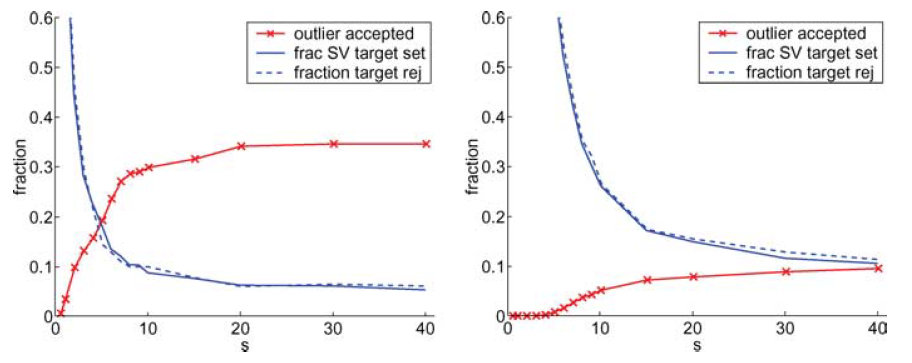
```

충분히 적절한 데이터 구조에 대한 묘사(Sufficiently Accurate description)을 위해서는 얼마 만큼의 데이터가 필요할까? 이는 우리의 데이터의 형태나 아웃라이어의 underlying distribution에 의존할 수 밖에 없어서 명확하게 말하기는 어렵지만, 구형의 데이터를 가정할 경우 하한은 정의될 수 있다. 이전에 SVM을 다룰 때, $d$ dimension에서는 $d+1$ 개의 데이터를 shatter할 수 있다고 했다. 이것과 아마 관계되는 것 같은데, 결국 $d$ 차원에서는 $d+1$ 개의 support vector가 최소의 개수로 만들어질 수 있다. 근데 이것은 2차원 상에서는 맞는데, 고차원에서는 $d+1$보다 작은 개수를 가지는 것으로 보인다. 논문에 관련된 정확한 내용이 없기 때문에 , 중요한 것은 support vector 개수의 하한을 정의할 수 있다는 것!

s를 키우면 가우시안 커널의 분산이 커지면서 거의 원형에 가까운 형태가 나타나게 된다. 그래프를 보게 되면, s가 커짐에 따라 파란선과 빨간선 모두 수렴하는 형태를 지니는 것을 확인할 수 있다. s가 증가함에 따라 target(normal)에서는 support vector의 개수가 줄어들게 되고, outlier들은 normal의 범주 안으로 들어오게 된다. 결국에 서포트 벡터의 개수가 줄어들어서 최소 개수의 서포트벡터로 수렴하는 것이다.

다음의 표는 시뮬레이션에 대한 표이다. 데이터를 가우스, 바나나, 타원 형태로 생성을 한다. 변수개수가 늘어났을 때, 필요한 서포트 벡터 개수의 하한을 표현한 표이다. 차원을 늘리면 늘릴수록 필요한 서포트 벡터가 늘어나기 때문에 결국에 더 많은 데이터가 필요함을 보여준다고 이해할 수 있다.

```{r, echo = FALSE, fig.cap = 'Numbers of Support Vector2', fig.align='center', out.width='70%'}
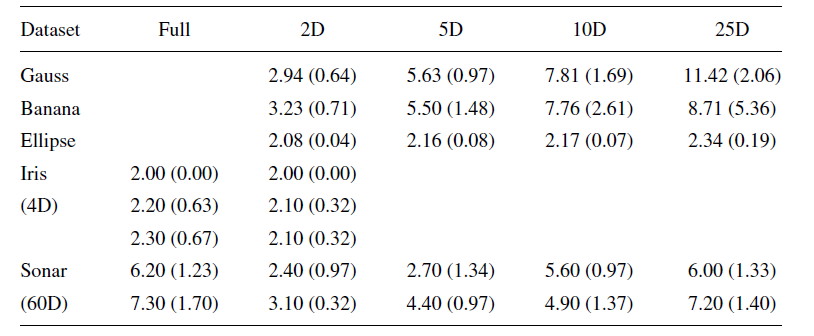
```

## Training with outliers

이런 one-class learning을 만약에 classification 문제로 바라보면 어떻게 될까? 결국에 성능 문제에 있어서 분류문제와 이상치 탐지 문제를 비교하는 파트를 담고 있다. 아래 표는 분류 알고리즘으로는 나이브베이즈, parzen classifier, SVC with 3-polynomial을 사용했고, 이상치 탐지로는 SVDD, SVDD with 3-polynomial를 사용했다. 그래서 그 결과를 보면 다음과 같다.

```{r, echo = FALSE, fig.cap = 'Classification and anomaly detection', fig.align='center', out.width='70%'}
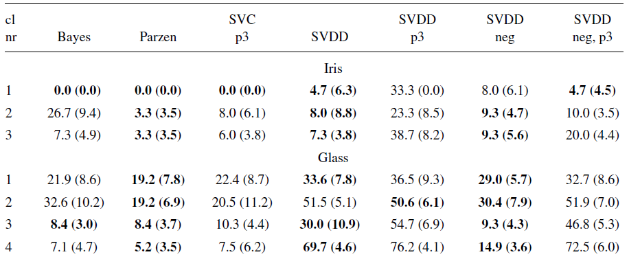
```

3번째를 기준으로 이제 알고리즘의 특성이 나누어지는데, 성능 차이가 현격한 것은 확인할 수 있다. 결국 우리 문제를 classification으로 바라볼 수 있다면, 분류문제로 푸는게 성능 측면에서 더 좋다고 이해할 수 있다. 실제로 극심한 class imbalance의 경우에도, 100000:1000과 같이 적은 범주의 데이터가 sampling이라던지 다른 방법으로 충분히 데이터의 구조를 파악하고 해결해줄 수 있다면 이는 분류문제로 다루는 것이 좋다. 같은 비율 1000:10의 경우에는 이제 적은 범주의 데이터가 10개 밖에 안되므로 이런 경우에는 outlier의 underlying distribution을 파악하는 것이 어렵기 때문에 이상치 탐지로 해결하는 것이 적절하다. 그리고 저 예시에서는 SVDD(Gaussian Kernel)을 사용하는 것이 일반적으로 좋다는 것을 확인할 수 있다.

## Comparison with Other Methods

다른 이상치 탐지 알고리즘에 대해 SVDD 성능의 우수성을 보여주는 부분이다. 시계열 특성을 지니는 spectrum 데이터에 대한 이상치 탐지를 여러 데이터셋에 대해 시행했다. 알고리즘은 Gaussian, Mixture Gaussian, Parzen density, KNN, SVDD를 사용했다. 결과에 대한 시각화를 보면 다음과 같다.

```{r, echo = FALSE, fig.cap = 'Comparison 1', fig.align='center', out.width='70%'}
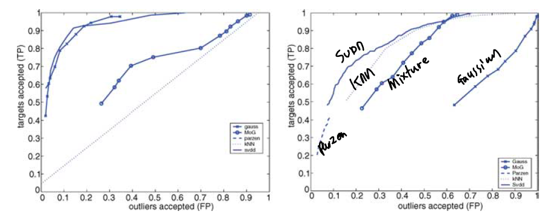
```

ROC curve를 보게 되면 SVDD가 다른 모델보다 성능이 좋은 것을 확인할 수 있다.

```{r, echo = FALSE, fig.cap = 'Comparison 2', fig.align='center', out.width='60%'}
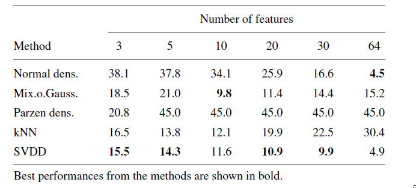
```

표를 통해 보아도 비슷한 결과를 확인할 수 있다. 변수 개수가 많던지 적던지 좋은 성능을 보여주고 있다.

```{r, echo = FALSE, fig.cap = 'Comparison 3', fig.align='center', out.width='70%'}
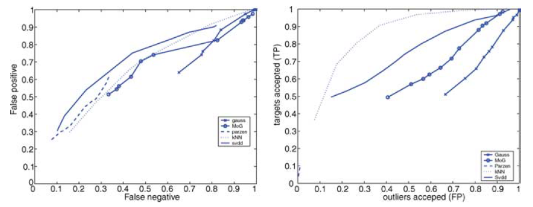
```

이 경우에는 SVDD의 성능이 KNN보다 좋지 않은 것을 확인할 수 있다. 물론 2등은 하고 있다. 이 데이터는 데이터들이 다른 데이터들에 비해 밀집도가 높은 데이터였다고 한다. 그 결과 SVDD는 sparse하고, complex(like banana)한 데이터에 더 좋은 성능을 보여준다고 논문은 말하고 있다.

# Conclusion

- SVDD는 확률적으로 구분하거나, 밀도를 이용하는 것이 아니라 경계를 구분하는 알고리즘이다.
- Kernel을 통해 flexible boundary를 만들 수 있다.
- polynomial kernel보다는 gaussian kernel이 일반적으로 더 좋다.
- 또한 error나 numbers of supprot vector에 대한 이론적인 정의를 할 수 있으므로, 대충 튜닝 때려박는 것보다 이해하고 튜닝하는 것이 가능하다.
- sparse & complex한 구조의 데이터에 더 좋은 성능을 발휘한다.


