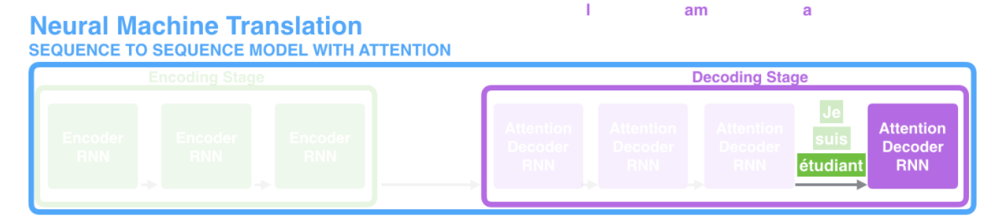
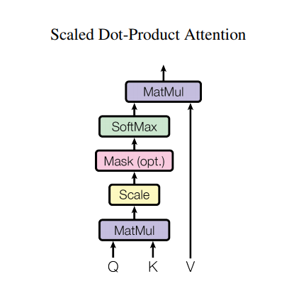
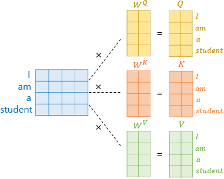
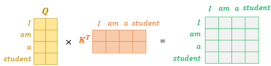

```{r setup, include=FALSE}
knitr::opts_chunk$set(echo = TRUE)
```

본 내용은 'Attention is all you need' 논문을 기반으로 만들었다. 해당 논문이 담고 있는 내용과 더불어서, 기존 seq2seq 모델이 지닌 한계와 Transformer를 위한 기본적인 개념들에 대해 소개하고, Transformer 모델의 구조와 특징들에 대해 설명하려 한다.

# Prerequisite

Transformer 모델에 대해 설명하기 전에, 이 모델에서 기본적으로 사용하는 Layer normalization과 Residual Connection에 대해 알아보려 한다. 더불어서 Seq2seq 모델과 attention에 대해 기본적으로 알아보겠다.

## Layer Normalization

### Batch Normalization

다들 Batch Normalization은 들어보았지만, Layer Normalization은 잘 모를 수 있다. 먼저 Batch Normalization(BM)에 대해 간단히 설명하려 한다. BM은 신경망의 각 layer에 들어가는 input을 batch 단위의 평균과 분산으로 정규화해 학습을 효율적으로 만드는 방법이다. 이런 BM은 신경망의 각 층마다 입력값의 분포가 달라지는 현상인 Covariate Shift 현상을 없애기 위해 제안되었다. 

하지만 BM 같은 경우 다음의 단점이 존재한다.

1) Mini-Batch 크기에 의존적이다.
  - 극단적으로 mini-batch 크기가 1이면 분산이 없어서 normalizing이 안된다.
  
2) Recurrent 기반 모델에 적용이 어렵다. 
  - 기존의 Feed-Forward 형태의 신경망에서는 그냥 각 배치별 입력값의 형태가 동일하기 때문에 normalize할 때 아무런 문제가 없었다. 하지만 Recurrent 기반의 모델의 입력값은 기본적으로 sequence다. 그렇다면 BM을 적용하기 위해서는 매 time-step마다 별도의 통계량(평균, 분산)을 저장해야 하고, 이는 모델을 훨씬 복잡하게 만든다.
  
### 둘의 차이

그래서 Layer Normalization이라는 방법을 도입하게 되는데, BM과 LM의 차이를 논문의 표현을 빌려와서 말하면, 다음과 같다.

- Batch Normalization: Estimate the normalization statistics from the summed inputs to the neurons **over a mini-batch of training case**
- Layer Normalization: Estimate the normalization statistics from the summed inputs to the neurons **within a hidden layer**

아래의 그림은 BM과 LM의 차이를 직관적으로 잘 표현해준다. LM을 이처럼 batch 단위가 아니라 input을 기준으로 평균과 분산을 계산하게 된다.

```{r, echo = FALSE, fig.cap = 'BM versus LM', fig.align='center', out.width='80%'}

```

### LM의 특징

mini-batch 단위가 아닌 위와 같은 방법으로 normalization을 시행하면 어떤 특징을 지닐까?

```{r, echo = FALSE, fig.cap = 'LM example', fig.align='center', out.width='90%'}
knitr::include_graphics('pic/LM_ex.png')
```

1) 데이터마다 각각 다른 normalization term($\mu$, $\sigma$)를 갖는다.
1) mini-batch 크기에 영향을 받지 않는다. (size=1 이어도 작동)
1) 서로 다른 길이를 갖는 sequence가 batch 단위의 입력으로 들어오는 경우에도 적용할 수 있다. (1번의 특징 때문)

일반적인 RNN 모델에서는 많은 time-step을 거칠 때 gradient가 explode 또는 vanish하는 현상이 발생한다. 그러나 LM이 적용될 경우, layer의 input의 scale에 영향을 받지 않기 때문에, 안정적인 학습이 진행된다.

[참고블로그](https://youngerous.github.io/)

## Residual Connection

### 형태

Residual Connection이란 ResNet 모델에서 나온 개념으로, 비선형 함수의 결과에 기존 인풋을 더해주는 방법이다. 이 구조가 정확히 어떤 이유에서 잘 되는지는 알 수 없지만, Ensemble과 같은 효과를 낸다고 한다.... 이는 Vanishing Gradient 문제에도 도움이 되어서, 더 깊은 신경망을 학습할 수 있도록 해준다.

```{r, echo = FALSE, fig.cap = '', fig.align='center', out.width='70%'}

```

다음과 같이 $f(x) + x$와 같은 형태로 연산을 하기 때문에, 추가적인 parameter나 계산복잡도를 요구하지 않으면서도 좋은 효과를 보인다. 간단한 예시로 단순히 $f(x)$일때 이에 대해 층이 깊어질 경우 gradient가 사라질 수 있지만, 이런 $f(x)+x$ 구조에서는 최소한 1의 gradient가 보장되기 때문에 안정적인 학습이 가능해진다는 장점이 있다.

transformer의 인코더 구조에서는 임베딩 벡터에 포지셔널 인코딩 벡터를 더해주는 식으로 학습이 진행된다. 이런 위치정보를 지닌 포지셔널 인코딩 벡터는 역전파과정에서 기울기가 소실될 수 있기 때문에, 포지셔널 인코딩 벡터를 어텐션 레이어를 스킵하고 다음 레이어로 보내게 된다. 이런 residual connection 이후 바로 layer normalization 과정이 일어나게 된다. 이부분을 뒤에서 설명하기에는 상대적으로 간단하기 때문에 앞에서 미리 다루고 간다.

### Why Residual?

그냥 단순히 $f(x)+x$의 형태로는 이게 왜 residual이라는 이름이 붙었는지 가늠하기 어렵다. 그래서 이에 대한 내용을 간단히 추가설명하려 한다.

뉴럴넷은 기본적으로 x를 y로 매핑하는 함수 $h(x)$를 찾는 것이 목적이기 때문에, $h(x)-y$를 최소화하는 방향으로 학습을 진행하게 된다. 근데 예를 들어 강아지 사진이면 1, 아니면 0을 내는 분류 문제라고 하자. 이 경우 타겟 $y$는 $x$를 대변해서 $y$와 $x$의 의미가 같게끔 매핑되어야 한다. 즉 어떤 강아지 사진이 주어지면 $y=1$해서 학습하는게 아니라, 강아지 사진의 픽셀값인 $x$로 $y$를 매핑해야 한다. 따라서 네트워크의 출력값은 $y$가 아니라 $x$가 되게 되고, $h(x)-x$를 최소화하는 방향으로 학습하게 된다. 그래서 이 $h(x)-x = f(x)$라는 변환만 거쳐주면 우리가 앞에서 다뤘던 $f(x)$와 동일한 형태가 되게 된다. 그래서 이런식으로 잔차를 학습하는 방법으로 Residual Learning이라 한다.

그래서 $f(x)+x$를 해주게 되면, 뉴럴넷의 아웃풋이 x가 되도록 매핑하는 것이 아니라, 뉴럴넷의 아웃풋은 0이 되지만 마지막에 $x$를 더함으로써 최종아웃풋이 x가 된다! Residual learning 자체로는 Vanishing Gradient를 해결하지 못했지만, x를 더함으로써 각 레이어의 그래디언트의 최소값은 1이 된다.

## Seq2Seq

```{r, echo = FALSE, fig.cap = 'encoder decoder', fig.align='center', out.width='80%'}

```

Recurrent Neural Network에서 many-to-many 구조를 지니는 대표적인 모델인 Seq2seq에 대해 다룬다. 후에 다룰 transformer 전에 seq2seq 구조와 attention에 대해 알아야 transformer 구조의 필요성을 알 수 있기 때문에 이를 먼저 가볍게 다루도록 하자.

여기서 다루는 시각화 사진들은 모두 Jay Alammar의 [블로그](http://jalammar.github.io/)에서 가져왔다

### Seq2seq의 구조

Seq2seq는 이렇게 앞부분의 입력을 받는 인코더(Encoder)와 출력을 담당하는 디코더(Decoder)로 나누어진다. 인코더에서는 입력정보를 처리하고 저장하고, 디코더 부분에서는 출력을 생성한다고 생각하자. 인코더의 입력 정보를 잘 압축한 하나의 문맥 벡터(Context Vector)를 디코더로 전해주면, 디코더는 이 문맥벡터를 통해 출력을 생성하게 된다.

```{r, echo = FALSE, fig.cap = 'Context Vector', fig.align='center', out.width='80%'}

```

여기서 RNN구조가 각각의 인코더와 디코더를 구성하게 된다. RNN 까먹지 않았죠?

$$
\vspace{10\baselineskip}
$$

```{r, echo = FALSE, fig.cap = 'RNN', fig.align='center', out.width='70%'}

```

이게 바로 seq2seq고, 무한 시각화로 이해해보자. 

```{r, echo = FALSE, fig.cap = 'seq2seq', fig.align='center', out.width='90%'}
knitr::include_graphics('pic/seq2seq.png')
```

각각의 rnn을 거치면서 hidden vector가 만들어질 것이고, 최종적으로 인코더에서 나오는 히든 벡터가 문맥(Context) 벡터가 되어 디코더에 전해지게 된다. 

하지만 직관적으로 알 수 있듯이, 이런 RNN 구조를 이용할 경우 문맥벡터안에서 초기 입력값이 가지는 영향력은 거의 없다시피하는 Vanishing Gradient 문제가 발생한다. 그래서 이 RNN을 LSTM, GRU로 바꿔주게 된다. 이렇게 되면 비교적 장기종속성이 완화되지만, 여전히 Vanishing Gradient로부터 자유롭지 못하다. 여전히 context vector는 마지막 인코더 블락을 통과하고 나온 하나 밖에 없기 때문이다.

```{r, echo = FALSE, fig.cap = 'I am a student', fig.align='center', out.width='90%'}

```

위의 시각화처럼, 간단한 번역의 예시를 생각해보자. etudiant와 student가 같은 의미를 지녀서 대응되게 번역된다고 가정할 때, 입력의 순서는 유의미해진다. 따라서 이 뒤에 있는 입력일수록, 뒤의 디코더가 student를 잘 뱉어낼 수 있도록 매칭시켜주는 작업이 필요하고, 이것이 바로 Attention이다.

### Attention

Seq2seq에서 Attention은 어렵지 않게 이해할 수 있다. 기존에는 인코더의 마지막 블락에서 나온 히든 벡터 하나만을 문맥벡터로 가져왔다. 반면에 attnetion을 더하게 되면, 인코더의 모든 블락에서 히든 벡터를 저장해둔다. 그리고 이 모든 히든벡터를 디코더로 전달한다.

```{r, echo = FALSE, fig.cap = 'attention', fig.align='center', out.width='90%'}

```

그래서 각각의 디코더 블락이 만들어내는 히든벡터와, 인코더 블락에서의 히든벡터(h4)간의 유사도들을 계산한다. 그래서 그 점수(Score)를 계산하면, 이를 softmax에 태워서 일종의 가중치로서 만들어낸다. 이 가중치로 인코더블락의 히든벡터의 가중합 벡터를 만들어내고, 이 벡터가 문맥벡터(c4)로 기능하게 된다.

```{r, echo = FALSE, fig.cap = 'attention mechanism 1', fig.align='center', out.width='70%'}

```

이 문맥벡터와 히든백터를 붙이고, feed-forward에 태워서 기존과 동일한 차원의 벡터를 만들어(출력해)낸다. 그리고 이 출력된 벡터가 다음 디코더 블락에서 인풋으로 작용해서 이 과정을 이어나간다. 다시 한 번 시각화로 이해하자.

```{r, echo = FALSE, fig.cap = 'attention mechanism 2', fig.align='center', out.width='80%'}
knitr::include_graphics('pic/attention_mec2.png')
```

$$
\vspace{10\baselineskip}
$$

인코더의 hidden state와 디코더에서의 hidden state의 유사도를 계산한 결과는 다음과 같다. 이런 어텐션 매커니즘을 통해 유사한 단어간의 대응이 되는 것을 확인할 수 있고, 'a'같이 대응이 어려운 단어들에 대해서는 여러 단어들과 유사하게 나오는 것을 확인 가능하다.

```{r, echo = FALSE, fig.cap = '', fig.align='center', out.width='80%'}

```

### 단점

이렇게 attention을 seq2seq에 적용하더라도 여전히 문제는 남아있다. 이렇게 시퀀셜한 구조를 가지고 학습하는 것은 엄청난 계산 비용을 유발한다. 안그래도 많은데, attention까지 적용해야하니까... transformer는 입력구조가 이렇게 sequential하지 않기 때문에 학습측면에서 훨씬 효율적이다. 앞으로 트랜스포머에 대해 다뤄보자.

# Transformer

## 한계와 제안

### 기존 어텐션 모델의 한계

기존 어텐션 모델이나 Seq2Seq 모델이 가지는 한계는 분명했다.  

1. Seq2Seq 모델은 인코더를 통해 압축한 정보를 디코더에 전달함으로써 입력 정보의 일부(주로 초기 시점의 정보들)이 제대로 전달되지 않는다.
2. 어텐션 메카니즘을 통해 이러한 한계를 보완하고자 했으나, 여전히 순차적으로 계산하여 병렬 처리가 불가능했다. 

### 트랜스포머 모델 제안 

```{r, echo = FALSE, fig.cap = 'Transformer Structure', fig.align='center', out.width='70%'}
knitr::include_graphics('pic/jaehee1.png')
```

해당 논문에서는 순차적 계산을 해결하기 위해 시간적 변수를 positional encoding을 통해 구현한 트랜스포머 모델을 제안했다. 

이 모델은 인코더와 디코더 모두 병렬처리가 가능한 Multi-Head Attention을 사용하여 병렬처리가 가능하면서도 각 시점의 정보를 충분히 반영할 수 있다는 장점을 가지고 있다. 모델 구조에 대해 다음과 같은 순서로 설명해보겠다. 

1. 입력값 (Q, K, V 벡터 얻기) 
2. Encoder 
  2-1.Scaled Dot-Product Attention 
  2-2 Multi-head Attention
3. Decoder 

## 입력값(Q, K, V 벡터 얻기)

자연어 처리에서 흔히 사용하는(거의 100% 사용하는) 입력값은 임베딩 벡터입니다. 임의의 차원으로 각 단어(token)을 배정하여 분산 표상을 구현하는 것입니다. 트랜스포머 논문 역시 여기서 크게 벗어나지는 않습니다. 하지만 어텐션을 기반으로 하는 모델이기 때문에 Query, Key, Value 벡터가 필요합니다. 이를 위해 아래 그림과 같이 하나의 임베딩 벡터로부터 가중치를 곱하여 각각의 벡터를 얻게 됩니다. 

```{r, echo = FALSE, fig.cap = 'Query Key Value', fig.align='center', out.width='80%'}
knitr::include_graphics('pic/jaehee2.png')
```

위 그림에서 student라는 하나의 단어는 4차원의 임베딩 벡터를 가집니다. 하지만 어텐션 메커니즘은 하나의 단어가 3개의 역할을 가지게 됩니다. 어텐션 메커니즘에서 비교하기 위해 사용되는 Query와 Key, 그리고 Key에 해당하는 값인 Value가 그 역할들입니다. 그리고 이를 위해 가중치를 곱하여 각각의 벡터를 생성하게 됩니다. 

$$
\vspace{8\baselineskip}
$$

## Encoder

트랜스포머는 weighted sum을 사용합니다. (각 단어의 중요도) X (각 단어의 임베딩 벡터)를 사용하여 출력값을 얻는데 이용합니다. 그리고 인코더는 각 단어의 중요도를 계산하는데 사용됩니다. 

```{r, echo = FALSE, fig.cap = '', fig.align='center', out.width='40%'}
knitr::include_graphics('pic/jaehee3.png')
```

인코더는 위와 같은 인코더 셀이 6개가 순차적으로 겹쳐져 있습니다. 그리고 하나의 인코더 층은 Multi-head Self-Attention과 Position-Wise FFNN으로 구성된 두개의 sublayer로 구성되어 있습니다. 

## Self-Attention

인코더에서 사용되는 Multi-head Self-Attention 중 Self-Attention의 개념을 먼저 살펴보겠습니다. 

Self-Attention은 하나의 입력값을 이용해 각 단어를 고려할 때 다른 단어의 중요도를 측정하는 것이라고 할 수 있습니다. 만약 The boy becomes a hansome man. 이라는 문장이 있다면 man이라는 단어의 뜻을 알기 위해서는 boy라는 단어가 중요하게 작용할 것 입니다. 이렇듯 각각의 단어마다 다른 단어가 의미를 파악하는데 얼마나 중요하게 작용하는지 측정하는 것이 Attention 입니다. 그리고 이때 비기준이 되는 단어를 Q, 비교되는 단어를 K라고 합니다. 만약 Q, K, V가 모두 같은 입력값에서 만들어졌다면, Self-Attention이라고 합니다. 

```{r, echo = FALSE, fig.cap = '', fig.align='center', out.width='45%'}

```

### Scaled-dot Product Attention

Self-Attention의 전체 구조는 다음과 같습니다. Q와 K를 행렬 곱합니다. 이는 각 단어마다 내적하는 것과 같습니다. 이를 통해 각 단어 간 유사도를 측정하고 비슷한 단어는 중요도가 높다고 할 수 있습니다. 이후 논문에서는 Q와 K의 차원 크기인 $d_k$가 너무 커지면 gradient를 최적화하기 힘들다고 판단하여 $\sqrt{d_k}$로 나누어 scaling해주게 됩니다. 그리고 이를 softmax 층에 통과시켜주면, Q에 나온단어가 어떤 단어에 더 집중해야 하는지 확률의 형태로 나타나게 됩니다.

이것을 행렬의 형태로 한번만 다시 살펴보겠습니다. 

```{r, echo = FALSE, fig.cap = '', fig.align='center', out.width='60%'}

```

우선 하나의 입력 문장에 대해 각각의 단어가 임베딩 벡터를 가지게 되므로, 좌측과 같이 입력값은 단어수x임베딩벡터차원의 행렬 모양이 됩니다. 그리고 이를 Q,K,V로 변환하기 위해 각각의 가중치를 행렬곱하게되어 Q,K,V를 만듭니다. 

```{r, echo = FALSE, fig.cap = '', fig.align='center', out.width='70%'}

```

Q와 K를 각각의 임베딩 벡터에 대해 내적해주어 각 단어 사이의 유사도 행렬을 만들어줍니다. 유사도 행렬은 행벡터를 이루는 단어가 각 coloumn의 단어에 대해 얼마나 집중해야할지 알기 위해 만든 행렬입니다. 그러므로 softmax 층을 통과시켜 확률의 형태로 만들어줍니다. 

```{r, echo = FALSE, fig.cap = '', fig.align='center', out.width='80%'}
knitr::include_graphics('pic/jaehee7.png')
```

softmax 층을 통과시켜 확률 분포의 형태로 만들어준 이후, 이 행렬과 V행렬을 곱해줍니다. 이를 통해 우리는 각 단어마다 다른 단어에 얼마나 집중해야 할지를 고려하여 정보를 종합할 수 있습니다. 여기서 한가지 고려할 것은 Q,K,V를 만들 때 일부러 본래의 입력값인 임베딩 벡터보다 차원수를 줄였다는 것입니다. 본래 입력 행렬이 $(seqlen, d_{model})$ 이라면 가중치 행렬이 $(d_{model}*d_k)$이므로 Q,K,V의 모양이 $(seqlen,d_k)$가 된 것입니다. 이렇게 만든 이유는 다음 Multi-head Attention에서 알 수 있습니다. 

### Multi-head Attention

그런데 하나의 어텐션 메커니즘을 사용하게 되면 하나의 시선으로만 보게 됩니다. The boy becomes a hansome man이라는 문장에서 boy가 man에 집중해야 할 수도 있지만, 어떻게 보면 handsome에 더 집중해야 할 수도 있습니다. 이는 encoder 층에선 결정할 수 없는 문제입니다. 이를 해결하면서 병렬처리가 가능하도록 해주는 것이 Multi-head Attention입니다. 이는 트리 기반 모델에서 앙상블을 하는 것과 비슷한 느낌입니다. 

```{r, echo = FALSE, fig.cap = '', fig.align='center', out.width='60%'}
knitr::include_graphics('pic/jaehee8.png')
```

위 그림은 encoder 층의 전체 구조를 multi head attention까지 포함하여 나타낸 것입니다. 이를 살펴보면 V, K, Q가 선형 층을 통과하고, h개의 Scaled Dot-Product Attention을 통과한 이후 concat한 이후 다시 선형 층을 통과하게 됩니다. 좀 더 자세히 살펴보자면 1개의 Scaled Dot-Product Attention을 통과할 경우 어텐션 층을 통과한 결과 값은 각 단어에 대한 확률 분포가 됩니다. 하지만 h개의 attention 층을 통과할 경우 h개의 확률 분포가 나오게 되고, 이를 선형 결합하여 하나의 확률 분포를 생성하게 됩니다. 이를 통해 다양한 시각에서 각 단어의 중요도를 평가할 수 있게 되고, h번의 병렬 연산이 가능해집니다. 

또한 앞의 Self-Attention에서 설명한 것처럼 일부러 Q,K,V의 차원 수를 줄인 이유도 여기에 있습니다. 차원수를 $(seqlen,d_k)$로 줄이고, 이를 Multi-head를 통해 n개의 head를 가지도록 하면 결국 Multi-head Attention의 출력값은 $(seqlen, d_k*n_{head})$가 됩니다. 만약 $n_{head}$를 $d_{model}/d_k$로 한다면 출력값의 형태가 $(seqlen, d_{model})$이 되어 입력값과 동일한 형태를 가지게 됩니다. 이 덕분에 인코더를 반복해서 쌓을 수 있게 됩니다. (논문에선 6개 쌓았습니다.)

$$
\vspace{3\baselineskip}
$$

## Decoder

디코더는 다음과 같은 구조로 되어 있습니다. 

```{r, echo = FALSE, fig.cap = '', fig.align='center', out.width='40%'}

```

첫번째 서브층에서는 각 단어의 임베딩 벡터라 할 수 있는 Q벡터를 생성합니다. 그리고 이렇게 생성된 Q벡터와 인코더 단에서 생성된  K,V벡터를 종합하여 출력값을 생성합니다. 하나씩 살펴보겠습니다. 

### Masked Multi-head Self-Attention 

기본적인 Multi-head Self-Attention의 구조와 동일합니다. 다만 다른 것이 있다면 Q벡터 생성과 연관이 있습니다. 우리가 rnn, lstm등을 구성할 때 가장 중요한 것은 이전 시점의 정보만 반영한다는 것입니다. 연속적으로 입력되는 자연어 데이터에서 이후의 데이터는 현재 시점에 고려될 수 없기 때문입니다. 하지만, 트랜스포머는 시계열 모델링을 하지 않습니다. 이로 인해 입력 데이터는 

```{r, echo = FALSE, fig.cap = '', fig.align='center', out.width='70%'}

```

위 그림과 같이 모든 정보를 가지게 됩니다. je suis estudiant에서 suis라는 단어를 파악할 때 estudiant는 아직 입력되지 않았기 때문에 고려될 수 없습니다. 하지만 Multi-head Self-Attention의 출력값은 그림과 같이 완전한 행렬의 형태이기 때문에 이것이 반영되어 있지 않습니다. 그래서 디코더 단에서는 해당 시점 이후의 정보들을 가리는 masking 작업을 수행합니다. 마스킹된 행렬은 다음과 같게 됩니다. 

```{r, echo = FALSE, fig.cap = '', fig.align='center', out.width='30%'}

```

$$
\vspace{5\baselineskip}
$$

### Multi-head Attention

이제 각 단어를 얼마나 고려해야 할 지에 대한 정보를 담은 encoder 단의 출력값과 각 단어의 정보를 담고 있는 decoder 단 내부의 Multi-head Self-Attention이 모두 준비되었습니다. 이를 종합하여 우리는 정보를 출력하면 됩니다. 이를 위해 encoder의 출력값과 decoder 단 내부의 값을 행렬곱합니다. 이를 통해 각 정보를 종합하게 됩니다. 

```{r, echo = FALSE, fig.cap = '', fig.align='center', out.width='70%'}

```

영어 -> 프랑스어 번역 문제에서 디코더 층 내부의 Q는 프랑스어, K와 V는 영어가 됩니다. 각각의 프랑스어 단어가 어떤 영어 단어의 영향으로 번역될 수 있는지 알아내야 하기 때문입니다. 

## Position-wise Feed-Forward Networks

```{r, echo=FALSE, fig.align='center', out.width = '50%'}

```

encoder와 decoder에서 각각 attention sublayer를 거치고 난 후, feed-forawrd network로 연결된다. 여기에서는 ReLU activation과 함께 2번의 linear transformation이 일어난다. 

```{r, echo=FALSE, fig.align='center', out.width = '50%'}


```

이렇게 먼저 선형변환이 일어난 후, ReLU를 적용하고, 다시 선형변환이 이루어진다. 

## Embedding and Softmax

다른 sequence transduction 모델들처럼 learned embeddings를 사용했다. 여기서 learned embedding이란 embedding값을 고정시키지 않고 학습을 하면서 embedding 값이 변경되는 것을 말한다. 

```{r, echo=FALSE, fig.align='center', out.width = '50%'}

```

decoder의 출력값을 다음 token의 확률로 바꾸기 위해 softmax함수를 적용한다. 

## Positional Encoding

transformer모델은 순차적으로 계산이 이루어지는 CNN이나 RNN을 사용하지 않기 때문에 순서 정보를 따로 넣어주어야 한다. 

```{r, echo=FALSE, fig.align='center', out.width = '50%'}

```

이렇게 encoder와 decoder stack의 밑부분에 Positional Encoding을 더해준다. 

```{r, echo=FALSE, fig.align='center', out.width = '70%'}

```

이때 각 단어의 embedding과 더해져야 하기 때문에 Positional Encoding은 각 단어의 embedding과 차원이 같은 벡터이다. 

Positional Encoding 방식은 여러가지가 있지만 논문에서는 사인/코사인 함수를 사용하였다. 인코딩에 사인/코사인 함수를 사용한 이유는 다음과 같은 조건들을 충족시키기 때문이다. 먼저 각각의 고유한 토큰 위치값은 유일한 값을 가져야 한다. 또한 서로 다른 두 토큰이 떨어져 있는 거리가 일정해야 한다. 그러니까, 첫 번째 토큰과 두 번째 토큰 사이의 차이는 두 번째 토큰과 세 번째 토큰의 차이와 같아야 한다는 것이다. 그리고 일반적으로 긴 길이의 문장들도 무난하게 표현해야 하며, 함수에 따른 토큰 위치의 값을 예측할 수 있어야 한다. 

사인/코사인 함수의 식은 다음과 같다. 

$$
PE_{(pos,2i)}=sin(pos/10000^{2i/d_{model}})
$$
$$
PE_{(pos,2i+1)}=cos(pos/10000^{2i/d_{model}})
$$

여기서 pos는 각각의 단어 번호이고 i는 각각의 단어의 embedding 값의 위치이다. 예를 들어 아래 그림에서 표시된 부분은 첫 번째 단어의 네 번째 embedding이다. 

```{r, echo=FALSE, fig.align='center', out.width = '70%'}

```

그림처럼 주기함수를 이용하여 각 단어의 상대적인 위치 정보를 네트워크에 입력하고 모델의 embedding에 더해준다. 

```{r, echo=FALSE, fig.align='center', out.width = '70%'}

```

이렇게 Positional Encoding을 통해 위치정보를 입력했을 때 두 단어 간의 거리가 input sequence 내에서 멀다면 그 두 단어의 positional encoding 사이의 거리도 멀어져야 한다. 위의 그림에서 볼 수 있듯이 바깥쪽일 수록, 그러니까 두 단어 사이의 거리가 멀 수록 두 단어의 positional encoding 사이의 distance가 커진다는 것을 확인할 수 있다. 

```{r, echo=FALSE, fig.align='center', out.width = '70%'}
knitr::include_graphics("pic/positional3.png")
```

앞서 본 그림은 10개의 단어를 10차원 embedding 했을 때의 Positional Encoding이다. 이것을 100개의 단어, 100차원으로 확장하면 위의 그림과 같다. 대각선은 당연히 0이 될 것이고, 노란색, 초록색 순으로 점점 커지는 것이다. 듬성듬성 거리 정보가 역전된 부분들도 있지만 큰 틀에서는 두 단어의 거리가 멀 수록 Positional Encoding 사이의 거리도 멀어진다는 것을 확인할 수 있다. 

## Why Self-Attention

먼저 Self attention이 무엇인지 살펴보자. Self attention은 매번 입력 문장에서 각 단어가 그 문장의 다른 어떤 단어와 연관성이 어떠한지 계산하는 과정이다.

```{r, echo=FALSE, fig.align='center', out.width = '70%'}

```

it이라는 Query에 대한 Key값들은 그 문장의 모든 단어가 되고 it에 대한 각 단어의 연관성을 계산하면 아마도 it 자신과 the, cockroach 등이 높게 나올 것이다. 

Self-attention을 하는 이유는 세 가지 정도이다. 

1. layer 당 계산량이 적다.
2. 계산이 병렬화될 수 있다. 
  - 입력 문장 전체는 행렬로 표현할 수 있고, Key,Value,Query도 모두 행렬로 저장되어 있으니까 모든 단어에 대한 attention 계산은 행렬곱으로 한번에 이루어질 수 있다. 
  - 반면에 RNN 같은 경우 순차적으로 계산해야 하기 때문에 병렬화가 불가능하다. 
3. 마지막으로 장거리 의존성 문제를 해결할 수 있기 때문이다. 
  - 장거리 의존성이란 어떤 정보와 다른 정보 사이의 거리가 멀 때 해당 정보를 이용하지 못하는 것이다. 
  - 예를 들어 "저는 언어학을 좋아하고, 인공지능 중에서도 딥러닝을 배우고 있고, 자연어 처리에 관심이 많습니다."라는 다소 긴 문장이 있다고 하자. 여기서 '자연어'라는 단어와 '언어학'이라는 단어는 서로 연관성이 높지만 두 단어의 거리가 가깝지 못하기 때문에 연관성이 높지 않게 계산될 수 있다. 

# 실험

## Training & Result

Optimizer로 Adam optimizer를 사용했고, Regulation으로 dropout과 label smoothing을 사용하였다. 여기서 label smoothing은 $Y=[0,0,1,\cdots,0,0]$ 일때 label smoothing을 적용하여 $Y_{smoothing} =[0.01,0.01,0.93,\cdots,0.01,0.01]$ 이런식으로 모델이 덜 confident 할 수 있게 만드는 역할을 한다. 

```{r, echo=FALSE, fig.align='center', out.width = '70%'}

```

결과를 보면 English-to-German task에서 base모델만 해도 충분히 최고의 성능을 보여주었으며, 특히 big model의 경우 이전의 최신 모델들의 성능을 상당한 수준으로 경신했다는 것을 확인할 수 있다. 

## Model variation

```{r, echo=FALSE, fig.align='center', out.width = '80%'}

```

Model의 variation에 대한 이 표를 요약하자면 Head(Attention의 종류)를 1개 쓰면 성능이 가장 낮다는 것을 알 수 있다. 따라서 적절하게 Head 수를 추가해야 한다. 그리고 Key의 dimension을 낮추면 모델의 퀄리티가 낮아진다. 모델의 dimension은 큰 것이 더 좋으며, dropout을 적용해 주는 것이 overfitting을 방지하는데 좋다는 사실을 확인할 수 있다. 참고로 PPL은 perplexity로, 모델 내에서 자신의 성능을 수치화 하여 결과를 내놓은 내부평가에 해당하며, 낮을 수록 성능이 좋은 것이다. BLEU는 기계 번역의 결과와 사람이 직접 번역한 결과가 얼마나 유사한지 비교하여 번역에 대한 성능을 측정하는 방법이다. 

# Conclusion

정리하자면 Transformer 모델은 오로지 attention 매커니즘에 기반한 모델로, 기존의 sequence transduction model들과 비교해 계산량이 적고 병렬화도 가능하여 훨씬 빠르다. 그리고 성능 또한 매우 좋은 편이다. 

이렇게 attention에 기반한 모델을 확장하여 이미지나 오디오, 비디오 같은 task에도 적용해 볼 수 있을 것이다. 
