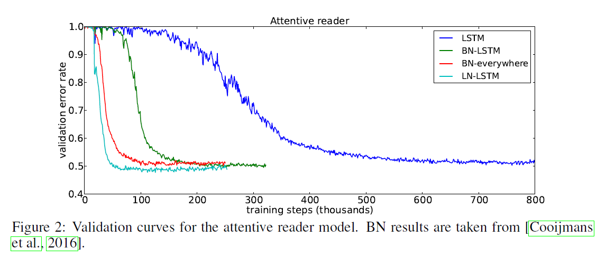
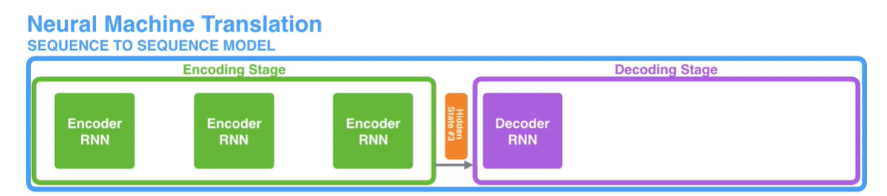
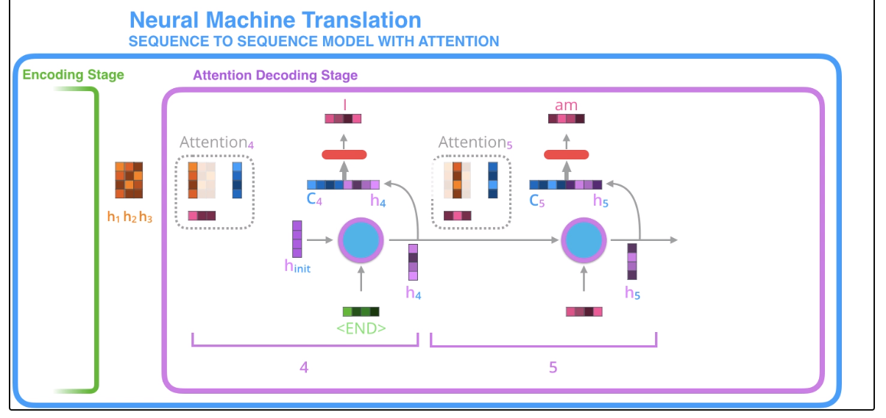

```{r setup, include=FALSE}
knitr::opts_chunk$set(echo = TRUE)
```

본 내용은 'Attention is all you need' 논문을 기반으로 만들었다. 해당 논문이 담고 있는 내용과 더불어서, 기존 seq2seq 모델이 지닌 한계와 Transformer를 위한 기본적인 개념들에 대해 소개하고, Transformer 모델의 구조와 특징들에 대해 설명하려 한다.

# Prerequisite

Transformer 모델에 대해 설명하기 전에, 이 모델에서 기본적으로 사용하는 Layer normalization과 Residual Connection에 대해 알아보려 한다. 더불어서 Seq2seq 모델과 attention에 대해 기본적으로 알아보겠다.

## Layer Normalization

### Batch Normalization

다들 Batch Normalization은 들어보았지만, Layer Normalization은 잘 모를 수 있다. 먼저 Batch Normalization(BM)에 대해 간단히 설명하려 한다. BM은 신경망의 각 layer에 들어가는 input을 batch 단위의 평균과 분산으로 정규화해 학습을 효율적으로 만드는 방법이다. 이런 BM은 신경망의 각 층마다 입력값의 분포가 달라지는 현상인 Covariate Shift 현상을 없애기 위해 제안되었다. 

하지만 BM 같은 경우 다음의 단점이 존재한다.

1) Mini-Batch 크기에 의존적이다.
  - 극단적으로 mini-batch 크기가 1이면 분산이 없어서 normalizing이 안된다.
  
2) Recurrent 기반 모델에 적용이 어렵다. 
  - 기존의 Feed-Forward 형태의 신경망에서는 그냥 각 배치별 입력값의 형태가 동일하기 때문에 normalize할 때 아무런 문제가 없었다. 하지만 Recurrent 기반의 모델의 입력값은 기본적으로 sequence다. 그렇다면 BM을 적용하기 위해서는 매 time-step마다 별도의 통계량(평균, 분산)을 저장해야 하고, 이는 모델을 훨씬 복잡하게 만든다.
  
### 둘의 차이

그래서 Layer Normalization이라는 방법을 도입하게 되는데, BM과 LM의 차이를 논문의 표현을 빌려와서 말하면, 다음과 같다.

- Batch Normalization: Estimate the normalization statistics from the summed inputs to the neurons **over a mini-batch of training case**
- Layer Normalization: Estimate the normalization statistics from the summed inputs to the neurons **within a hidden layer**

아래의 그림은 BM과 LM의 차이를 직관적으로 잘 표현해준다. LM을 이처럼 batch 단위가 아니라 input을 기준으로 평균과 분산을 계산하게 된다.

```{r, echo = FALSE, fig.cap = 'BM versus LM', fig.align='center', out.width='80%'}
knitr::include_graphics('pic/LM.png')
```

### LM의 특징

mini-batch 단위가 아닌 위와 같은 방법으로 normalization을 시행하면 어떤 특징을 지닐까?

```{r, echo = FALSE, fig.cap = 'LM example', fig.align='center', out.width='90%'}

```

1) 데이터마다 각각 다른 normalization term($\mu$, $\sigma$)를 갖는다.
1) mini-batch 크기에 영향을 받지 않는다. (size=1 이어도 작동)
1) 서로 다른 길이를 갖는 sequence가 batch 단위의 입력으로 들어오는 경우에도 적용할 수 있다. (1번의 특징 때문)

일반적인 RNN 모델에서는 많은 time-step을 거칠 때 gradient가 explode 또는 vanish하는 현상이 발생한다. 그러나 LM이 적용될 경우, layer의 input의 scale에 영향을 받지 않기 때문에, 안정적인 학습이 진행된다.

[참고블로그](https://youngerous.github.io/)

## Residual Connection

Residual Connection이란 ResNet 모델에서 나온 개념으로, 비선형 함수의 결과에 기존 인풋을 더해주는 방법이다. 이 구조가 정확히 어떤 이유에서 잘 되는지는 알 수 없지만, Ensemble과 같은 효과를 낸다고 한다.... 이는 Vanishing Gradient 문제에도 도움이 되어서, 더 깊은 신경망을 학습할 수 있도록 해준다.

```{r, echo = FALSE, fig.cap = '', fig.align='center', out.width='70%'}
knitr::include_graphics('pic/rescon.png')
```

다음과 같이 $f(x) + x$와 같은 형태로 연산을 하기 때문에, 추가적인 parameter나 계산복잡도를 요구하지 않으면서도 좋은 효과를 보인다. 간단한 예시로 단순히 $f(x)$일때 이에 대해 층이 깊어질 경우 gradient가 사라질 수 있지만, 이런 $f(x)+x$ 구조에서는 최소한 1의 gradient가 보장되기 때문에 안정적인 학습이 가능해진다는 장점이 있다.

transformer의 인코더 구조에서는 임베딩 벡터에 포지셔널 인코딩 벡터를 더해주는 식으로 학습이 진행된다. 이런 위치정보를 지닌 포지셔널 인코딩 벡터는 역전파과정에서 기울기가 소실될 수 있기 때문에, 포지셔널 인코딩 벡터를 어텐션 레이어를 스킵하고 다음 레이어로 보내게 된다. 이런 residual connection 이후 바로 layer normalization 과정이 일어나게 된다. 이부분을 뒤에서 설명하기에는 상대적으로 간단하기 때문에 앞에서 미리 다루고 간다.

## Seq2Seq

```{r, echo = FALSE, fig.cap = 'encoder decoder', fig.align='center', out.width='80%'}
knitr::include_graphics('pic/encdec.png')
```

Recurrent Neural Network에서 many-to-many 구조를 지니는 대표적인 모델인 Seq2seq에 대해 다룬다. 후에 다룰 transformer 전에 seq2seq 구조와 attention에 대해 알아야 transformer 구조의 필요성을 알 수 있기 때문에 이를 먼저 가볍게 다루도록 하자.

여기서 다루는 시각화 사진들은 모두 Jay Alammar의 [블로그](http://jalammar.github.io/)에서 가져왔다

### Seq2seq의 구조

Seq2seq는 이렇게 앞부분의 입력을 받는 인코더(Encoder)와 출력을 담당하는 디코더(Decoder)로 나누어진다. 인코더에서는 입력정보를 처리하고 저장하고, 디코더 부분에서는 출력을 생성한다고 생각하자. 인코더의 입력 정보를 잘 압축한 하나의 문맥 벡터(Context Vector)를 디코더로 전해주면, 디코더는 이 문맥벡터를 통해 출력을 생성하게 된다.

```{r, echo = FALSE, fig.cap = 'Context Vector', fig.align='center', out.width='90%'}
knitr::include_graphics('pic/context.png')
```

여기서 RNN구조가 각각의 인코더와 디코더를 구성하게 된다. RNN 까먹지 않았죠?

```{r, echo = FALSE, fig.cap = 'RNN', fig.align='center', out.width='80%'}
knitr::include_graphics('pic/rnn.png')
```

이게 바로 seq2seq고, 무한 시각화로 이해해보자. 

```{r, echo = FALSE, fig.cap = 'seq2seq', fig.align='center', out.width='90%'}

```

각각의 rnn을 거치면서 hidden vector가 만들어질 것이고, 최종적으로 인코더에서 나오는 히든 벡터가 문맥(Context) 벡터가 되어 디코더에 전해지게 된다. 

하지만 직관적으로 알 수 있듯이, 이런 RNN 구조를 이용할 경우 문맥벡터안에서 초기 입력값이 가지는 영향력은 거의 없다시피하는 Vanishing Gradient 문제가 발생한다. 그래서 이 RNN을 LSTM, GRU로 바꿔주게 된다. 이렇게 되면 비교적 장기종속성이 완화되지만, 여전히 Vanishing Gradient로부터 자유롭지 못하다. 여전히 context vector는 마지막 인코더 블락을 통과하고 나온 하나 밖에 없기 때문이다.

```{r, echo = FALSE, fig.cap = 'I am a student', fig.align='center', out.width='90%'}
knitr::include_graphics('pic/vanishing.png')
```

위의 시각화처럼, 간단한 번역의 예시를 생각해보자. etudiant와 student가 같은 의미를 지녀서 대응되게 번역된다고 가정할 때, 입력의 순서는 유의미해진다. 따라서 이 뒤에 있는 입력일수록, 뒤의 디코더가 student를 잘 뱉어낼 수 있도록 매칭시켜주는 작업이 필요하고, 이것이 바로 Attention이다.

### Attention

```{r, echo = FALSE, fig.cap = 'attention', fig.align='center', out.width='90%'}
knitr::include_graphics('pic/attention.png')
```

```{r, echo = FALSE, fig.cap = 'attention mechanism 1', fig.align='center', out.width='70%'}
knitr::include_graphics('pic/attention_mec.png')
```

Seq2seq에서 Attention은 어렵지 않게 이해할 수 있다. 기존에는 인코더의 마지막 블락에서 나온 히든 벡터 하나만을 문맥벡터로 가져왔다. 반면에 attnetion을 더하게 되면, 인코더의 모든 블락에서 히든 벡터를 저장해둔다. 그리고 이 모든 히든벡터를 디코더로 전달한다.

그래서 각각의 디코더 블락이 만들어내는 히든벡터와, 인코더 블락에서의 히든벡터(h4)간의 유사도들을 계산한다. 그래서 그 점수(Score)를 계산하면, 이를 softmax에 태워서 일종의 가중치로서 만들어낸다. 이 가중치로 인코더블락의 히든벡터의 가중합 벡터를 만들어내고, 이 벡터가 문맥벡터(c4)로 기능하게 된다.

이 문맥벡터와 히든백터를 붙이고, feed-forward에 태워서 기존과 동일한 차원의 벡터를 만들어(출력해)낸다. 그리고 이 출력된 벡터가 다음 디코더 블락에서 인풋으로 작용해서 이 과정을 이어나간다. 다시 한 번 시각화로 이해하자.

```{r, echo = FALSE, fig.cap = 'attention mechanism 2', fig.align='center', out.width='80%'}

```

인코더의 hidden state와 디코더에서의 hidden state의 유사도를 계산한 결과는 다음과 같다. 이런 어텐션 매커니즘을 통해 유사한 단어간의 대응이 되는 것을 확인할 수 있고, 'a'같이 대응이 어려운 단어들에 대해서는 여러 단어들과 유사하게 나오는 것을 확인 가능하다.

```{r, echo = FALSE, fig.cap = '', fig.align='center', out.width='80%'}
knitr::include_graphics('pic/attention_process.png')
```

### 단점

이렇게 attention을 seq2seq에 적용하더라도 여전히 문제는 남아있다. 이렇게 시퀀셜한 구조를 가지고 학습하는 것은 엄청난 계산 비용을 유발한다. 안그래도 많은데, attention까지 적용해야하니까... transformer는 입력구조가 이렇게 sequential하지 않기 때문에 학습측면에서 훨씬 효율적이다. 앞으로 트랜스포머에 대해 다뤄보자.


