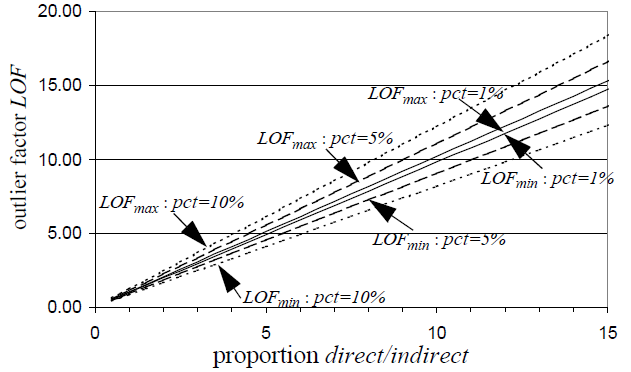
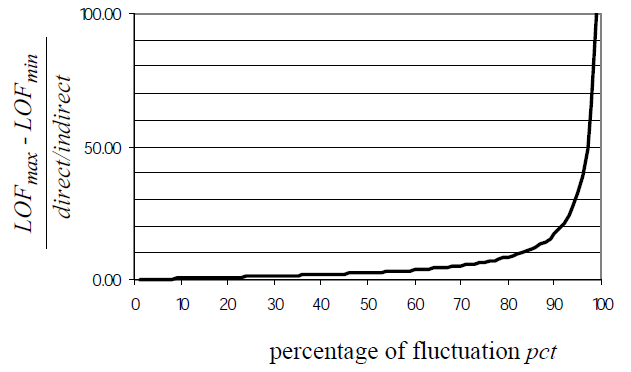
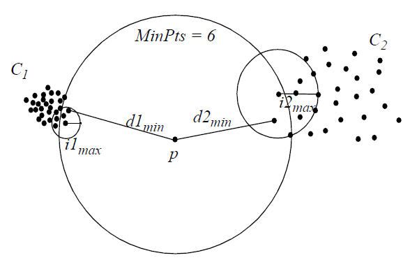
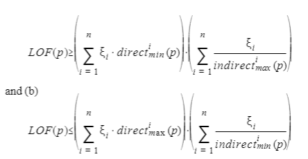
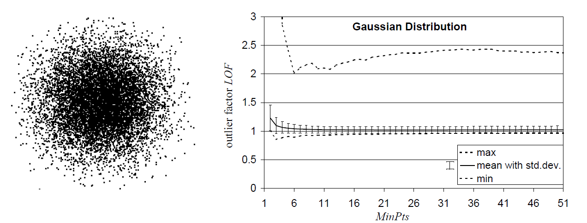
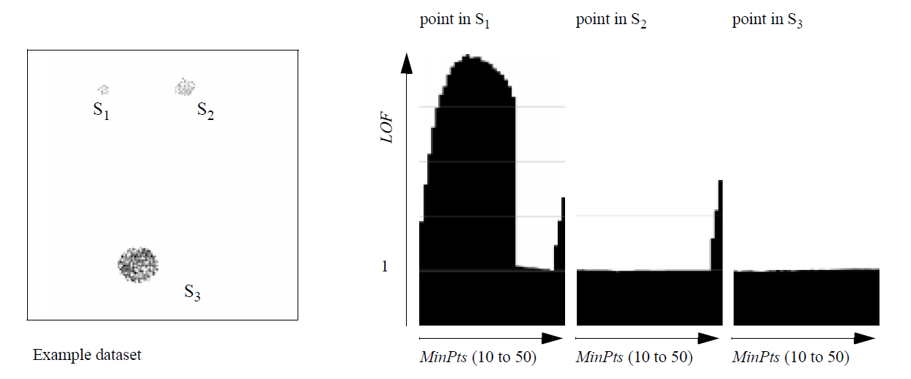

```{r setup, include=FALSE}
knitr::opts_chunk$set(echo = TRUE)
```

이상치 탐지의 대표적인 방법론인 LOF에 관한 논문 'LOF: Identifying Density-Based Local Outliers' 을 읽고 정리한 내용입니다. 해당 논문은 1만번 이상 인용되었을 정도로 유명한 논문이며, 실제로 읽어보면 단순히 실험으로만 방법론의 성능을 보여주는 것이 아니라, LOF value가 갖는 수리적인 정당성에 대해서도 충분히 논의되고 있기 때문에 만 번 이상 인용되지 않나 싶습니다.

# Introduction

LOF(Local Outlier Factor)에 대해 다루기에 앞서 기존의 이상치 탐지 접근 방식에 대해 살펴보도록 하자. 대부분의 기존 접근 방식은 이상치가 되는 것을 binary한 특징으로 여기는 반면 LOF는 이상치가 될 정도에 대해 할당하는 것으로 여긴다. LOF에 대해 잘 알아보기 위해 기존의 접근 방식들을 카테고리별로 살펴보고, 그 문제점에 대해서 알아보겠다. 

## 기존의 이상치 연구

- Distribution based

기준이 되는 분포(정규분포, 포아송 분포 등)에 데이터셋을 피팅하는 방법이다. 이상치는 분포를 기반으로 정의되며, 각가지 다른 상황에 대해서 100가지가 넘는 discordance test가 존재한다. 하지만 이 방법은 대부분 하나의 변수만을 이용하여 test하기에 다변량분포에 적합하지 않다. 다변량 test들이 존재하긴하지만, 여전히 실제 분포는 알 수 없다는 한계를 가지고 있다. 

- Depth based

각각의 데이터는 k차원의 공간에서 표현이되며, 깊이를 할당받는다.깊이에 대해서는 다양한 정의가 존재하는데, 어쨌든 여기서 얕은 깊이를 가진 데이터셋이 이상치일 확률이 높다. 이론적으로는 고차원에서 잘 작동하는 방식이지만, 실제로 4차원이상에서는 계산량이 많아 비효율적이다. 

- Distance based

거리기반 방식은 거리를 통해 knn을 계산하고, neighbor의 개수로 이상치 순위를 매기는 방법이다.

- Clustering

클러스터링 알고리즘은 어느정도 예외를 다루는데 사용이 될 수 있다. 하지만 클러스터링의 주된 목표는 클러스터를 찾는 것이므로 이들은 클러스터링을 최적화하는 방향으로 발전하지, 이상치 탐지를 최적화하는 방향으로 발전하지 않는다. 예외적인 데이터들은 클러스터링에서는 무시되고, 예외적인 데이터가 존재한다고 해도 어느정도 이상치인지는 알 수 없다. 

## 기존의 접근의 문제

앞서 다룬 기존의 연구들은 통계학의 분야에서 다루어졌는데, 이상치는 Hawkins에 의해 직관적으로 정의될 수 있다.

- 정의 1: Hawkins-outlier

다른 관측치로부터 아주 벗어나서 다른 메커니즘에서 생성된 관측치가 아닌지 의심되는 관측치를 이상치라고 한다.

- 정의 2: DB(pct, dmin)-outlier

최소 pct %의 데이터가 p로부터 dmin만큼 떨어져있는 경우 이상치이다. 다시말해 $\{q \in D| d(p,q)\leq dmin \}$ 집합의 크기가 (100-pct)%보다 작을 경우 이상치이다. 이러한 정의는 데이터셋에대해 global한 관점으로 바라보기에 global 이상치라고 정의된다. 하지만, 현실의 데이터셋은 더욱 복잡한 구조를 가지고 있고 다른 종류의 이상치들도 존재한다. 예를들면 자신 근처 점들에 비해 이상한 local 이상치들이 존재할 수 있는 것이다. 

```{r, echo = FALSE, fig.cap = '', fig.align='center', out.width='70%'}
knitr::include_graphics('pic/example_dataset.jpg')
```

이 데이터셋의 예시를 살펴보자. Hawkins의 정의에 따르면 o1, o2둘 다 이상치로 정의되고 C1, C2안에 있는 관측치들은 이상치가 아닌 것으로 정의된다. 하지만 DB(pct, min)의 정의에 따르면 o1만 이상치로 정의된다. C1에 있는 모든 관측치들 사이의 거리는 o2와 C2안의 관측치들 사이의 거리보다 멀기에 o1만 이상치로 정의된다. 만약 o2와 C2안의 관측치들 사이의 거리 중 최소값인 $d(o_2, C_2)$보다 큰 값을 $dmin$으로 설정할 경우 C1안의 많은 관측치들도 outlier로 정의되게 된다. 

# LOF 관련 용어정리

앞서 언급된 문제점 속에서, 결국 local에 대한 정보를 고려하는, local의 상대적인 dense를 비교하여 outlier를 정의하는 LOF가 등장하게 되었다. LOF의 차이점은 outlier에 대하여 binary로 생각하지 않고, 어떤 정도(값)으로 생각하는 것이다.

이번 장에서는 LOF(local outlier factors)의 정의와 해당 내용을 이해하는데 필요한 다양한 수식 및 정의들에 대해서 설명을 할 것이다.

1) k-distance of an object p

 - k-distance(p)라고 표기하며 p로부터 k번째 근접 이웃까지의 거리를 뜻한다. 간단한 예시를 통해서 살펴보도록 하자.

```{r, echo = FALSE, fig.align='center', out.width='70%'}
knitr::include_graphics('pic/lof1.png')
```

  - 위와 같은 경우 3-distance(p) = 1.5라고 할 수 있겠다.

2) k-distance neigborhood of an object p

  - $N_k(p)$ 혹은 $N_{k-distace(p)}(p)$라고 표기하며 k-distance보다 작거나 같은 object 개수를 의미한다. 앞서 보았던 예시를 통해 생각을 해보면 $N_3(p)=5$가 될것이다.

3) reachability distance of an object p w.r.t object o

  - $reach-dist_k(p,o)$로 표기하며 p에 대해서 생각할 때, 주변 데이터 o의 k-distance를 고려한 거리이다. 관심데이터p가 주변데이터o의 k_distance내에 들어와 있으면 o의 k_distance, 그것보다 밖에 있는 경우면 그냥 p와o의 거리를 사용한다. 식으로 나타내면 다음과 같다.

$$
reach-dist_k(p,o) = max\{k-distance(o),d(p,o)\}
$$

 - 간단한 예시를 통해 살펴보도록 하자.
 
```{r, echo = FALSE, fig.align='center', out.width='70%'}
knitr::include_graphics('pic/lof4.png')
```

  - A를 기준으로 봤을 때, B와 C까지의 reachability-distance는 3-distance(A)를 반지름으로하는 원 안쪽에 존재하기 때문에 3-distance(A)와 같아진다. 그리고 D의 경우는 원 밖에 존재하기 때문에 실제 거리값을 사용하게 된다.

4) local reachability density of an object p

식은 다음과 같다.

$$
lrd_k(p) = \frac{|N_k(p)|}{\sum_{O\in N_k(p)}reach-dist_k(p,o)}
$$

  - 식을 해석해 보자면 p 주변의 점들의 reach-dist 평균의 역수인데, 관측치 p 주변에 이웃이 얼마나 밀도있게 있는가를 보여주는 지표라고 생각할 수 있다. 간단한 예시를 통해 살펴보도록 하자.

```{r, echo = FALSE, fig.align='center', out.width='70%'}
knitr::include_graphics('pic/lof5.png')
```

  - case1의 경우 p가 밀도가 높은 지역 중심에 위치하여 분모가 작아질 것이고 이에 따라 $lrd_k(p)$의 값이 커질 것이다.

  - case2의 경우 p가 밀도가 높지 않은 지역 중심에 위치하여 분모가 커질 것이고 이에 따라 $lrd_k(p)$의 값이 작아질 것이다.

5) local outlier factor of an obiect p

식은 다음과 같다.

$$
LOF_k(p) = \frac{\sum_{O\in N_k(p)}\frac{lrd_k(o)}{lrd_k(p)}}{|N_k(p)|} =  \frac{\frac{1}{lrd_k(p)}\sum_{O\in N_k(p)}lrd_k(o)}{|N_k(p)|}
$$

  - 식이 시사하는 바는 간단하게 정리하자면 p와 주변의 점들 o와의 밀도(lrd)를 비교하여 평균낸 것이다. 우리는 이 지표를 outlier를 판별하는데 사용한다.

간단한 예시를 통해 살펴보도록 하자.

```{r, echo = FALSE, fig.align='center', out.width='70%'}
knitr::include_graphics('pic/lof6.png')
```

간단하게 정리하자면 p가 밀도가 낮은 지역에 있을 수록, o가 밀도가 높은 지역에 위치할수록 p에 대한 LOF 값은 커지게 된다. 위의 예시를 표로 정리하면 다음과 같다.

\begin{center}
\begin{tabular}{cccc}
\hline
case  & $lrd_k(p)$ & $lrd_k(o)$ & $LOF_k(p)$ \\ 
\hline
case1 & Large & Large & Small \\ 
\hline
case2 & Small & Large & Large \\ 
\hline
case3 & Small & Small & Small \\ 
\hline
\end{tabular}
\end{center}


# LOF 성질

이번 장에서는 LOF에 관한 여러 성질들을 살펴볼 것이다.

## Cluster 중심부 

해당 내용을 간단하게 정리하자면 어떤 cluster 중심부에 위치한 점 p에 대한 LOF 값은 1에 가깝다는 것이다. 여기서 cluster가 'tight'하면 할수록 더 1에 가까워 진다.

자세한 증명은 넘어가도록 하지만, 간단하게 생각해보면 p가 cluster의 중심부에 존재하고 p의 k-nearest neighbors인 q, q의 k-nearest neighbors인 o도 cluster 내부에 속하는 점이여서 LOF(p)식에서 $\frac{lrd_k(q)}{lrd_k(p)}$값이 1에 가깝게 나올 것이기 때문에 LOF도 1에 가까운 수치들이 나올 것이다.


## LOF의 Upper & Lower bound

위에서는 p가 특수한 상황인 경우의 성질을 살펴 보았는데 이번에는 general한 상황에 있는 p에 대한 LOF(p)의 Upper & Lower bound에 대해서 살펴보도록하자.

이와 관련하여 몇 가지 용어를 정의하고 가도록 하겠다.


$$
direct_{min}(p) = min\{reach-dist(p,q)|q\in N_{MinPts}(p)\}
$$

$$
direct_{max}(p) = max\{reach-dist(p,q)|q\in N_{MinPts}(p)\}
$$

$$
indirect_{min}(p) = min\{reach-dist(q,o)|q\in N_{MinPts}(p) \:\&\: o\in N_{MinPts}(q)\}
$$

$$
indirect_{max}(p) = max\{reach-dist(q,o)|q\in N_{MinPts}(p) \:\&\: o\in N_{MinPts}(q)\}
$$

결론적으로 LOF(p)의 범위는 다음과 같다.
$$
\frac{direct_{min}(p)}{indirect_{max}(p)} \le LOF(p) \le \frac{direct_{max}(p)}{indirect_{min}(p)}
$$
다음의 예시를 통해 살펴보자
```{r, echo = FALSE, fig.align='center', out.width='70%'}
knitr::include_graphics('pic/lof8.png')
```
$d_{min}$은 $direct_{min}(p)$, $d_{max}$는 $direct_{max}(p)$,$i_{min}$은 $indirect_{min}(p)$ ,$i_{max}$는 $indirect_{max}(p)$를 의미한다. 위의 예시에서 LOF(p)의 범위는 4와 6사이가 된다.

LOF의 Upper & Lower bound 도출 과정은 부록으로... 관심있는 사람들은 참고하길 바란다.

## The Tightness of the Bounds

앞에서 이렇게 LOF value의 Lower Bound(LB)와 Upper Bound(UB)를 정의할 수 있었다. LOF value가 유계인 것은 명확한데, 과연 이 bound가 tight한지는 여전히 의문으로 남는다. 

이전에 
$$
LOF_{max}=\frac{direct_{max}}{indirect_{min}}, \quad \quad LOF_{min} = \frac{direct_{min}}{indirect_{max}}
$$
로 정의했다. 결국 $LOF_{max}-LOF_{min}$는 $direct / indirect$의 비로 나타나게 될 것이다. 그리고 그 차이는 특정 조건하에서 매우 작다! 이 차이가 작은(tightness) 경우를 먼저 살펴보자.

먼저 notation을 정의하자. 
$$
\begin{aligned}
direct(p)&= mean(direct_{min}(p),\: direct_{max}(p)) \\ 
indirect(p)&= mean(indirect_{min}(p),\: indirect_{max}(p))
\end{aligned}
$$
이다. 각각의 최대/최소값의 평균을 $direct, \: indirect$ 값으로 정해준다. 그리고 표기의 편의를 위해 $direct(p) = direct$, $indirect(p) = indirect$로 표기한다. 이후 하나의 가정을 추가하자.

- 가정 : Reachability distances in the direct and indirect neighborhoods fluctuate by the same amount.

$$
\frac{direct_{max}-direct_{min}}{direct}=\frac{indirect_{max}-indirect_{min}}{indirect}
$$

즉, 우리가 관심있는 관측치 $p$와 $p$의 neighborhoods $o$가 변동하는 비율은 동일하다는 것은, 가장 쉬운 예로는 같은 클러스터 안에 있는 경우가 있다. 이렇듯 direct와 indirect의 변동비율이 같다고 가정했기 때문에, 이 변동비율 $pct=x \%$를 정의할 수 있다. 

```{r, echo = FALSE, fig.cap = '', fig.align='center', out.width='70%'}

```

$$
\begin{aligned}
direct_{max}&=direct*(1 + x \%) \\
direct_{min}&=direct*(1 - x \%) \\
indirect_{max}&=indirect*(1 + x \%) \\
indirect_{min}&=indirect*(1 - x \%)
\end{aligned}
$$

이렇게 가정으로 유도된 결과를 통해, $LOF_{max}$와 $LOF_{min}$의 차이는 고정된 $pct=x\%$하에서 $direct/indirect$의 비에 따라 선형적으로 증가한다. 이를 그림을 통해 이해하자.

LOF value값이 Y축이 되고, x축은 direct/indirect가 된다. 또한 직선은 각각 $pct=x\%$가 변함에 따른 상한과 하한을 표현하고 있다. $pct=1\%$인 경우, ratio가 커지더라도 그 차이는 매우 작은 것(tightness)을 확인할 수 있다.

반면에 $pct=x\%$가 커지면(변동이 커지면), bound가 느슨해지는 것을 확인할 수 있다. 따라서 이런 변동은 단순히 direct와 indirect의 거리 그자체(absolute value)에 의존하는 것이 아니라, ratio에 의존한다. 그리고 그 ratio는 $pct=x\%$로 나타나질 수 있다.

이번에는 $pct=x\%$가 증가함에 따라 $\frac{LOF_{max}-LOF_{min}}{(direct/indirect)}$의 값이 어떻게 변하는지 한번에 확인해보자. 아까하고 결과는 같다!

```{r, echo = FALSE, fig.cap = '', fig.align='center', out.width='70%'}

```

정리하자면, 변동이 작을 경우 Theorem 1의 추정은 bound가 tight하기 때문에 유효하다. 

1) 해당 관측치 $p$에 대해 $pct=x\%$가 매우 작다는 것은, reachability distance의 변동이 주변 이웃들과 동질적이라는 의미이다. 같은 클러스터 안에 있는 것과 같이! 이 경우 $direct_{max},\:direct_{min},\:indirect_{max},\:indirect_{min}$이 거의 동일할 것이고, 이는 LOF value가 1에 가까운 것을 의미한다. 결국 Lemma 1과 일맥상통한다.

2) 반면에 관측치 $p$는 어떤 클러스터 안에 속해있지 않더라도, $p$의 이웃들이 모두 동일한 클러스터에 속한다면, 해당 관측치 $p$의 LOF value는 1에 가까울수는 없지만 적어도 tight bound를 보장한다.

## Bound for Objects whose Direct Neighborhoods Overlap Multiple Clusters

위의 두 경우에 대해 Theorem 1에 의해 tight bound를 갖는다는 것을 보였다. 그렇다면 언제 loss bound를 가질까?

위의 2)에 답이 있다. 주변의 이웃들이 각각 다른 클러스터에 속하는데, 각각의 클러스터가 가지는 밀도가 다른 경우에 bound가 느슨해진다. 각각의 밀도가 크게 다른 경우, $pct$가 커질 것이고, 그에 따라 LOF의 최대 최소의 차이가 커지게 된다.

```{r, echo = FALSE, fig.cap = '', fig.align='center', out.width='60%'}

```

위의 그림의 예시처럼 두 클러스터가 존재한다고하고, 이때 k=6이라 하자. 3개의 관측치 씩 각각의 클러스터에 속한다고 하자. 그래서 $LOF_{min}$을 계산하면,
$$
LOF_{min} = \frac{0.5 * direct1_{min}+0.5 * direct2_{min}}{0.5 * indirect1_{min}+0.5 * indirect2_{min}}
$$
이렇게 클러스터가 여러개 있는 경우, 각각의 클러스터별로 가중치를 준다고 이해할 수 있다. 그러나 $LOF_{max}$의 값은 현재 알 수 있다. 이를 알기 위해서 Theorem 2가 나온다. Theorem 2의 결과만 적고, 증명이나 세부적인 내용은 모두 논문의 부록에 존재한다.

```{r, echo = FALSE, fig.cap = '', fig.align='center', out.width='60%'}

```

이 Theorem 2는 Theorem 1에 대해 이웃들이 여러 다른 클러스터에 속할 수 있는 일반화된 버전이다. 

# The Impact of the Parameter MinPts = k

지금까지 LOF value가 갖는 값들에 대한 수리적인 논의를 했다. 그런데 이 LOF value는 하이퍼파라미터 MinPts=k가 고정된 상태에서 계산된다. 따라서 우리는 이 k값의 변화가 어떻게 LOF value에 영향을 미치는지, k값의 변화에 따른 계산비용은 어떻게 되는지 논의해야 한다.

## How LOF Varies according to Changing MinPts Values

k값이 변함에 따라 LOF value가 단조증가하거나 단조감소하지는 않는다. 다음과 같이 정규분포를 따르도록 샘플을 만들고, k를 2부터 50까지 값을 갖도록 변화시켜 나갔다. k값의 변화에 따른 LOF value의 최대/최소/평균을 기록했다. 

```{r, echo = FALSE, fig.cap = '', fig.align='center', out.width='95%'}

```

k가 작을 때는 $LOF_{max}$값이 크다가, k를 늘려감에 따라 reachability distance 안에서 변동이 감소해서 $LOF_{max}$값이 감소하게 된다. 하지만 k를 계속 증가시키면 어느순간부터는 다시 증가하다가 그 값이 안정화된다.

가장 기본적인 가우시안 가정에서 이런 형태가 나오기 때문에, 더 복잡한 상황을 가정할 경우에는 LOF value는 k에 따른 변화가 매우 클 것이다. 

다음과 같이 10개의 관측치는 S1 클러스터, 35개의 관측치는 S2 클러스터, 500개의 관측치는 S3 클러스터에 속하는 경우를 생각하자. k를 10부터 50까지 변화시킴에 따른 LOF value를 관측했는데, S3은 매우 안정적인 반면, S1과 S2는 k값의 변화에 따른 명확한 차이가 존재한다.

```{r, echo = FALSE, fig.cap = '', fig.align='center', out.width='85%'}

```

## Determining a Range of MinPts Values

이렇듯 k를 변화시킴에 따라 LOF value가 어떤식으로 변하는지 확인했다. 그렇다면 어떤 k를 잡는 것이 최적의 $k$라고 말할 수 있을까?

먼저 k의 최소값을 정하자. 이전의 가우시안 예제를 보았을 때, LOF의 최대값이나 분산이 $k=10$부터 조금 안정화된다. 따라서 $k=10$이 $k$가 가질 수 있는 최소값으로 생각하는 것이 좋고, $k=10$ 정도가 되어야 불필요한 변동을 줄일 수 있다고 한다.

두번째 기준은 어떤 클러스터 $C$에 존재하는 관측치의 개수이다. 우리가 관심있는(이상치라고 여겨지는) 관측치 $p$가 존재하고, 클러스터 $C$가 하나 존재하는 간단한 상황을 상정하자. 이때 $k$를 $C$의 개수보다 크게 잡는다면, $p$의 입장에서도 $C$는 이웃이고, $C$의 모든 점 입장에서도 $p$는 이웃이 된다. 따라서 $p$를 $C$와 구별할 수 없다. 

반대로 $k$를 $C$의 개수보다 작게 잡는다면, 비로소 구별이 가능하다. $C$의 중심부에 있는 관측치는 절대로 $p$를 이웃으로 갖지 않을 것이다. 물론 $C$의 일부는 $p$를 이웃으로 갖겠지만, 모두가 그런것은 아니기 때문에 $p$의 LOF value는 $C$의 LOF value와 차이를 지닐 것이다. 그래서 보통 $k$는 10~20 사이의 값을 지정하며, 실제로 사이킷런에서도 기본값은 20이다.

다음 기준은 $k$의 최대값에 대한 기준이다. 아까 S1, S2, S3이 세 개의 클러스터가 있는 경우를 생각하자. S3는 누가보아도 이상치가 아니다. 반면 S1은 이상치라고 보는 것이 일반적이다. S2는 조금 애매하다. S2를 일반적이지만 다른 특성을 지니는 클러스터로 생각할 수도 있을 것이고, 반면에 S2도 이상치의 하나라고 볼 수 있다. 우리가 이 S2를 어떻게 다룰 것인지에 따라 $k$의 최대값은 달라진다. 현재 S1은 10개, S2는 35개, S3는 500개의 관측치가 있다. 

만약 우리가 S2도 이상치라고 판단하고 싶다면, k의 최대값을 $k>35$로 잡아주어야 S2의 중심에 있는 관측치가 S3 클러스터의 관측치를 이웃으로 가실 수 있을 것이다. 더 이상치를 잘 잡으려면 S1과 S2의 관측치 개수를 합친 $k>45$로 잡아줄 수도 있다. 실제로 LOF value를 보게 되면 45 이후부터 값이 뛰는 것을 확인할 수 있다. 반면에 S2를 정상으로 보고 싶다면, $k<35$로 잡아주어야 한다. 이렇듯 $k$ 대충 잡는 것이 아니라, 우리의 목적에 맞게 잡게 된다.

이렇게 $k$의 하한과 상한을 규정하면, 그 안에서 어떤 값을 선택해야할까? 논문에서는 '하한에서 상한사이의 $k$ 중에서 최대의 LOF value를 만들어 내는 k'를 선택하라고 한다.


# Experiment

## Synthetic example

왼쪽 그림에는 하나의 밀도가 낮은 정규분포 클러스터와 세개의 밀도가 높은 클러스터(하나는 정규분포, 두개는 균일분포)가 있는 데이터셋이 있다. 오른쪽 그림은 그 데이터셋의 모든 관측치에 대해 3차원축에 LOF값을 나타낸 플랏이 나타나 있다. 균일 분포 클러스터의 LOF는 1이고, 대부분의 정규분포 클러스터의 LOF도 1인것을 알 수 있다. 클러스터에서 살짝 벗어난 데이터들은 1보다 큰 값을 가지고, 나머지 관측치들은 압도적으로 큰 LOF값을 가진다. 그리고 클러스터의 밀도에 따라 상대적으로 LOF값이 결정된다는 것도 알 수 있다. 

```{r, echo = FALSE, fig.cap = ' ', fig.align='center', out.width='70%'}
knitr::include_graphics('pic/synthetic_example.jpg')
```

## Performance

LOF값을 계산하기 위해서는 2단계의 작업이 필요하다. 먼저 MinPtsUB-nearest neighborhoods를 찾아야하고, 그 다음 LOF가 계산이 된다. knn작업의 시간복잡도는  저차원 데이터에서 $O(n)$, 중간 차원의 데이터에서 $O(\log n)$, 고차원의 데이터에서 $O(n^2)$이다. 보다싶이 2차원, 5차원에서는 거의 선형에 가까운 모습을 보이지만 10차원, 20차원에서는 점점 속도가 아주 느려짐을 알 수 있다. 

$$
\vspace{5\baselineskip}
$$

```{r, echo = FALSE, fig.cap = '', fig.align='center', out.width='70%'}
knitr::include_graphics('pic/materialization_runtime.jpg')
```

두번째 단계에서는 LOF값 계산에는 전 단계에서 계산된 데이터(M)로 충분하기에 원래의 데이터셋은 필요로 하지 않고, 시간 복잡도는 $O(n)$이다

```{r, echo = FALSE, fig.cap = ' ', fig.align='center', out.width='70%'}
knitr::include_graphics('pic/computation_runtime.jpg')
```

# Conclusion

- LOF는 이상치를 binary한 특성으로 보지않고, 주변 이웃들로부터 얼마나 떨어져있는가에 대한 정도로 여긴다. 
- 클러스터 내의 관측치들의 LOF는 거의 1이고, 그 외에는 LOF값의 하한과 상한을 정의하였다. 
- LOF값이 MinPts에 의해 어떻게 달라지는지, MinPts를 어떻게 설정할지에 대해 다루었다. 
- 가까운 데이터에 대한 정보가 뒷받침되는 데이터나 큰 데이터에서 효율적인 방법이다.
- 왜 local outlier로 판별되었는지에 대한 설명필요(특히 고차원에서), 계산 수행 향상 필요성의 한계가 존재한다.

# Appendix

```{r, echo = FALSE, fig.align='center', out.width='100%'}
knitr::include_graphics('pic/lof9.png')
```
