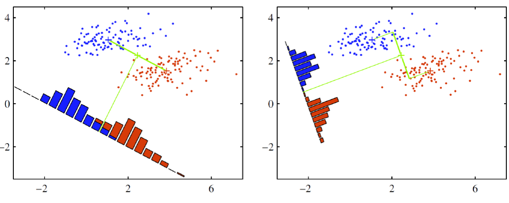
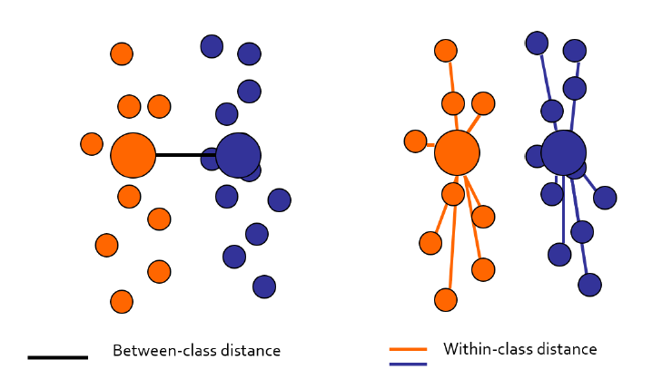
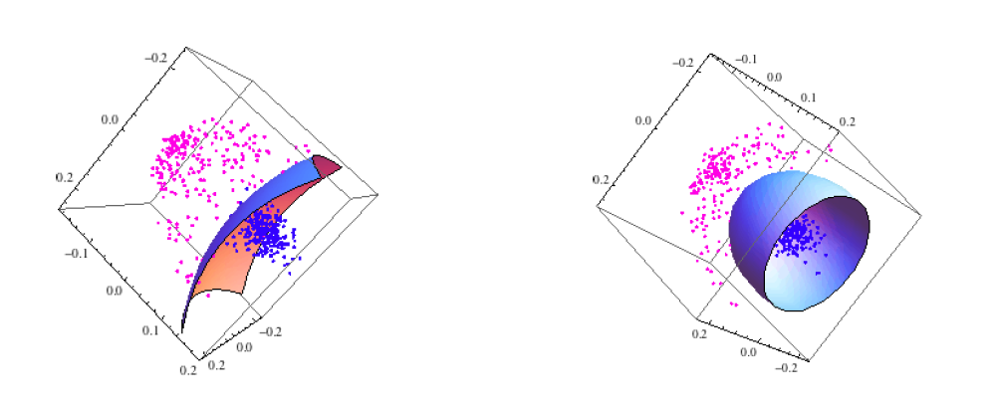

```{r setup, include=FALSE}
knitr::opts_chunk$set(echo = TRUE)
```

# KFDA

KFDA는 Kernel Fisher Disciminant Analysis의 줄임말이다. 판별분석에 커널버전이다. 따라서 판별분석에 대해 먼저 다루고, KFDA를 다루자.

## Linear Discriminant Analysis (선형판별분석)

### LDA의 아이디어

```{r, echo = FALSE, fig.cap = '', fig.align='center', out.width='90%'}

```

LDA는 두 클래스를 가장 잘 구분하는 하나의 축을 찾는 것이다. PCA같은 경우에는 분산을 최대로 보존하는 여러개의 축을 찾았지만, LDA는 단 하나의 축에 Projection 시킨다. 사진처럼 하나의 축에 Projection 시키는 것은 되게 다양할 수 밖에 없는데, 어떻게 해야 최적의 축(기저, Basis)를 찾을 수 있을까?

두 개의 클래스가 있다고 가정하자. 왼쪽의 사진처럼 축을 찾으면, 두 클래스가 겹치는 부분이 많다. 반면에 오른쪽 사진처럼 축을 잡으면, 두 클래스가 비교적 명확하게 나뉘는 것을 확인할 수 있다. 두 클래스는 명확하게 나뉘면서, 동시에 같은 클래스는 충분히 밀집해있어야 좋은 분류가 가능하다고 직관적으로 파악 가능하다.

이를 LDA의 언어로 말하자면, 

1) 다른 클래스 사이의 거리(분산)는 최대화 하면서,
1) 같은 클래스 사이의 거리(분산)는 최소화해야 한다.

```{r, echo = FALSE, fig.cap = '', fig.align='center', out.width='70%'}

```

### Notation

우리가 찾아야하는 축은 $\mathbf{w}$이다. x를 새로운 기저로 Projection을 시키면, 다음과 같다.

$$
y = \mathbf{w}^T\mathbf{x}
$$

각 클래스의 중심은 다음과 같이 정의하자.

$$
\mathbf{m}_1= \frac{1}{N_1} \sum_{n \in C_1}\mathbf{x_n}, \quad\quad \mathbf{m_2}=\frac{1}{N_2} \sum_{n \in C_2} \mathbf{x_n}
$$

1) 먼저 다른 클래스 사이의 거리를 계산하자.

$$
m_2 - m_1 = \mathbf{w}^T(\mathbf{m_2}-\mathbf{m_1})
$$

2) 그 다음 각각 클래스 내의 분산을 계산하자.

$$
s_k^2 = \sum_{n \in C_k} (y_n - m_k)^2
$$

클래스 사이의 거리는 커져야하고, 클래스 내의 분산은 작아져야하기 때문에, 각각을 분자와 분모로 넣으면 최대화 하는 문제로 바꿀수 있다.

$$
J(\mathbf{w}) = \frac{(m_2-m_1)^2}{s_1^2 + s_2^2} = \frac{\mathbf{w}^T\mathbf{S}_B\mathbf{w}}{\mathbf{w}^T\mathbf{S}_W\mathbf{w}} 
$$

$$
\mathbf{S}_B = (\mathbf{m}_2-\mathbf{m}_1)(\mathbf{m}_2-\mathbf{m_1})^T
$$

$$
\mathbf{S}_W = \sum_{n \in C_1}(\mathbf{x}_n-\mathbf{m}_1)(\mathbf{x}_n-\mathbf{m}_1)^T + \sum_{n \in C_2} (\mathbf{x}_n-\mathbf{m}_2)(\mathbf{x}_n-\mathbf{m}_2)^T
$$

우리는 언제나 최대화/최소화 문제에서 미분값 = 0으로 놓고 문제를 푼다. 목적함수 $J$가 Convex 문제인지는 우리의 생각으로는 애매할 수 있지만, Convex 문제라고한다...!! 따라서 걱정없이 미분을 때려버리자! 지금의 형태는 $\frac{f}{g}$의 상황이기 때문에, 이를 미분 때리면 $\frac{f^{\prime}g - fg^{\prime}}{g^2}$가 된다. 미분값=0으로 해버리면 다음과 같다.

$$
(\mathbf{w}^T \mathbf{S}_B\mathbf{w})\mathbf{S}_W \mathbf{w} = (\mathbf{w}^T\mathbf{S}_W\mathbf{w})\mathbf{S}_B\mathbf{w}
$$

근데 여기서 $\mathbf{w}^T \mathbf{S}_B\mathbf{w}$와 $\mathbf{w}^T\mathbf{S}_W\mathbf{w}$는 스칼라 값이다. $\mathbf{S}_B \mathbf{w}$의 경우는 
$$
\mathbf{S}_B \mathbf{w} = (\mathbf{m}_2-\mathbf{m}_1)(\mathbf{m}_2-\mathbf{m_1})^T\mathbf{w} = \beta (\mathbf{m}_2-\mathbf{m}_1)
$$
와 같이 변경될 수 있다.

따라서 각각의 scalar 값을 걍 무시하면 다음과 같은 요약이 가능하다.

$$
\mathbf{w} \propto \mathbf{S}^{-1}_W (\mathbf{m}_2-\mathbf{m}_1)
$$

우리가 찾고자하는 축 $\mathbf{w}$는 위의 식에 비례하게 되고, 그냥 스칼라 값은 무시한다음 저 벡터를 유닛벡터로 만들어 주면 끝나게 된다!

### LDA의 추가적인 설명

맨처음 LDA의 그림에서 projection 했을 때 이들의 분포가 일종의 정규분포와 같은 형태를 띄는 것을 확인할 수 있다. 이처럼 LDA는 data가 normally distributed되었다는 가정에 기반한다. 각각의 그룹 또한 동일한 공분산 구조를 가진다고 가정하기 때문에, 매우 제약이 쎈 모형이다. 클래스 별로 공분산 구조가 다르다고 가정할 경우, QDA (Quadratic Discriminant Analysis)가 된다. 이 경우에는 비선형적인 분리가 가능해진다.

그러면 QDA와 KFDA는 어쩌면 비슷하지 않을까, 특정 조건에서는 같지 않을까 생각도 잠깐 해봤는데(왜냐하면 2차원 혹은 3차원에서의 비선형 분리를 하게되면 시각적으로는 QDA나 KFDA나 큰 차이가 없지 않을까?), QDA의 Kernel 버전도 존재한다. 따라서 아니라고 생각해도 될 것 같다.

## Kernel Fisher Disciminant Analysis

### Notation

KFDA는 LDA의 커널화된 버전이다. $\mathbf{x} \rightarrow \Phi (\mathbf{x})$로, x를 더 고차원인 $\Phi(\mathbf{x})$ 상에서 projection을 진행한다. 해당 공간에 대한 공분산을 계산하면 다음과 같다.

$$
\mathbf{C}^{\Phi} = \frac{1}{N} \sum_{n=1}^N (\Phi(\mathbf{x}_n)-\mathbf{m}^{\Phi})(\Phi(\mathbf{x}_n)-\mathbf{m}^{\Phi})^T, \quad\quad
\mathbf{m}^{\Phi} = \frac{1}{N}\sum_{n=1}^N \Phi(\mathbf{x}_n)
$$

더불어서 고차원으로 매핑된 공간에서의 '클래스 내의 분산'과 '클래스 간의 분산'을 계산하자.

$$
\mathbf{S}_W^{\Phi} = \sum_{i=1,2} \sum_{n=1}^{N_i} (\Phi(\mathbf{x}_n^i) - \mathbf{m}_i^{\Phi})(\Phi(\mathbf{x}_n^i)-\mathbf{m}_i^{\Phi})^T
$$
$$
\mathbf{S}_B = (\mathbf{m}_2^{\Phi} - \mathbf{m}_1^{\Phi})(\mathbf{m}_2^{\Phi} - \mathbf{m}_1^{\Phi})^T
$$

### Objective Function

KFDA의 목적함수는 결국 LDA와 다르지 않지만, 분산 텀 부분만 달라진다.

$$
J(\mathbf{w}) = \frac{\mathbf{w}^T\mathbf{S}_B^{\Phi} \mathbf{w}}{\mathbf{w}^T\mathbf{S}_W^{\Phi} \mathbf{w}}
$$

더불어서 $\mathbf{w} = \sum_{n=1}^{N} \alpha_n \Phi(\mathbf{x}_n)$라고 두게 되면, mean을 다음과 같이 projection할 수 있다.

$$
\begin{aligned}
\mathbf{w}^T\mathbf{m}_i^{\Phi} &= \frac{1}{N_i}\sum_{n=1}^N \sum_{k=1}^{N_i} \alpha_n(\Phi(\mathbf{x}_n) \cdot \Phi(\mathbf{x}_k^i)) \\
&= \frac{1}{N_i} \sum_{n=1}^N \sum_{k=1}^{N_i} \alpha_n \mathbf{K}(\mathbf{x}_n,\mathbf{x}_k^i) = \alpha^T \mathbf{\mu}_i
\end{aligned}
$$

결국 매핑된 공간에서 클래스의 중심은 다음과 같은 커널함수로 바로 나타난다.

$$
(\mu_i)_n = \frac{1}{N_i}\sum_{k=1}^{N_i}\mathbf{K}(\mathbf{x}_n, \mathbf{x}_k^i)
$$

그렇다면 이제 목적함수를 보자. 목적함수도 결국에는 커널함수로 바로 나타나기 때문에, 이를 미분하게 될 것이고 그 꼴이 커널 트릭의 존재 때문에 매우 간단할 것임을 예상할 수 있다.

목적함수의 분자부분을 먼저 보면,
$$
\begin{aligned}
\mathbf{w}^T\mathbf{S}_B^{\Phi}\mathbf{w} &= \mathbf{w}^T (\mathbf{m}_2^\Phi - \mathbf{m}_1^{\Phi})(\mathbf{m}_2^\Phi - \mathbf{m}_1^{\Phi})^T\mathbf{w} \\
&= \alpha^T(\mu_2-\mu_1)(\mu_2-\mu_1)^T\alpha \\
&= \alpha^T \mathbf{M} \alpha, \quad \quad \text{where} \:\: \mathbf{M}=(\mu_2-\mu_1)(\mu_2-\mu_1)^T
\end{aligned}
$$
와 같이 정리될 수 있다.

더불어서 목적함수의 분모부분을 보면 조금 전개가 많이 귀찮다. 따라서 결과만 간단히 요약한다면
$$
\begin{aligned}
\mathbf{w}^T\mathbf{S}_W^{\Phi}\mathbf{w} &= (\sum_{i=1}^N \alpha_i \Phi(\mathbf{x}_i))\:\: (\sum_{j=1,2}\sum_{n=1}^{N_i} (\Phi(\mathbf{x}_n^j)-\mathbf{m}_j^{\Phi})(\Phi(\mathbf{x}_n^j)-\mathbf{m}_j^{\Phi})^T) \:\: (\sum_{k=1}^N \alpha_k \Phi(\mathbf{x}_k)) \\
&= \sum_{j=1,2} \alpha^T \mathbf{K}_j\mathbf{K}_j^T\alpha - \alpha^T\mathbf{K}_j \:\mathbf{1}_{N_j}\: \mathbf{K}_j^T\alpha \\
&= \alpha^T \mathbf{N} \alpha, \quad\quad where \:\: \mathbf{N}=\sum_{j=1,2}\mathbf{K}_j(\mathbf{I}-\mathbf{1}_{N_j})\mathbf{K}_j^T
\end{aligned}
$$
다음과 같다. 

결국 우리의 목적함수는 다음과 같이 변경된다.

$$
J(\alpha) = \frac{\alpha^T \mathbf{M} \alpha}{\alpha^T \mathbf{N} \alpha}
$$

이 목적함수에 대해 미분하고 정리를 하면 이전과 결과가 비슷하다. 바로 넘어가보자.

$$
\alpha = \mathbf{N}^{-1}\:(\mathbf{M}_2-\mathbf{M}_1)
$$

왜 $\mathbf{w}$가 아닌 $\alpha$를 찾았는가? $\mathbf{w}$는 고차원 공간에서 선형으로 사영하는 것이고, 이를 원래 공간에서 사영해주는 것이 바로 알파이다. 그래서 이를 새로운 데이터 포인트로 매핑하게 되면

$$
y(\mathbf{x}) = (\mathbf{w}\:\cdot\:\Phi(\mathbf{x})) = \sum_{n=1}^N \alpha_n\mathbf{K}(\mathbf{x}_n,\mathbf{x})
$$

이런 비선형적인 분리를 다음과 같이 시각화 할 수 있다. 왼쪽은 Polynomial Kernel을 사용한 것이고, 오른쪽은 Gaussian Kernel을 사용한 것이다.

```{r, echo = FALSE, fig.cap = '', fig.align='center', out.width='90%'}

```


