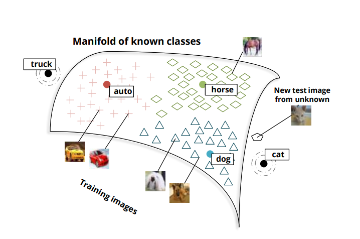
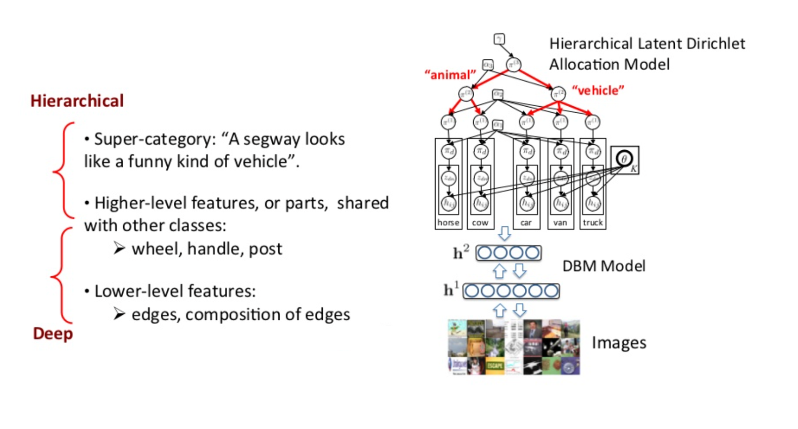
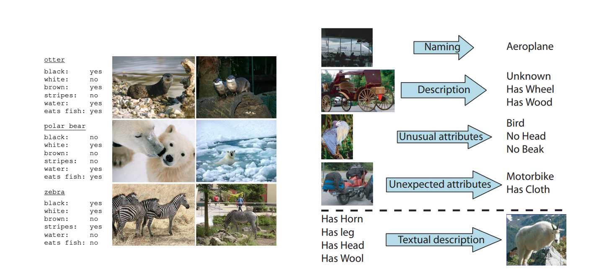
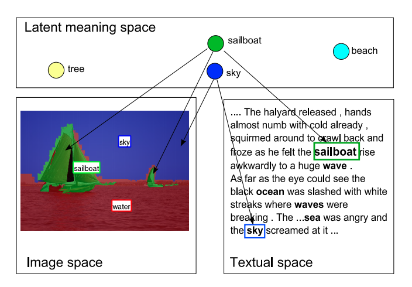
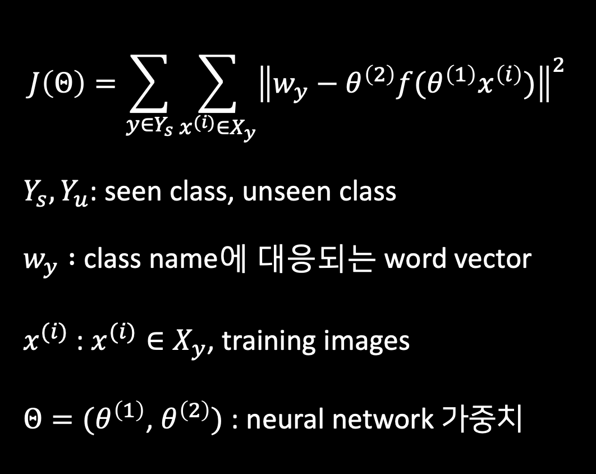
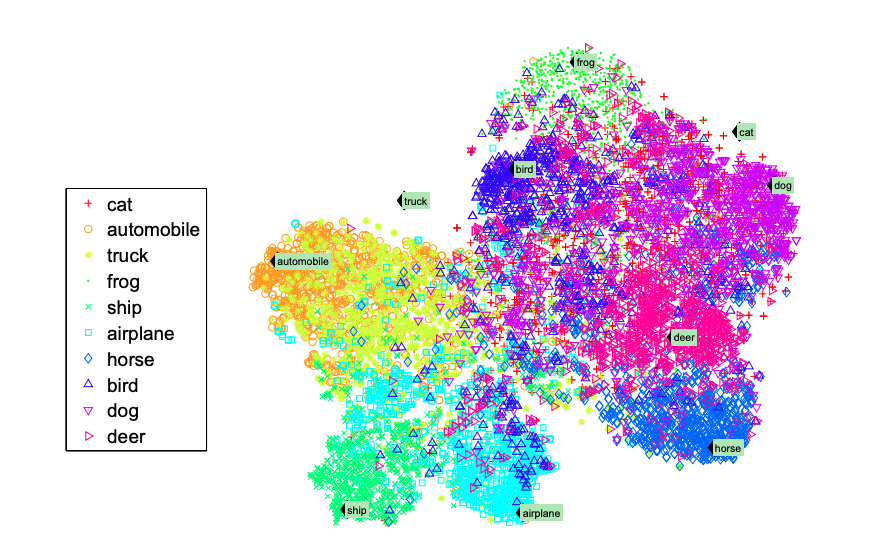
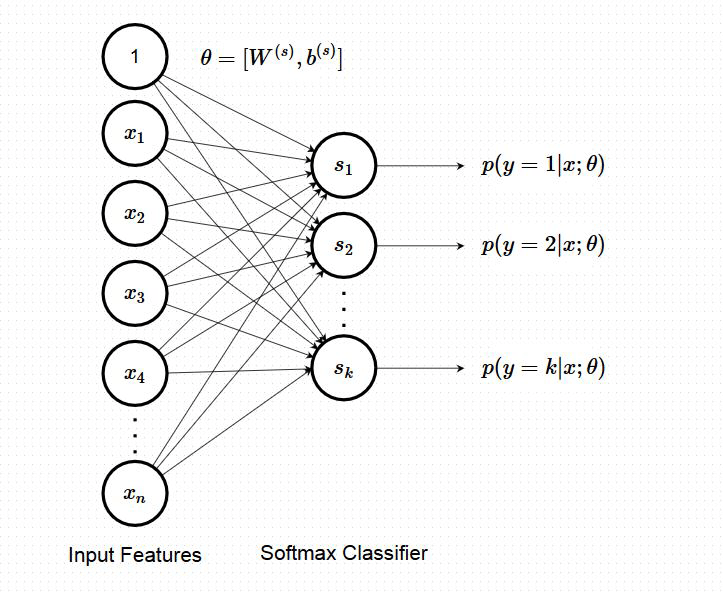
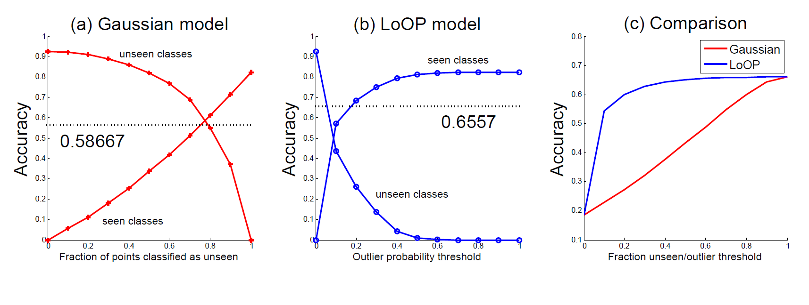
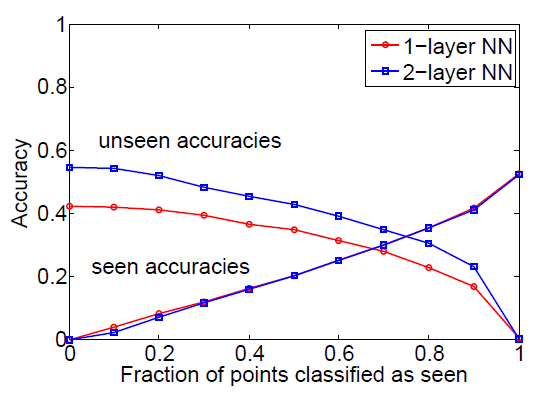
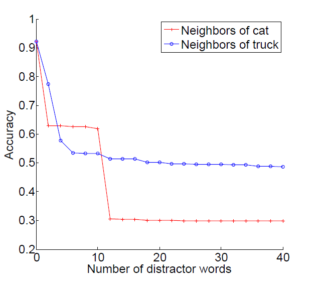

```{r setup, include=FALSE}
knitr::opts_chunk$set(echo = TRUE)
```

'Zero-Shot Learning Through Cross-Modal Transfer' 논문을 바탕으로 zero shot learning에 대한 전반적인 내용을 소개하는 자료입니다.

# 1.Introduction

제로샷 러닝은 한 번도 본 적 없는 데이터를 분류 가능하도록 학습하는 것이다. 이러한 학습 방법은 데이터가 없어도 유용한 패턴이나 결과를 도출하기 때문에 label이 없는 상품들을 분류해야 할 때나, 자동차 또는 전자 기기처럼 자주 신상품이 출시되는 품목에서 이미지들을 분류해야 할 때 사용된다. 예를 들어 소타나가 세단이라는 것을 판단할 경우 AI는 카테고리 별로 구분된 사전 데이터가 있어야 객체를 식별할 수 있다. 즉, 자동차가 어떻게 생겼고, 어떠한 종류들이 있다는 빅데이터를 학습하거나 검색해야 가능하다. 반면, 인간은 굳이 데이터를 검색하지 않아도 몇가지 정보만으로 직관적으로 소나타는 세단이라고 판단한다. 물론 이런 경우에도 자동차에 기초적인 상식이 있어야 하겠지만 AI처럼 광범위한 정보데이터를 필요로 하지는 않는 것이다. 제로샷 러닝은 이러한 인간의 능력을 모델링하고자 하는 기술이다. 


이 논문에서 학습데이터 라벨링 되어있던 클래스를 seen class, test데이터에서 처음 등장한 클래스를 unseen class라고 하자. 이 논문에서 소개할 제로샷 모델은 seen class와 unseen class를 모두 예측할 수 있다. 예를 들어 아래의 그림처럼 auto, horse, dog 등은 seen class이고, cat이나 truck은 unseen class라면 고양이 사진이  입력되었을 때 이 사진이 unseen class인 cat에 속하는 것인지, seen class인 auto,horse, 또는 dog에 속하는지 결정할 수 있다는 것이다.  

```{r figure1, echo=FALSE, fig.align='center', out.width = '100%'}


```

이 모델은 두 가지 main idea에 기초한다.
- 첫 번째, 이미지들은 신경망 모델로 학습된 단어의 의미적 공간에 매핑된다. 
- 두 번째로, 분류기는 test 이미지를 seen class로 분류하는 것을 선호하기 때문에 모델은 새로운 이미지가 seen class에 해당하는지 아닌지를 결정하는 novelty detection도 포함하게 된다. 


# 2.Related Work 

이 논문과 관련된 5가지 연구와의 연관성과 차이점에 대해 알아보도록 하자. 

- Zero-Shot Learning

Palatucci의 Zero-Shot Learning with Semantic Output Codes라는 논문으로, 학습데이터에는 없었던 unseen class를 의미적으로 매핑시켜 예측할 수 있다는 점에서 해당 논문과 가장 비슷한 연구이다. 여기서는 사람들이 특정 단어를 떠올릴 때의 fMRI scan이미지들을 수작업으로 구축된 feature space에 맵핑하고 그 feature들을 이용해서 분류한다. 학습데이터에 없었던 unseen image라도 이 이미지에 맵핑되는 word에 대해 semantic feature가 예측 가능하고, unseen class 간의 구분도 가능하다. 하지만 새로운 test instaces가 들어오면 그것이 unseen class인지 seen class인지에 대한 분류를 하지 못한다. 따라서 이러한 접근을 좀 더 확장하여 이 논문에서는 novelty detection을 사용하였다. 

- One-Shot Learning 

원샷 러닝은 이미지 인식 분야에서 training example의 수가 적을 때 이를 인식하고 분류하는 방법이다. Learning to Learn with Compound HD Models이라는 논문에서는 베이지안 계층 모델과 딥네트워크로 구성된 hierarchical deep model을 이용하여 이미지 분류를 학습한다.이는 feature representation이나 모델의 파라미터를 공유함으로써 이루어진다. 이 논문도 마찬가지로 딥러닝 기술을 이용해  low-level image feature 학습을 한 다음 확률적 모델을 사용하여 knowledge transfer를 하는 것을 기반으로 하는데 자연어로부터 cross-modal knowledge transfer를 하기 때문에 학습데이터가 필요하지 않다는 것이 추가적인 이점이라고 할 수 있다. 여기서 low-level image feature란 픽셀의 강도나 색상처럼 컴퓨터가 이미지를 식별하고 분류하는데 사용되는 특징이다. 이는 사람이 이미지를 묘사하는데 사용하는 특징으로 이미지의 내용과 같은 semantic image feature와 대비되는 개념이다. 
```{r figure2, echo=FALSE, fig.align='center', out.width = '100%'}


```

- Knowledge and Visual Attribute Transfer 

Describing Objects by their Attributes와 Learning To Detect Unseen Object Classes by Between-Class Attribute Transfer논문에서는 잘 설계된 semantic attribute를 이용하여 이미지들을 분류하였다. 아래 사진들처럼 이미지의 내용적인 특징을 기준으로 분류를 진행한 것이다. 우리 논문에서도 속성으로 이미지를 분류하는 작업을 하지만 이미지의 의미적인 부분에 대해서는 말뭉치에서 학습된 단어의 분포적 특성만 가지고 있으며, training image의 수가 0개인 카테고리와 1000개인 카테고리 간의 분류가 가능하다는 점이 조금 다르다. 
```{r figure3, echo=FALSE, fig.align='center', out.width = '100%'}


```

Towards cross-category knowledge propagation for learning visual concepts 논문에서는 카테고리 간의 지식을 직접 전파할 수 있는 교차 카테고리 라벨 전파 알고리즘을 개발했는데, 여기에서 하나의 카테고리에서 다른 카테고리로 지식을 transfer하는 시기를 알 수 있다.

- Domain Adaptation

Domain adaptation for large-scale sentiment classification: a deep learning approach와 Domain Adaptation in Sentiment Classification using Deep Sentence Properties에서는 한 도메인에서 훈련된 감정 분류기를 다른 도메인에 adaptation시키는 작업에 대한 연구이다.이러한 방법은 training data가 한 도메인에서는 많지만 다른 도메인에서는 매우 적거나 없을 때 유용한 방법이다. 예를 들면, 영화 리뷰에 대해 감정분석을 한 분류기를 책 리뷰에 적용시킨다면 그 둘이 연관성이 있기는 하지만 각 클래스에 대한 데이터가 있기 때문에 작업 라인이 달라지게 되고, 따라서 도메인에 따라 feature가 다를 것이다. 우리 논문에서도 다양한 카테고리에 대한 분류가 이루어지기 때문에 domain adaptation이 필요하고, 뒤에서 attribute-based model과 비교해 도메인에 빨리 적응한다는 내용이 등장한다. 

- Multimodal Embedding

multimodal embedding은 음성, 비디오, 이미지와 같이 여러가지 소스에서 나온 정보들을 연관짓는 것이다. Connecting Modalities: Semi-supervised Segmentation and Annotation of Images Using Unaligned Text Corpora에서는 단어와 이미지 부분을 같은 공간에 투영하여 annotation과 segmentation 부분에서 최고 성능을 얻었다. 이 연구에서는 우리 논문과 비슷하게 semantic word representation을 학습하기 위해 unsupervised large text corpora를 사용하였다. 

```{r figure4, echo=FALSE, fig.align='center', out.width = '100%'}


```


# 3.Word and Image Representation

distributional approach는 단어들 간에 의미적 유사성을 캐치하는데 자주 쓰이는 방법이다. 이러한 방식에서는 단어가 분포적 특성 벡터로 표현되며 대부분 저번 GloVe 논문에서 설명한 적이 있는 co-occurrences방식을 사용한다. 이러한 representation은 nlp task에서 매우 효과적이라는 것이 증명되었다. 다른 언급이 없으면 단어벡터는 50차원의 pre-trained 벡터로 초기화되며, 이 모델은 위키피디아 text를 이용하여 각 단어가 context에서 발생할 가능성을 예측하여 단어벡터를 학습한 것이다. 이 모델은 local context와 global document context를 모두 이용하여 통사적,의미적 정보의 분포를 캐치하였다.


# 4.Projecting Images into Semantic Word Spaces

이미지의 semantic relationship과 class membership을 학습시키기 위해 image feature vector를 d차원의 semantic word space인 F에 투영하였다. 이미지와 단어 간의 매핑을 훈련시키기 위해 다음의 식을 최소화해야한다. 

```{r figure5, echo=FALSE, fig.align='center', out.width = '50%'}


```

여기서 neural network layer가 2개일 때 single linear mapping보다 더 성능이 뛰어났다. 이렇게 이미지를 단어 벡터 공간에 투영함으로써 시각적으로 의미를 확장할 수 있다. 

다음 그림은 word vector와 image로 seen class와 unseen class의 semantic space를 시각화한 것이다. semantic space는 원래 50차원인데 t-SNE를 이용하여 2차원으로 축소하여 시각화하였다. 

```{r figure6, echo=FALSE, fig.align='center', out.width = '100%'}


```

그림을 보면 대부분의 class들은 각자 대응되는 word vector가 응집력 있게 군집을 이루고 있는 반면 cat이나 truck과 같은 zero-shot class는 그렇지 않다는 것을 확인할 수 있다. 하지만 각각의 zero-shot class들은 의미적으로 유사한 벡터에 가깝게 위치하고 있는데, 예를 들어 cat은 dog나 horse와는 가까이 있지만 car나 ship과는 떨어져있다. 이러한 발견이 unseen class의 image를 detection 하는 아이디어의 근간이 되었고, 그것들을 zero-shot word vctor로 분류하게 되었다. 


# 5. Zero-shot Learning Model

##### Notation
$y \in y_s \cup y_u$ : seen and unseen 클래스에 대한 y값  
$x \in X_t$ : test셋 이미지  
$f \in F_t$ : test셋 semantic vectors  
$X_s$ : seen 클래스에 대한 모든 training셋 이미지의 feature vectors  
$F_s$ : 각 $X_s$에 대응하는 semantic vectors  
$F_y$ : y의 클래스에 대한 semantic vectors  
$V \in \{s,u\}$ :  seen and unseen 클래스에 대한 novelty 변수  
$\theta$ : image feature vector를 d차원 semantic word space에 매핑시키기 위한 Neural Network의 파라미터  

- 본 논문에서 제시하는 모델의 궁극적 목표는 테스트 셋의 이미지 $x \in X_t$에 대한 $p(y|x)$를 예측하는 것이다. 이를 달성하기 위해 이미지 $x$가 $f \in F_t$에 매핑된 semantic vectors를 사용할 것이다.

- 또한, 일반적인 분류기는 테스트 셋에 없는 클래스에 대해 예측하지 못하므로 novelty detection을 적용해 테스트 셋에 대한 unseen class를 처리했다. 테스트 이미지 $x$에 대한 클래스 $y$가 seen인지 unseen인지 판별하기 위해 semantic vector $f$를 사용하여 아래와 같은 식으로 $p(y|x)$를 구한다.

$$
p(y|x,X_s,F_s,W,\theta)=\sum_{V\in \{s,u\}} P(y|V,x,V_s,F_s,W,\theta)P(V|x,X_s,F_s,W,\theta)
$$

### 5.1 신규 데이터 탐지 전략
- $P(V=u|x,X_s,F_s,W,\theta)$는 unseen class 이미지에 대한 확률이지만 training 데이터로는 이를 구할 수 없다. 하지만 대략적으로 기존의 semantic region에 있을 것이다. (unseen 고양이 semantic vectors가 seen 강아지 semantic vectors region 주변에 있음) 따라서 이상치 탐지로 seen과 unseen을 판별할 수 있을 것이다!

- 두 가지 이상치 탐지 전략을 사용했는데, 둘 다 semantic vector가 매핑 된 트레이닝 이미지의 매니폴드를 계산하는 방법이다. 

#### 1) 각 클래스 마다의 등거리 변환된 정규 분포 사용 (isometric, class-specific Gaussians)
- 각 seen 클래스 $y$에 대해 $P(x|X_y,w_y,F_y,\theta)=P(f|F_y,W_y)=\mathcal{N}(f|W_y,\mathsf{\Sigma}_y)$를 계산하는데, 각 클래스에 대한 정규 분포는 semantic word vector인 $w_y$을 mean으로, $\mathsf{\Sigma}_y$를 공분산으로 갖는다.
- 특정 threshold $T_y$를 설정해 확률이 그것 이하면 이상치(1), 즉 unseen으로 판별한다.
$$
P(x|X_y,w_y,F_y,\theta):=\mathbf{1}\{\forall y \in Y_s : P(f|F_y,W_y) < T_y\}
$$
- 임계값이 작을수록 unseen class로 판별되는 데이터가 적어진다. 방법 1의 가장 큰 결점은 이상치에 대해 실제 확률값을 도출하지 않는 다는 점이다. 방법 2는 이를 보완한다.

#### 2) seen과 unseen에 대한 weighted combinated classifiers를 사용해 클래스에 대한 조건부 확률을 구함
- Fig2를 보면, 많은 unseen 이미지는 전체 데이터 매니폴드에 대해 이상치가 아님을 알 수 있다. 따라서 방법 2는 novelty인지 아닌지를 정하는 데 있어 매우 보수적이므로 seen 클래스에 대해 높은 정확도를 보인다. 그러므로 모든 test 이미지를 이상치로 간주하지 않기에 모든 test 데이터를 사용하지 않는다.
- 위 방법은 두 개의 파라미터를 갖는다.  
$k$ : 특정 포인트가 이상치인지 결정하기 위해 고려되는 가장 가까운 이웃의 수  
$\lambda$ : 표준편차의 계수. $\lambda$가 클수록 더 많은 포인트가 평균에서 떨어져 있음  

- seen 클래스의 training 데이터 중 각 포인트 $f \in F_t$에 대해 가장 가까운 k개 이웃을 context set $C(f) \in F_s$로 정의한다. 이를 사용해 각 $x$와 $C(f)$에 대한 pdist(probabilistic set distance)를 구할 수 있다. distance는 유클리드 거리를 사용했다.
$$
pdist_\lambda(f,C(f))=\lambda\sqrt{\cfrac{\sum_{q\in C(f)}d(f,q)^2}{|C(f)|}}
$$

- 또한 이를 활용해 lof값을 구한다. (lof 값과 이상치 정도는 비례함)
$$
lof_\lambda(f)=\cfrac{pdist_\lambda(f,C(f))}{\mathbb{E}_{q\sim C(f)}[pdist_\lambda(f,C(f))]}-1
$$
- 이상치에 대한 실제 확률을 구하기 위해 normalization factor $Z$를 아래와 같이 정의한다. $Z$는 seen 클래스의 training 데이터의 lof값에 대한 표준편차로 여겨질 수 있다.
$$
Z_\lambda(F_s)=\lambda \sqrt{\mathbb{E}_{q\sim F_s[(lof(q))^2]}}
$$

- lof와 $Z$를 사용해 Local Outlier Probability를 아래처럼 구한다. erf는 $\cfrac{2}{\sqrt{\pi}}\int_0^x e^{-t^2}\, \mathrm dt$이다. 이렇게 seen과 unseen에 대한 실제 확률을 구해 분류의 객관성을 확보했다,
$$
LoOP(f) = max\{0,erf(\cfrac{lof_\lambda(f)}{Z_\lambda(F_s)})\}
$$

### 5.2 분류
- $V=s$의 경우, $P(y|V=s,x,X_s)$를 구하기 위해 아무 분류 모델이나 사용할 수 있지만, 논문에서는 softmax classifier를 사용했다.
- $V=u$의 경우, 즉 zero-shot의 경우에는 각 novel class word vectors에 isometric Gaussian을 가정해 likelihood에 따라 클래스를 분류했다.


# 6. Experiments
- 실험에 사용한 데이터셋은 CIFAR-10이다. CIFAR-10 데이터 셋은 10개의 클래스(label)로 구성되어 있으며, 각 클래스에 대해 32x32의 RGB 데이터가 5000장 포함되어 있다. 이미지 데이터는 feature vector로는 Coates와 Ng 교수가 사용한 비지도 학습 방법론을 이용해 12,800 차원의 벡터로 변환하였다. word vector로는 Hwuang이 제안한 50차원의 word vector set을 사용했다(학습된 vector를 그대로 가지고 왔다는 뜻).
- 데이터를 Seen과 Unseen 데이터로 구분하기 위해 CIFAR-10 데이터 중 2개의 클래스를 Unseen으로 가정하여 사용했다. 즉, 2개의 클래스를 학습에 사용하지 않고, test에만 사용했다. 

### 6.1 Seen and Unseen Classes Separately
- 우선 Seen 클래스에 대한 분류 정확도(accuracy)를 평가해보았다. 논문은 softmax 분류기를 이용해 8개의 클래스에 대한 분류 정확도를 평가한다. 이때 평균 82.5%의 정확도를 달성했다. 이때, cat 과 truck 클래스를 unseen 클래스로 사용했는데, 이때,10개의 클래스를 모두 사용해 분류한  Ng 교수의 논문과 성능이 비슷하게 나왔다고 한다. 
```{r, echo = FALSE, fig.align='center', out.width='100%'}


```
- Softmax 분류기는 찾아보니 Logistic Regression이 이중분류밖에 못하니까, 이를 발전시킨 형태인 것 같다. 단순히 말하면, 인공신경망 모델에서 다른 층 없이 softmax 층만 붙인 것이다(위 사진은 ANN 배울 때 자주 보던 사진과 비슷하지 않은가). 혹은, logistic regression을 class 수만큼 실행하고, 이 값들을 softmax 층에 통과시킨 것이다. logistic regression과 달리 SGD(Stochastic Gradient Denscent)를 이용해 최적화 한다는 점에서 ANN에 더 가까운 모델인 것 같다. 

- Unseen 클래스에 대해서 분류를 해보자. 분류 모델은 isometric Gaussian을 사용했다는데, 단순히 Unseen 클래스의 word vector와 맵핑된 이미지 벡터 사이에서 거리가 가장 가까운 클래스로 분류해주는 모델이다. 이때 만약 Unseen 클래스와 비슷한 클래스를 학습에 사용했으면(예를들면 cat과 비슷한 dog 클래스) 성능이 좋게 나왔지만, 비슷한 클래스가 없었다면 성능이 좋지 못했다고 한다. 이는, 이미지 벡터를 word vector로 맵핑하는 모델이 잘 학습되었다면, 이미지를 잘 맵핑할 수 있기 때문일 것이다. 즉, 고양이랑 개는 비슷하게 생겼으니, 비슷한 word vector로 맵핑되어야 하고, 이는 cat과 truck을 다르게 맵핑하여 서로 구분하기 쉽게 해줄 것이라는 이야기다. 

### 6.2 Influence of Novelty Detectors on Anverage Accuracy
- 위에선 Seen 클래스와 Unseen 클래스를 나누어 분류기의 성능을 평가했다. 그렇다면, Seen과 Unssen 클래스를 함께 test하여, Seen인지 Unseen인지 마저 예측하게 한다면 성능이 어떨까? 이 경우, 데이터는 이상치 탐지기를 통과하여 Seen과 Unseen으로 분류되고, Seen은 softmax 분류기를 통해, Unseen은 Gaussian 분류기를 통해 분류되게 된다. 
```{r, echo=FALSE, fig.align='center', out.width = '50%'}


```
- 그 결과는 위 그림과 같다. 테스트 데이터들은 10 클래스에서 동일한 수를 추출했다. 맨 왼쪽 그래프를 먼저보자. Gaussian Unseen 분류기와 LoOP 모델 모두 fraction이 낮을 경우(그래프의 왼쪽) 모든 데이터를 Unseen으로 간주했다. 그 반대의 경우(그래프의 오른쪽) 역시 마찬가지였다. 
- 하지만 fraction의 정도에 따른 변화는 두 분류기가 달랐다. Gaussian의 경우 Unseen으로 분류하는데 자유롭기 때문에(데이터에 강건하다는 뜻인듯)fraction이 상승해도 비교적 Unseen을 잘 분류하는 모습이다. 하지만 LoOP 모델은 이상치 분류 모델이기 때문에, manifold 평면 상에 넓게 펴져 있는(위에 그림에서 봤듯이) Unseen 데이터를 제대로 분류하지 못하면서 fraction이 커질 수록 Seen 데이터를 잘 분류해내는 모습이다. 
- 즉, 불균형 데이터(2:8)에 대해 accuracy가 좋은 지표가 아닌 이유를 이 두 모델이 잘 설명하고 있다. 하지만, 만약 사용자가 Seen 데이터의 성능을 놓치고 싶지 않다면 LoOP 모델을 사용하면 좋고, Unseen 데이터에 대해 성능을 잡고 싶다면 Gaussian 모델을 고려해볼 수 있을 것이다. 
- 결론적으로, 원하는 Seen과 Unseen 데이터에 대한 성능에 따라 Threshold를 조절하고 이상치 분류기 모델을 선택할 수 있을 것이다. 

### 6.3 Combining predictions for seen and unseen classes 
- 우리가 할 전반적인 작업은 Bayesian  파이프라인을 만드는 것이다. 즉, 우리는 우선 사전 확률로 한 이미지가 이상치일 확률을 구해놨다. 그리고 LoOP는 확률값을 반환해준다. 하지만 Gaussian 모델은 확률값을 반환해주지 않기 때문에 cutoff fraction을 설정하여 로그 확률값을 반환하도록 했다. 그리고 이 확률에 따라 0 또는 1로 분류되도록 threshold를 설정했다. 이 결과 나타난 모델의 성능이 위 그래프에서 수평선으로 되어 있는 성능이다. 

### 6.4 Comparison to attribute-based classification
- 기존의 모델들과 비교하기 위해, Lampert가 사용했던 attribute-based 분류기와 성능을 비교해보았다. 논문에선 25개의 특성을 직접 구성했다고 한다. 어떤 특성들은 동물 기반의 특성이고, 어떤 특성은 탈 것 기반의 특성이라고 한다. (귀 모양, 깃털 유무, 바퀴 갯수 등등) 그리고 각각의 특성을 구분하는 분류기를 각각 만든 후(이 사진이 귀 모양이 0이냐 1이냐로 분류하는 모델), Unseen 데이터에 대해 labeling 하도록 했다(Unseen 데이터는 처음부터 Unseen 하도록 하고 싶었던 듯 하다.). 이후, 최종적인 Unseen 데이터에 대해 MAP(Maximum A Posteriori, 사후확률최대화?)를 이용해 분류했습니다. 그리고 그 결과 Gaussian 분류기를 이용할 경우 74.25%, LoOP를 이용할 경우 65.31%, MAP를 이용할 경우 42.25%로 해당 논문의 결과가 월등히 좋았습니다. 
### 6.5 Novelty detection in original fearture space
- 6.2에선 word space에 대한 연산을 포함하고 있습니다. 만약, 원래 공간(이미지 feature에 대해)에서 Gaussian 모델을 사용하면 어떨까요? Gaussian 이상치 탐지기를 이용한 결과, 100개의 이미지가 이상치일 가능성이 가장 높은 것으로 나타났습니다. 하지만 이중 12%의 이미지는 이상치가 아닌 False Positive 였습니다. 또한, 이 False Positive 비율은 최대 78%까지 올라가는 것으로 나타났습니다. 
- 이는 역으로 word space로의 맵핑이 이미지 간의 잠재 의미들을 잘 살린다고 볼 수 있는 결과입니다. 즉, 이미지 자체로는 동일 클래스의 이미지들이 공간 내에서 비슷한 위치에 있지 않지만, 맵핑을 통해 비슷한 위치로 이동하는 것을 의미합니다. 고양이 이미지들이 "고양이"라는 단어 vector의 주위로 모인다는 뜻이지요. 

### 6.6 Extension to CIFAR-100 and Analysis of Deep Semantic Mapping
- 실험에 사용한 데이터는 고작 클래스가 10개 밖에 되지 않았습니다. 즉, 정확도(accuracy)가 상대적으로 높을 수 밖에 없습니다. 또한 단어 vector들이 클래수랑 동일하기 때문에 10개 밖에 되지 않아 맵핑이 잘 되었을 수도 있습니다. 그러면, 이를 확장해보면 어떻게 되는지 봅시다. 
- CIFAR-100 데이터셋은 100개의 클래스에 대해 32x32 RGB 이미지가 각각 500개씩 있는 데이터셋입니다. 연구진은 이 중 4개의 클래스가 word vector가 없어 삭제했습니다. 그리고 CIFAR-10 데이터와 합쳐 총 106개의 클래스에 대한 데이터를 확정했습니다. 그리고 이 중 6개의 클래스를 Unseen 데이터로 간주했습니다. 그리고 정확도를 측정한 결과, 52.7%의 정확도를 얻을 수 있었습니다. 이 수치는 해당 데이터 셋에 대한 베이스라인 모델과 비슷한 수치입니다. 즉, 논문에서 구현한 한번도 학습하지 않은 데이터에 대한 성능이 기존 논문에서 기준 성능으로 삼고 있는 모델과 비슷한 성능을 보이는 것입니다. 
```{r, echo=FALSE, fig.align='center', out.width = '50%'}


```
- 연구진은 word space가 100개의 클래스로 더 커졌기 때문에, 이미지를 word space로 맵핑하는 일이 더 복잡할 것이라고 판단했습니다. 이에 히든 레이어를 포함하여 Section4에서 설명한 인공신경망이 성능을 향상시킬 것이라고 판단했습니다. 이를 통해 위와 같은 성능 향상을 기록했습니다. 

### 6.7 Zero-Shot Classes with Distractor Words
```{r, echo=FALSE, fig.align='center', out.width = '50%'}


```
- 하지만 현실에선 Unseen 클래스가 Seen 클래스보다 많을 수밖에 없습니다. 이를 구현하기 위해 논문에서는 두가지 상황을 가정했습니다. 첫번째로는 무작위 word vector를 Distractor Words로 추가하여 Unseen 데이터의 정확도를 측정하거나, Unseen 클래스와 word space 상 거리가 가까운 단어들을 Distractor Words로 추가하여 실험했습니다. 이 논문에서 제안하는 모델은 기본적으로 이미지 데이터를 word space 상에 맵핑하고, 가까운 class의 word vector를 찾아 분류하는 모델이기 때문에, 클래스가 전혀 아닌 word vector가 추가되었을 때 성능의 변화를 보고 싶었던 것입니다. 비슷한 단어들은 예를 들어 Unseen 클래스가 cat이라면 Distractor Words는 rabbit, kitten, mouse와 같은 단어들이었습니다. 
- 무작위 word vector를 추가한 경우 강건한 모습을 보이며 성능이 잘 저하되지 않았습니다. 하지만 Unseen 클래스와 비슷한 단어들을 추가한 경우 일정 개수가 단어가 추가될 때까지는 계속해서 성능이 저하되다, 수렴하는 모습을 보였습니다. 이 역시 word space로의 맵핑이 잘 이루어졌다고 할 수 있습니다. 비슷한 단어들은 당연히 성능에 영향을 줄 수 밖에 없습니다. cat이나 kitten이나 결국 고양이인데, word space에서 비슷한 곳에 위치해 있을 것이고, 그렇다면 이미지를 맵핑 했을 때 둘 사이 어딘가에 위치하여 kitten으로 분류되는 이미지가 있을 수 밖에 없습니다. 또한, 어느 정도 거리가 있는 word vector들은 당연히 이미지에서도 의미가 멀 수 밖에 없으므로 해당 클래스로 분류되는 일이 없을 것이기 때문에 성능에 큰 영향을 미치지 않는 것입니다. 

# 7. Conclusion
- 인 논문은 딥러닝을 활용한 단어(class)와 이미지 표상(임베딩이라고 우리는 배웁니다.)을 이용해 제로샷 분류를 제안했습니다. 
- 이 논문에서 주로 제시한 발상은 다음과 같이 두가지입니다.
- 첫째, semantic word vector(워드 임베딩을 통해 만들어진 벡터들)이 나타내는 표상은 이미지와 텍스트 간의 지식 전달(help to transfer knowledge)를 가능하게 한다. 
- 베이지안 프레임 워크는 제로샷과 일반 분류를 하나의 프레임워크로 묶을 수 있다. 


