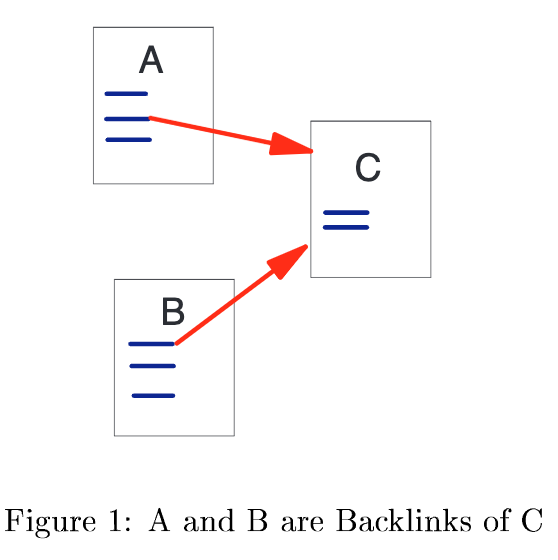
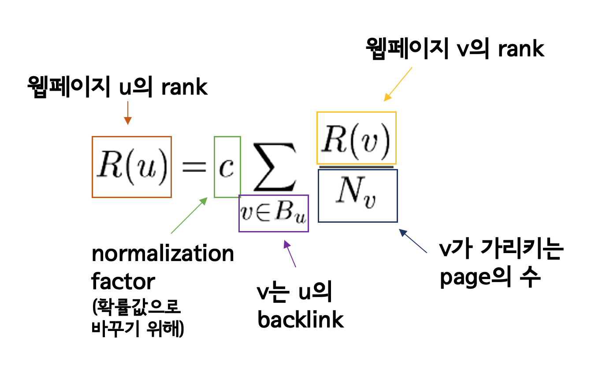
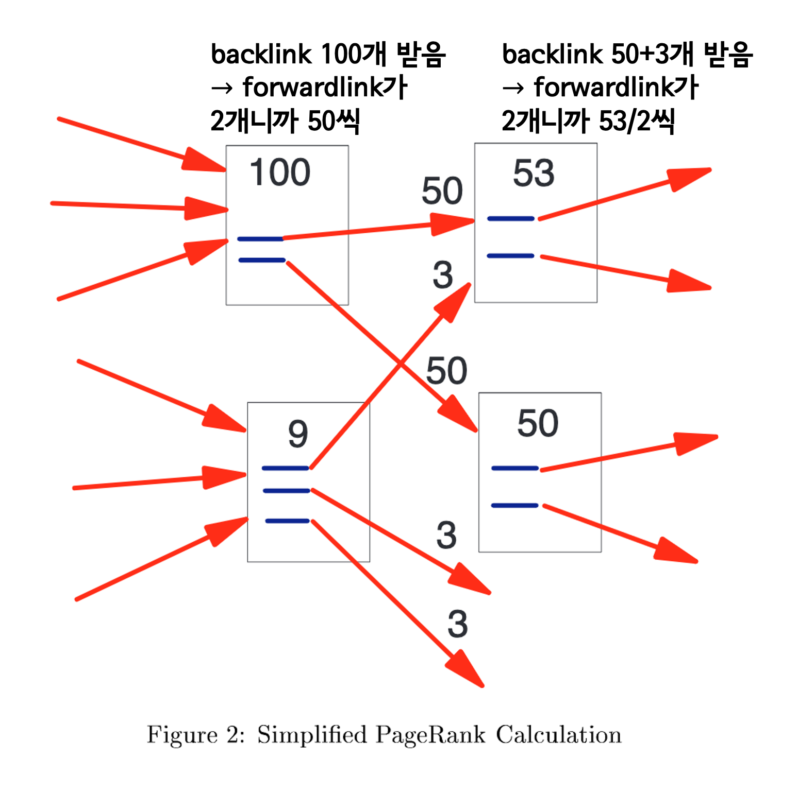
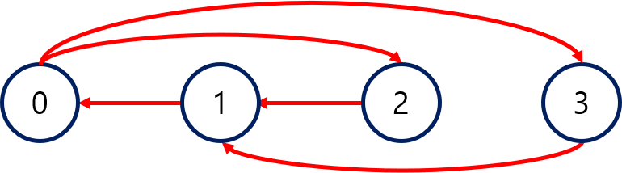

```{r setup, include=FALSE}
knitr::opts_chunk$set(echo = TRUE)
```

해당 내용은 ’The PageRank Citation Ranking : Bringing Order to the Web’ 논문에 대한 요약입니다.

# Introduction and Motivation

구글에 "PageRank"라는 검색어를 입력하면 약 17,100,000개의 검색결과가 나온다. 그런데도 구글 search statistics에 따르면 사용자들이 2번째 검색 결과 페이지로 넘어가는 일은 1% 미만으로 매우 드물다고 하니 이 방대한 검색결과 중 유용한 웹페이지들은 모두 첫 페이지에 있었다고 생각해 볼 수 있다. 이 논문에서는 이렇게 웹페이지에 "중요도"를 기준으로 순위를 부여한 PageRank에 대해 알아보고자 한다. 

## Diversity of Web Pages

학술 논문 인용 분석에 대한 연구는 이미 많은데 논문 인용과 웹페이지의 link structure는 비슷하지만 많은 점에서 다르다. 세심하게 검토되는 학술 논문과 비교해 웹페이지는 상대적으로 질적인 부분이나 출판 비용에 구애를 받지 않는다. 또한 웹페이지에는 이익을 얻으려는 회사의 광고성 글도 포함한다. 즉, 웹페이지가 학술 논문보다 질적인 부분, 용도, 인용, 분량 등의 측면에서 더 광범위하다. 따라서 웹페이지가 차별화될 수 있는 요인들은 다양한데, 이 논문에서는 웹페이지의 전반적인 상대적인 중요도에 초점을 맞추기로 한다. 

## PageRank

앞서 언급했던 것처럼 웹페이지의 상대적 중요도를 구하기 위해서는 PageRank 알고리즘을 사용한다. PageRank 알고리즘은 웹페이지들이 다른 웹페이지들의 링크를 인용하는 웹의 그래프를 이용하여 계산한다. 

```{r, echo=FALSE, fig.align='center', out.width = '50%'}

```

# Ranking for Every Page on the Web

## Related Work

- 학술 논문 인용을 분석하여 과학 커뮤니티에서 정보가 어떻게 흐르는지에 대한 이론 정립
- 웹과 같은 large hypertext system의 link structure를 이용한 다양한 연구들
- 그 예시로 HITS(Hypertext induced Topic Selection) 알고리즘
- Authority : 중요한 정보를 제공하고 있는 페이지로, 우수한 Authority일수록 우수한 Hub에서 링크를 많이 받음
- Hub : 중요한 정보를 제공하고 있는 페이지에 링크를 보내고 있는 페이지로, 우수한 Hub일수록 우수한 Authority에 링크를 함
- 이 두 가지 개념을 이용해 피참조도와 높은 평가를 받은 웹페이지로부터의 참조도를 통해 중요도가 높은 웹페이지를 추출하는 알고리즘 
- 우리 논문에서도 페이지의 중요도에 대해 비슷한 방식으로 접근

앞서 언급한 것처럼 웹의 hypertextual citation structure는 학술 논문 인용 구조와 비슷하지만 이것을 그대로 적용해서 단순히 backlink가 많은, 그러니까 많은 페이지에서 인용된 페이지가 중요하다고 생각할 수 있다. backlink가 많은 페이지라는 것은 어느 정도 중요한 페이지라고 볼 수 있긴 하지만 웹의 특성상 단지 backlink 수만으로 중요도를 평가하는 것은 문제가 많다. 그래서 관련 연구로 소개한 것처럼 Authority, Hub와 같은 개념이 필요하다. 

## Link Structure of the Web

```{r, echo=FALSE, fig.align='center', out.width = '50%'}

```

link에는 forwardlink와 backlink가 있다. 그림을 보면, A와 B의 입장에서 저 링크는 C로의 forwardlink이다. C의 입장에서 A와 B에서 오는 링크들은 backlink가 된다. 

```{r, echo=FALSE, fig.align='center', out.width = '80%'}

```

위의 그림에서 친구의 블로그는 보나마나 backlink가 매우 적을 것이다. 반면 전세계인의 유용한 정보원인 위키피디아는 backlink가 아주 많을 것으로 예상된다. 이 둘을 비교해 보면 당연히 backlink가 많은 위키백과가 개인 블로그보다 중요하다. 

하지만 웹에서는 backlink가 많은 것이 높은 중요도로 대응되지 않는 사례가 많다. 그럴 일은 없겠지만 만약 위키백과에서 친구의 블로그 링크를 인용한다면, 위키피디아와 같은 매우 중요도가 높은 웹페이지가 인용을 한 친구의 블로그는 그 중요성이 높아진다. 위키피디아의 중요도가 워낙 높기 때문에 backlink의 수가 많은 다른 파워블로그들보다도 훨씬 그 중요도는 높게 평가될 것이다. 그런데 위키피디아가 친구의 블로그를 인용하다가 갑자기 손절을 한다면 하나의 link였을 뿐이지만 그 link가 매우 중요한 것이였기 때문에 중요도에 대한 타격이 클 수밖에 없다.

## Propagation of Ranking Through Links

앞서 본 예시를 통해 우리는 backlink들의 순위 합이 높으면 그 인용 당한 페이지의 순위도 높을 것이라는 것을 알 수 있다. 이 말은 단순히 backlink의 수가 많은 경우와 backlink의 수가 적어도 그것들이 굵직한 것인 경우를 모두 포함한다. 

## Definition of PageRank

```{r, echo=FALSE, fig.align='center', out.width = '70%'}

```

위의 식은 웹페이지 u의 Rank를 구하는 simplified version식이다. v가 u의 backlink라고 하면 u의 rank는 자신을 가리키는 backlink들의 rank를 수집한다. $N_v$는 v가 가리키는 페이지 수인데 이 $N_v$가 높아지면 $\frac{R(v)}{N_v}$이 낮아지기 때문에 상업적 link를 거르는데 도움이 된다.

```{r, echo=FALSE, fig.align='center', out.width = '60%'}

```

위의 그림은 위의 식을 그림으로 나타낸 것이다. 

하지만 위에서 본 simplified version의 식은 rank sink문제가 발생할 수 있다. sink는 그래프 이론에서 밖으로 나가는 링크가 없는 것을 가리킨다. 즉, 아래 그림처럼 밖으로 나가는 링크 없이 trap에 갇히는 구조를 말한다.

```{r, echo=FALSE, fig.align='center', out.width = '70%'}

```

따라서 이 문제를 해결하기 위해 rank source를 도입한다. source는 그래프 이론에서 안으로 들어오는 것은 없고 밖으로 나가는 것만 있는 것을 가리킨다. 여기서 $E(u)$를 rank source에 해당하는 웹페이지의 벡터 중 하나라고 하자. 그러면 일군의 웹페이지들은 다음 식을 만족한다. 

```{r, echo=FALSE, fig.align='center', out.width = '70%'}

```

## Random Surfer Model

Simplified version의 PageRank는 웹 그래프 상에서 랜덤 워크의 확률분포에 해당한다. 직관적으로 생각해 보면 이것은 "random surfer"의 행동을 모델링한 것으로 볼 수 있다. "random surfer"는 무작위로 일련의 링크들을 클릭해 나간다. 생각해 보면 우리가 링크를 따라서 웹 서핑을 하다가 trap에 갇혔을 때 계속 갇혀있지는 않는다. 링크를 따라서 계속 보다가 이미 다 본 페이지라는 생각이 들면 랜덤하게 다른 페이지로 이동할 것이기 때문이다. 여기서 $E$는 바로 이 행동을 모델링 한 것으로 볼 수 있다. 서퍼는 주기적으로 지루해지고, $E$분포에 기반해서 랜덤한 페이지로 건너 뛴다. 

## Dangling Link

```{r, echo=FALSE, fig.align='center', out.width = '40%'}

```

이 모델에서의 이슈 중 하나는 dangling link 문제이다. dangling link는 위의 그림처럼 외부로 나가는 링크가 없는 페이지를 가리키는 링크를 뜻한다. dangling link가 모델에 영향을 주는 이유는 이 link의 가중치가 어디로 분산되고 있는지가 불분명하고 또 dangling link의 수가 많기 때문이다. 하지만 dangling link는 다른 페이지의 순위에 직접적으로 영향을 주지는 않는다. 따라서 이 논문에서는 모든 PageRank가 계산이 될 때까지 그냥 dangling link들을 제거했다. PageRank 계산이 다 끝난 뒤에, 즉 큰 영향을 주지 않을 때 dangling link를 다시 추가할 수 있다. 

# Implementation

PageRank를 시행하기 전에 웹 크롤러는 수 천 억개에 달하는 웹페이지에서 정보를 모아 이를 검색 색인에 정리한다. 단순한 과정 같지만 웹 상에는 페이지의 수가 어마어마하게 많고 또 무한하게 큰 사이트나 페이지, html이 잘못된 웹페이지 등 여러가지 문제가 있기 때문에 쉬운 일은 아니다. 그럼에도 불구하고 여기서는 공개적으로 접근가능한 실제 link structure를 상당한 수준으로 표현했다고 한다. 

## PageRank Implementation

PageRank가 이루어지는 과정은 다음과 같다. 
- 각 페이지들의 URL을 unique integer로 바꾸고 그것들을 데이터베이스에 저장한다. 
- link structure를 그 데이터베이스의 시스템에 따라 정렬한다. 
- 앞서 언급한 것처럼 dangling link를 데이터베이스로부터 제거한다. 
- 페이지에 initial rank를 부여한다. (Marcov Chain이 일어나기 전)
- 확률이 수렴할 때까지 반복한다. 좋은 initial rank를 부여해야 수렴이 빨라진다.

# Markov chain

## 정의

마코프 체인은 마코프 특성을 가지는 확률 과정이다. 마코프 특성은 미래의 상태가 과거의 상태와는 독립적으로 현재의 상태만으로 결정되는 것을 의미한다. 이를 식으로 나타내면 다음과 같다.

$$
\begin{aligned} 
P(X_{n+1}=j |X_n=i, X_{n-1}=i_{n-1},...,X_0=i_0)\\
=P(X_{n+1}=j|X_n=i)
\end{aligned}
$$

마코프 체인에서 한 상태에서 다음 상태로 변화하는 것을 전이라고 하고, t시점에 상태 i에서 t+1시점에 상태 j로 전이할 확률을 $P(X_{t+1}=j|X_t=i) = p_{ij}$로 나타낼 수 있다. 모든 i와 j 상태에 대한 전이 확률을 다음과 같이 행렬 형태로 나타낼 수도 있는데 이를 전이 행렬이라고 한다. 마코프 체인은 다음과 같은 전이 행렬의 형태로 표현할 수 있다.  

$$
\begin{aligned}
\mathbb{P} = 
\begin{pmatrix}
p_{00} & p_{01}&\cdots\\
p_{10}&p_{11}&\cdots\\
\vdots&\vdots&\ddots
\end{pmatrix}
\end{aligned}
$$

다음과 같이 t+1시점에서 어떤 상태일 확률은 t시점에서의 확률에 전이 행렬을 곱해준 형태로 말할 수 있다. 

$$
\begin{aligned}
r_{t+1} = \mathbb{P}r_t
\end{aligned}
$$

전이를 반복한 결과 $lim_{n\to\infty}\mathbb{P}^n$은 더이상 변화하지 않고 어떤 값에 수렴하여 stationary state를 달성한다. 그렇다면 모든 마코프 체인이 이렇게 수렴하게 되는 것일까? 그렇지 않다. 

$$
\begin{aligned}
r_{t+1} = \mathbb{P}r_t \rightarrow r_{t+1}=r_t
\end{aligned}
$$


## 수렴의 조건
마코프 체인이 수렴하려면 irreducible하고, aperiodic한 stochastic matrix의 형태를 가져야 한다. 

### Irreducible

i 상태에서 j 상태로 갈수 있고, j 상태에서 i 상태로 갈 수 있을 경우 i와 j 상태가 communicate한다고 말한다. 만약 마코프 체인에서 모든 상태가 서로 communicate한다면, 이를 Irreducible MC라고 부른다. 

```{r, echo = FALSE, fig.cap = '', fig.align='center', out.width='50%'}

```

이 마코프 체인의 경우 모든 state가 다른 모든 state로 전이가 가능하기에 irreducible MC 이다. 

```{r, echo = FALSE, fig.cap = '', fig.align='center', out.width='70%'}

```

하지만 이 마코프 체인의 경우 {0,1}, {2,3}, {4}가 각각 communicating class가 된다. 예를들어 0 상태에서는 0과 1 상태로 전이할 수 있지만 다른 상태로는 전이할 수 없다. 이러한 경우를 Reducible MC 라고 한다. 

### Aperiodic

i 상태로 d step 후에 다시 온다고 할 때, i 상태는 d 주기로 periodic 하다고 한다. 모든 d에 대하여 최대공약수를 d(i)라고 하는데, d(i)가 1인 경우 aperiodic하다고 한다. 

```{r, echo = FALSE, fig.cap = '', fig.align='center', out.width='40%'}

```

```{r, echo = FALSE, fig.cap = '', fig.align='center', out.width='40%'}

```

0상태에서 d는 2,3,4....가 될 수 있으므로 d(0)=1이다. 마찬가지로 1 상태, 2 상태에서도 d는 2,3,4,...가 될 수 있으므로 모든 i에 대해서 d(i)=1이다. 따라서 이 경우 aperiodic하다고 할 수 있다. 

0 상태에서 d는 3, 6, 9 ...가 될 수 있으므로 d(0)=3이다. 마찬가지로 1,2,3 상태에서도 d는 3, 6, 9 ...가 될 수 있으므로 모든 i에 대해 d(i)=3이다. 이 경우 periodic 하다고 할 수 있다. 

$$
\vspace{10\baselineskip}
$$

## 수렴하지 않는 경우

### Dead end (Dangling link)

```{r, echo = FALSE, fig.cap = '', fig.align='center', out.width='30%'}

```

외부로 가는 link node가 없어 자신의 rank를 넘겨줄 수 없는 경우를 Dead end의 경우 iteration이 돌면서 결국 모든 page rank가 0으로 사라지게 되기 때문에 수렴하지 않는다. 위 그림의 상황을 행렬의 형태로 나타내면 다음과 같다. 

$$
\begin{aligned}
\mathbb{P} = 
\begin{pmatrix}
0 & 0&0\\
0&0&0\\
1&1&0
\end{pmatrix}
\end{aligned}
$$

이 행렬을 보면 세번째 컬럼의 합이 0으로, 1이 아니다. 즉, stochastic 한 행렬이 아니기에 수렴하지 않는다고 설명할 수 있다.  

### Spider trap

```{r, echo = FALSE, fig.cap = '', fig.align='center', out.width='30%'}

```

다음과 같이 rank가 한 block 내에서만 갇혀서 계산되는 경우를 Spider trap이라고 한다. Spider trap의 경우 iteration이 반복되면 spider trap의 노드들만 페이지랭크 계산이 되고, 나머지는 아주 작아지는 문제가 발생한다.

이는 {A,B}와 {C,D,E}로 나누어 지기에 reducible하고, d(a)=d(b)=2이기에 periodic 한마코프 체인이다. 즉, Irreducible, aperiodic한 마코프 체인이 수렴한다는 조건을 만족하지 못한다. 이렇게 Pagerank의 계산과 수렴을 마코프 체인으로 설명할 수 있다. 

# 수렴성과 실험

## Convergence Properties

```{r, echo = FALSE, fig.cap = '', fig.align='center', out.width='70%'}

```

앞의 마코프체인을 통해, 우리가 가진 그래프가 Irreducible/Positive Recurrent/Aperiodic 조건을 만족하면 limiting distribution(probability)을 지닌다는 것을 알았다. '수렴은 한다'라는 것을 알았으니, 이제 '수렴 속도'와 '어느 조건에서 빠르게 수렴하는가'에 대한 질문에 답해야한다. 위의 그림은 수렴속도를 보여주고 있다. 322 millon이나 161milion이나 수렴속도에서 큰 차이가 나타나지 않는 것을 실험을 통해 확인가능하고, 수렴속도는 약 $\log n$ 정도이다. 

그렇다면 우리 그래프가 어떤 조건에서 빠르게 수렴하는지를 설명하기 위해서, perfectly random walk(surfer) 구조를 생각해보자. 이 경우 모든 노드들이 동일한 가중치로 연결되어 있다. 너무나도 분명하게 Irreducible/Positive Recurrent/Aperiodic하다. 따라서 이는 잘 수렴할 것으로 생각되는데, 이를 행렬로서 이해하면 모든 성분이 $1 \over n$인 상황이다. 모든 행과 열은 linearly dependent하고, 해당 행렬의 rank는 1이다. 따라서 이 행렬이 지니는 eigenvalue는 오직 하나이다. 하지만 수학적으로는 이렇게 분명해도 large n을 지니는 행렬이기 때문에, 연산과정의 오차를 생각했을때 first largest eigenvalue와 second largest eigenvalue의 차이는 매우 큰 상황이 될 것이다. 

현실은 이런 이상적인 그래프 구조가 아니겠지만, 적어도 first largest eigenvalue와 second largest eigenvalue의 차이는 매우 크다면 충분히 합리적인 수렴속도를 지닌다고 이해할 수 있다. 결국에 같은 말이긴 하지만, random surfer 형태를 더해주는 것은 마코프체인의 수렴성을 위하면서 동시에 first largest eigenvalue와 second largest eigenvalue의 차이를 크게 만들어주기 위한 작업이다.

## Experiment

pagerank를 기반으로한 구글의 검색 결과와 title-based의 검색엔진의 검색 결과를 비교하려 한다. 각각의 성능을 측정하는 명확한 기준이 없기 때문에 명확한 실험이라고 말하긴 어렵지만, 가볍게 보는 것만으로도 pagerank의 우수성을 보여주는 부분이다. 해당 논문이 나온 시점에 이미 구글 엔진의 우수성은 널리 알려진 상태였다.

이런 pagerank 기반의 검색엔진은 '불충분한 정보'를 담은 검색어를 입력할 때 더 효과적이다. 예를 들어 'Stanford University'를 입력할 경우, 각각의 검색엔진은 모두 Stanford University을 맨 위에 반환한다. 반면에 단순하게 'University'를 입력할 경우, 각각의 결과를 보면 다음과 같다.

```{r, echo = FALSE, fig.cap = '', fig.align='center', out.width='80%'}

```

왼쪽의 구글 검색 결과는 상대적으로 우리가 많이 들어본 대학들이 많이 보이는 반면, 오른쪽의 'Altavista' 검색 결과는 최상단에 검색결과에 대해 의문을 제기할 수 밖에 없다. 대학들을 반환하고 있지만, 왼쪽의 결과가 조금 더 일반적으로 원하는 결과일 것이다. 왼쪽에서 %를 보여주는 부분은, 실제 pagerank에 log를 씌운 값을 정규화해준 값이다.

## 왜 잘 작동하는가?

어떤 단어에 대한 중요한 정보를 담고 있는 사이트를 찾는 것과, 해당 단어에 일반적으로 대응하는 사이트를 찾는 것은 다르기 때문이다. 논문에서는 'Wolverine'에 대한 예시를 들고 있는데, Wolverine은 미시간 대학의 GLS 같은거라고 이해하자. 미시간 대학의 학생은 Wolverine을 검색함으로써 Wolverine Access라는 사이트로 들어가길 원한다. 하지만 Wolverine Access라는 단어는 다른 웹페이지의 내용에 거의 포함되지 않을 것이다. 그러다보니 그냥 title-based의 검색엔진은 Wolverine Access를 잘 찾지 못한다고 한다. 반면에 pagerank는 해당 페이지가 얼마나 내용적으로 중요한 정보를 담고 있는지를 보는 것이 아니라, 페이지 사이의 정보들을 보기 때문에 한 페이지만 봤을 때 누락될 수 있는 정보를 잡아낸다고 한다. 여러 웹페이지들의 collaborative notion of authority/trust가 반영되는 구조라고 해당 논문에서 언급하고 있다.

# Personalized PageRank

이전까지는 $E$를 모든 노드에 대해 균등확률로 이동할 수 있는 random surfer구조로 만들어서 rank sink를 해결하려 했다. 이런 random surfer는 rank sink 자체는 효과적으로 해결할 수 있지만, 실제로 서로 많이 얽혀있는 부분적인 그래프에 위치하는 웹페이지들이 이 과정에서 지나치게 높은 랭킹을 가지게 된다는 단점이 존재한다고 한다. 이런 경우를 위해 우리가 검색하는 주제(topic)에 맞는 부분그래프로만 random surfing을 진행하게 해주는 것이 Personalized PageRank이다. 

```{r, echo = FALSE, fig.cap = '', fig.align='center', out.width='80%'}

```

해당 논문에서는 다음과 같은 예시를 들고 있다. Netscape(Yahoo)에서 그냥 일반인이 검색하는 것과 같은 상황(기존의 random surfer)과 John McCarthy라는 유명한 CS교수의 사이트에서 검색을 하는 두 상황(Personalized)을 만들었다. 아래의 그림은 두 사람이 동일한 검색어로 검색을 했을 때, Personalized PageRank의 정확도가 더 뛰어남을 보여준다. 주제에 맞는 부분그래프로만 random surfing를 허용함으로써, 검색 결과의 매칭에 confidence가 강해짐을 확인할 수 있다.

이런 타입의 Personalized PageRank는 상업적인 이유로 인한 랭크 개입으로부터 상대적으로 안전하다고 한다. 어떤 페이지가 높은 랭크를 지니려면, 매우 중요한 페이지로부터의 백링크가 존재하거나, 매우매우 많은 무의미한 페이지로부터의 백링크가 필요하다. 이를 위해서는 엄청난 비용이 필요하다. 이런 백링크를 위해서는 본인이 직접 root level의 site를 만들어야 해서 안전하다고 하는데... 이 부분은 논문에서 충분히 설명하고 있지 않다.

# Conclusion

- PageRank는 웹페이지의 글로벌 랭킹을 매기는 알고리즘인데, 이때 해당 페이지의 컨텐츠에 기반하지 않고 웹간의 연결 구조에 기반한다.
- 이런 그래프 구조는 마치 peer review처럼 해당 페이지의 중요도를 드러낸다.
- 실험으로 보았을 때, 검색결과의 질이 더 좋음이 드러난다.
- pagerank의 구조에서 쿼리에 대응하는 일부만의 부분 구조를 가져오는 personalized pagerank는 더 좋은 결과를 가져올 수 있다.